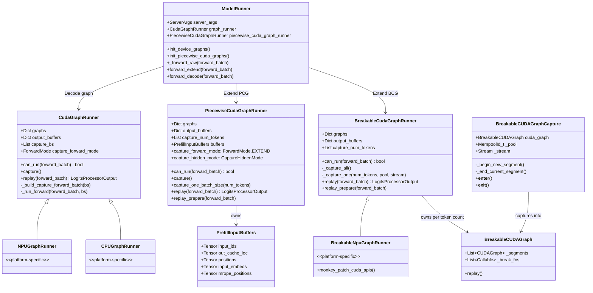
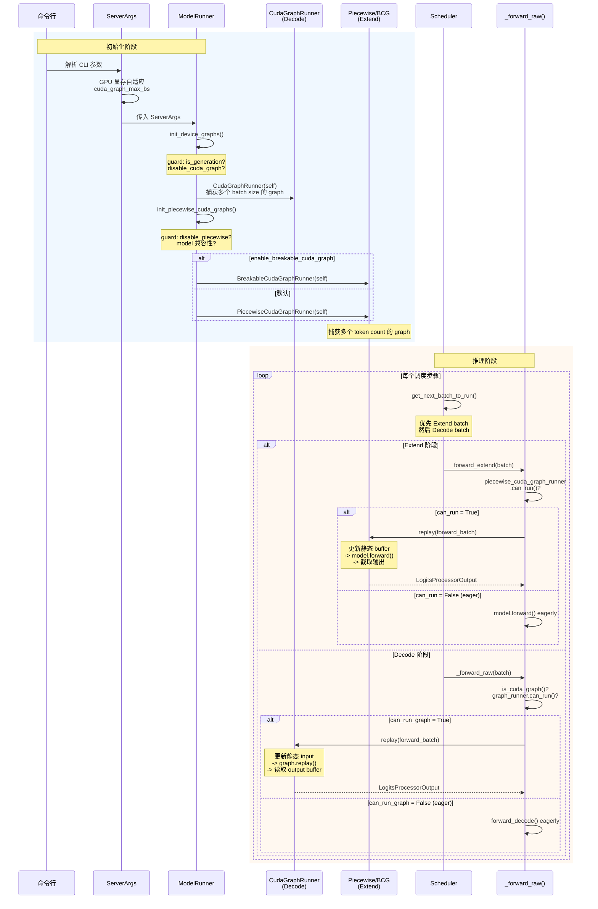
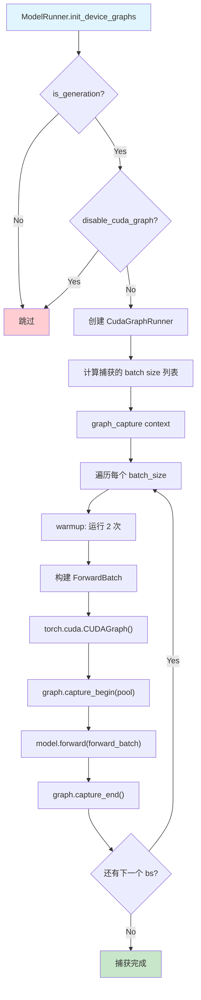
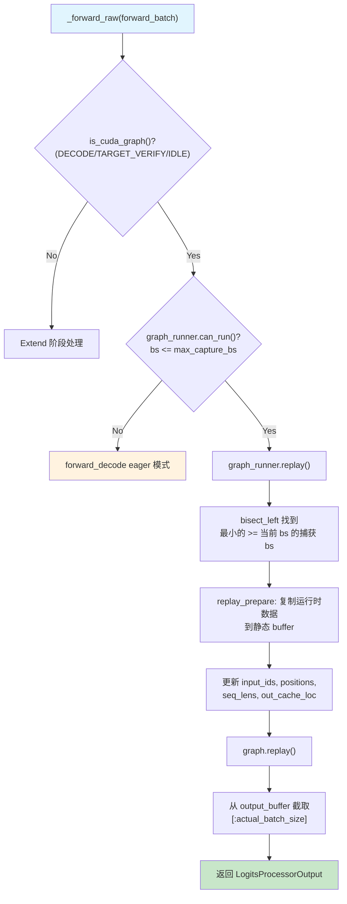
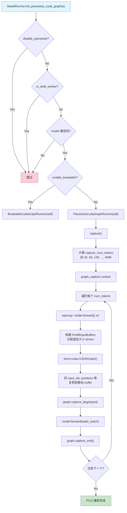
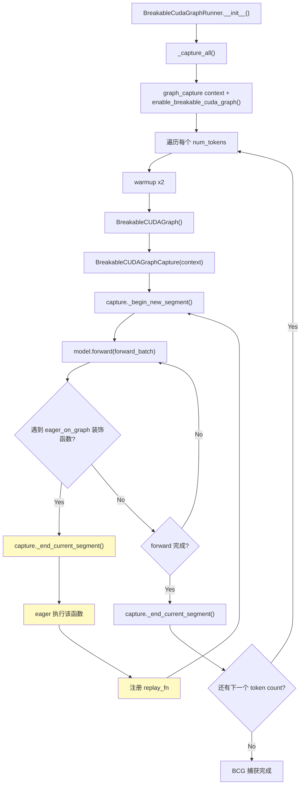
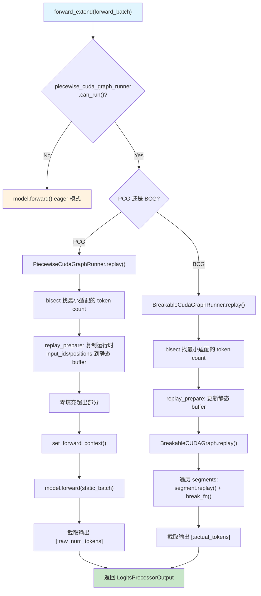
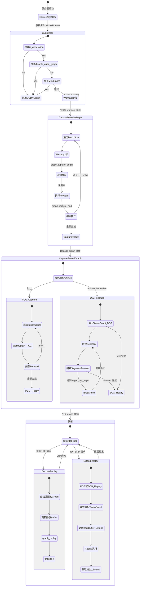

# SGLang CUDA Graph 完整调用链教程

## 概述

CUDA Graph 是 NVIDIA 提供的一种优化技术，通过将一系列 GPU 操作录制为一张"图"，在重放时避免 CPU 端的 kernel launch 开销。

SGLang 的 CUDA Graph 按推理阶段分为**两条独立路径**：

- **Decode 阶段**：使用 `CudaGraphRunner`（按 batch size 捕获多个固定大小的 graph），是成熟稳定的路径。正常模式下使用 `torch.cuda.CUDAGraph`；`--debug-cuda-graph` 模式下内部也会使用 `BreakableCUDAGraph` 机制，让每个操作走 eager 路径以便调试。
- **Extend（Prefill）阶段**：使用 `PiecewiseCudaGraphRunner`（PCG，按 token 数量捕获）或 `BreakableCudaGraphRunner`（BCG，支持断点的分段 graph）。二者互斥，由 `--enable-breakable-cuda-graph` 参数决定。

整个机制从 `ServerArgs` 参数解析开始，经过运行时 guard 判断，最终在 `ModelRunner` 中完成初始化、捕获和重放。

---

## 1. 启用条件链

### 1.1 ServerArgs 参数定义

所有 CUDA Graph 相关的 CLI 参数定义在 `python/sglang/srt/server_args.py`：

| 参数 | 类型 | 默认值 | 说明 |
|------|------|--------|------|
| `--disable-cuda-graph` | `store_true` | `False` | 禁用 Decode 阶段的 CUDA Graph |
| `--disable-cuda-graph-padding` | `store_true` | `False` | 当需要 padding 时禁用 CUDA Graph |
| `--cuda-graph-max-bs` | `int` | `None`（自动推断） | Decode Graph 的最大 batch size |
| `--enable-breakable-cuda-graph` | `store_true` | `False` | 使用 BCG 替代 PCG |
| `--enable-profile-cuda-graph` | `store_true` | `False` | 启用 CUDA Graph 捕获的性能分析 |
| `--disable-piecewise-cuda-graph` | `store_true` | `False` | 禁用 Extend 阶段的 Piecewise CUDA Graph |

> 源码位置：`server_args.py:624-629`（默认值定义）

### 1.2 GPU 显存自适应

`cuda_graph_max_bs` 会根据 GPU 显存自动设置（`server_args.py:1302-1340`）：

| GPU 显存 | TP < 4 | TP >= 4 |
|----------|--------|---------|
| < 20 GB | 8 | 8 |
| 20-35 GB | 24 | 80 |
| 35-60 GB | 32 | 160 |
| 60-90 GB | 256 | 512 |

### 1.3 运行时 Guard 链

从 `ServerArgs` 到实际捕获，有三层 guard：

```
ServerArgs 解析
  |
  v
ModelRunner.init_device_graphs()     # model_runner.py:2675
  |-- guard 1: is_generation?        # 只对生成模型启用
  |-- guard 2: model_impl == MindSpore?  # MindSpore 不支持
  |-- guard 3: disable_cuda_graph?   # 用户显式禁用
  +-- 通过 -> 创建 graph_runner
       |-- CUDA -> CudaGraphRunner
       |-- CPU  -> CPUGraphRunner
       +-- NPU  -> NPUGraphRunner
  |
  v
ModelRunner.init_piecewise_cuda_graphs()  # model_runner.py:2729
  |-- guard 1: disable_piecewise_cuda_graph?
  |-- guard 2: is_draft_worker?       # Draft model 用 decode graph
  |-- guard 3: model 兼容性检查       # 非语言模型、特定 layer 类型等
  +-- 通过 -> 创建 piecewise_cuda_graph_runner
       |-- enable_breakable_cuda_graph + NPU -> BreakableNpuGraphRunner
       |-- enable_breakable_cuda_graph       -> BreakableCudaGraphRunner
       +-- 默认                               -> PiecewiseCudaGraphRunner
```

### 1.4 ForwardMode 判断

在推理时，`ForwardMode.is_cuda_graph()` 决定是否使用 Decode Graph（`forward_batch_info.py:166-172`）：

```python
def is_cuda_graph(self):
    return (
        self == ForwardMode.DECODE
        or self == ForwardMode.TARGET_VERIFY
        or self == ForwardMode.IDLE
        or self == ForwardMode.DLLM_EXTEND
    )
```

注意：`ForwardMode.EXTEND`（Prefill）**不在** `is_cuda_graph()` 中，Extend 阶段走的是独立的 PCG/BCG 路径。

### 1.5 NPU/Ascend 适配层的降级处理

NPU 平台有以下特殊处理（`server_args.py:1158-1199`）：

1. **强制 eager 编译器**：NPU 不支持 `torch.compile`，自动将 `piecewise_cuda_graph_compiler` 设为 `"eager"`
2. **PCG 默认禁用**：非 CUDA 硬件（AMD/NPU/CPU/MPS/XPU）默认 `disable_piecewise_cuda_graph = True`（`server_args.py:1198-1204`）
3. **BCG 可选启用**：通过 `--enable-breakable-cuda-graph` 配合 NPU monkey patch 使用 `BreakableNpuGraphRunner`（`model_runner.py:2838-2843`）

### 1.6 自动禁用条件

PCG 会在以下条件自动禁用（`server_args.py:1184-1239`）：

- 非 CUDA 硬件（AMD/NPU/CPU/MPS/XPU）
- 启用了 DP Attention
- 启用了 Torch Compile
- Pipeline Parallelism > 1
- LoRA 启用
- 多模态模型
- GGUF 量化模型
- CPU Offload 启用
- 确定性推理模式
- PD 分离部署
- Expert Distribution Recorder 启用

---

## 2. 类图与关键代码

### 2.0 Capture 调用链全景

所有 CUDA Graph 的 capture 都发生在**服务器启动时的 `ModelRunner.__init__()` 阶段**，在收到任何推理请求之前完成。完整的调用链如下：

```
ModelRunner.__init__()                                   # model_runner.py:307
  |
  ├── [CUDA/MUSA] init_cublas()                          # model_runner.py:758
  ├── init_attention_backend()                           # model_runner.py:759
  ├── kernel_warmup()                                    # model_runner.py:760
  |
  ├── init_device_graphs()                               # model_runner.py:762
  |     ├── guard: is_generation? disable_cuda_graph?
  |     └── CudaGraphRunner(self)                        # model_runner.py:2718
  |           ├── __init__(): 计算捕获的 batch_size 列表      # cuda_graph_runner.py:558
  |           └── capture(): 遍历每个 bs，warmup + 捕获        # cuda_graph_runner.py:837
  |                 └── capture_one_batch_size(bs)           # cuda_graph_runner.py:950
  |                       └── _capture_graph()               # cuda_graph_runner.py:910
  |                             ├── 普通模式: torch.cuda.graph(...)
  |                             └── debug 模式: BreakableCUDAGraphCapture(...)  ← BCG 也用于 Decode！
  |
  └── init_piecewise_cuda_graphs()                       # model_runner.py:782
        ├── guard: disable_piecewise? model 兼容性?
        └── [PCG 或 BCG 选择]                            # model_runner.py:2836-2847
              ├── 默认: PiecewiseCudaGraphRunner(self)
              |     └── capture(): 遍历每个 num_tokens       # piecewise_cuda_graph_runner.py:450
              └── enable_breakable: BreakableCudaGraphRunner(self)
                    └── _capture_all(): 遍历每个 num_tokens   # breakable_cuda_graph_runner.py:283
                          └── _capture_one(): BreakableCUDAGraphCapture(...)   # 分段捕获
```

**另一个调用时机**：`update_weights()` 时如果 `recapture_cuda_graph=True`，会重新调用 `init_device_graphs()`（`model_runner.py:1608-1616`），但**不会**重新捕获 piecewise graph。

### 2.1 总体类图



### 2.2 ModelRunner 如何创建 Decode Graph

Decode Graph 在 `ModelRunner.init_device_graphs()` 中创建（`model_runner.py:2675-2718`）。以下是关键代码：

**创建入口**（`model_runner.py:2675-2718`）：

```python
# model_runner.py:2675
def init_device_graphs(self):
    """Capture device graphs."""
    self.graph_runner = None
    self.graph_mem_usage = 0

    # Guard 1: 只对生成模型启用
    if not self.is_generation:
        return

    # Guard 2: MindSpore 不支持
    if self.server_args.model_impl.lower() == ModelImpl.MINDSPORE:
        return

    # Guard 3: 用户显式禁用
    if self.device != "cpu" and self.server_args.disable_cuda_graph:
        return

    # 根据平台选择不同的 GraphRunner
    if current_platform.is_out_of_tree():
        GraphRunnerCls = current_platform.get_graph_runner_cls()
        self.graph_runner = GraphRunnerCls(self)
    else:
        graph_runners = defaultdict(
            lambda: CudaGraphRunner,
            {
                "cpu": CPUGraphRunner,
                "npu": NPUGraphRunner,  # NPU 使用自己的 runner
            },
        )
        self.graph_runner = graph_runners[self.device](self)
```

**CudaGraphRunner 初始化**（`cuda_graph_runner.py:558-638`）：

```python
# cuda_graph_runner.py:558
class CudaGraphRunner:
    def __init__(self, model_runner, *, attn_backend=None, ...):
        self.model_runner = model_runner
        self.graphs = {}          # 存储 torch.cuda.CUDAGraph
        self.output_buffers = {}  # 存储每个 graph 的输出

        # 默认捕获 DECODE 模式
        self.capture_forward_mode = ForwardMode.DECODE
        self.num_tokens_per_bs = 1

        # 推测解码时切换为 TARGET_VERIFY
        if model_runner.spec_algorithm.is_speculative():
            self.capture_forward_mode = ForwardMode.TARGET_VERIFY
            self.num_tokens_per_bs = self.speculative_num_draft_tokens

        # 计算需要捕获的 batch size 列表
        self.capture_bs, self.compile_bs = get_batch_sizes_to_capture(
            model_runner, self.num_tokens_per_bs
        )
```

**Capture 流程**（`cuda_graph_runner.py:837-906`）：

```python
# cuda_graph_runner.py:837
def capture(self) -> None:
    def _capture_one_stream(stream_idx=None):
        # 反向遍历 batch size（大的先捕获，小的复用内存池）
        capture_range = reversed(self.capture_bs)
        for i, bs in enumerate(capture_range):
            for variant_label, variant_has_lora in lora_variants:
                with patch_model(self.model_runner.model, bs in self.compile_bs, ...):
                    graph, output_buffers = self.capture_one_batch_size(bs, forward, stream_idx)
                    key = _default_make_graph_key(bs, stream_idx, variant_label)
                    self.graphs[key] = graph
                    self.output_buffers[key] = output_buffers

    with graph_capture() as graph_capture_context:
        self.stream = graph_capture_context.stream
        _capture_one_stream()
```

### 2.3 ModelRunner 如何使用 Decode Graph

Decode Graph 在 `ModelRunner._forward_raw()` 中被调用（`model_runner.py:3103-3134`）：

```python
# model_runner.py:3103
def _forward_raw(self, forward_batch, skip_attn_backend_init, pp_proxy_tensors, ...):
    # 第一步：判断是否可以使用 CUDA Graph
    # is_cuda_graph() 只对 DECODE/TARGET_VERIFY/IDLE/DLLM_EXTEND 返回 True
    # 注意：EXTEND 不在此列表中！
    mode_check = (
        forward_batch.forward_mode.is_cpu_graph
        if self.device == "cpu"
        else forward_batch.forward_mode.is_cuda_graph
    )
    can_run_graph = bool(
        mode_check()
        and self.graph_runner              # graph_runner 已初始化
        and self.graph_runner.can_run(forward_batch)  # bs 在捕获范围内
    )

    if can_run_graph:
        # 走 CUDA Graph replay 路径
        ret = self.graph_runner.replay(
            forward_batch,
            skip_attn_backend_init=skip_attn_backend_init,
            pp_proxy_tensors=pp_proxy_tensors,
        )
        return ModelRunnerOutput(logits_output=ret, can_run_graph=can_run_graph)

    # Fallback: 不满足条件时走 eager 模式
    if forward_batch.forward_mode.is_decode():
        ret = self.forward_decode(...)
    elif forward_batch.forward_mode.is_extend(...):
        ret, can_run_graph = self.forward_extend(...)
```

**CudaGraphRunner.replay()**（`cuda_graph_runner.py:1289-1347`）：

```python
# cuda_graph_runner.py:1289
def replay(self, forward_batch, skip_attn_backend_init=False, pp_proxy_tensors=None):
    # 1. 准备：将运行时数据复制到静态 buffer
    if not skip_attn_backend_init:
        self.replay_prepare(forward_batch, pp_proxy_tensors)
    else:
        self.buffers.input_ids[:self.raw_num_token].copy_(forward_batch.input_ids)
        self.buffers.positions[:self.raw_num_token].copy_(forward_batch.positions)

    # 2. 找到对应的 graph（根据 bs、stream、lora variant）
    variant_label = self._resolve_lora_variant(forward_batch)
    stream_idx = get_current_stream_idx() if self.enable_pdmux else None
    graph_key = self._make_graph_key(self.bs, stream_idx, variant_label)

    # 3. Replay！
    self.graphs[graph_key].replay()
    output = self.output_buffers[graph_key]

    # 4. 截取有效输出（去除 padding）
    if isinstance(output, LogitsProcessorOutput):
        next_token_logits = output.next_token_logits[:self.raw_num_token]
        return LogitsProcessorOutput(next_token_logits=next_token_logits, ...)
```

### 2.4 ModelRunner 如何创建和使用 Extend Graph（PCG/BCG）

Extend Graph 在 `ModelRunner.init_piecewise_cuda_graphs()` 中创建（`model_runner.py:2729-2854`）：

```python
# model_runner.py:2729
def init_piecewise_cuda_graphs(self):
    self.piecewise_cuda_graph_runner = None

    if self.server_args.disable_piecewise_cuda_graph:
        return
    if self.is_draft_worker:
        return
    # ... 更多 guard 检查 ...

    # 关键选择逻辑：PCG 还是 BCG？
    if self.server_args.enable_breakable_cuda_graph:
        # BCG 路径
        if _is_npu:
            from sglang.srt.hardware_backend.npu.graph_runner.breakable_npu_graph_runner import (
                BreakableNpuGraphRunner,
            )
            self.piecewise_cuda_graph_runner = BreakableNpuGraphRunner(self)
        else:
            self.piecewise_cuda_graph_runner = BreakableCudaGraphRunner(self)
    else:
        # PCG 路径（默认）
        self.piecewise_cuda_graph_runner = PiecewiseCudaGraphRunner(self)
```

注意：无论 PCG 还是 BCG，都赋值给 **同一个字段** `self.piecewise_cuda_graph_runner`。

**Extend Graph 的使用入口**（`model_runner.py:2927-2963`）：

```python
# model_runner.py:2927
def forward_extend(self, forward_batch, skip_attn_backend_init=False, pp_proxy_tensors=None):
    # ... 准备 kwargs ...

    # 关键判断：piecewise_cuda_graph_runner 能否处理此 batch？
    can_run_graph = (
        self.piecewise_cuda_graph_runner is not None
        and self.piecewise_cuda_graph_runner.can_run(forward_batch)
    )

    if can_run_graph:
        # 走 PCG 或 BCG 的 replay 路径
        # （取决于 piecewise_cuda_graph_runner 的实际类型）
        return (
            self.piecewise_cuda_graph_runner.replay(forward_batch, **kwargs),
            can_run_graph,
        )

    # Fallback: eager 模式
    if not skip_attn_backend_init:
        ...
    ret = self.model.forward(forward_batch.input_ids, forward_batch.positions, forward_batch, ...)
```

### 2.5 BCG 与 Decode 阶段的关系

**BCG 实际上可以通过两种方式参与 Decode 阶段**，之前的"BCG 不能用于 Decode"的说法不够严谨。完整分析如下：

#### 方式一：`--debug-cuda-graph` 模式下，CudaGraphRunner 内部使用 BCG 机制

`CudaGraphRunner`（Decode Graph Runner）在 `__init__` 时导入了 `BreakableCUDAGraph` 和 `BreakableCUDAGraphCapture`（`cuda_graph_runner.py:96-101`）：

```python
# cuda_graph_runner.py:96-101
if not _is_hip:
    from sglang.srt.model_executor.breakable_cuda_graph.breakable_cuda_graph import (
        BreakableCUDAGraph,
        BreakableCUDAGraphCapture,
        eager_on_graph,
    )
```

当用户设置 `--debug-cuda-graph` 时（`server_args.py:5927-5933`），`ServerArgs._handle_post_validation()` 会设置环境变量：

```python
# server_args.py:3842-3854
if self.debug_cuda_graph:
    if not is_cuda():
        self.debug_cuda_graph = False
    else:
        envs.SGLANG_USE_BREAKABLE_CUDA_GRAPH.set("1")
        # "All operations will run eagerly through the graph capture/replay path."
```

这导致 `CudaGraphRunner` 在 capture 时使用 BCG 的分段机制（`cuda_graph_runner.py:910-941`）：

```python
# cuda_graph_runner.py:910
def _capture_graph(self, graph, pool, stream, run_once_fn):
    if envs.SGLANG_USE_BREAKABLE_CUDA_GRAPH.get():
        graph_ctx = BreakableCUDAGraphCapture  # ← Decode Graph 也用 BCG 的分段捕获！
    else:
        graph_ctx = self.device_module.graph    # 普通 torch.cuda.graph

    if self.model_runner.server_args.debug_cuda_graph:
        captured_fn = eager_on_graph(True)(run_once_fn)  # ← 每个操作都插入断点
    else:
        captured_fn = run_once_fn

    with graph_ctx(cuda_graph=graph, pool=pool, stream=stream):
        out = captured_fn()
```

以及创建 graph 对象时（`cuda_graph_runner.py:943-948`）：

```python
# cuda_graph_runner.py:943
def _create_device_graph(self):
    if envs.SGLANG_USE_BREAKABLE_CUDA_GRAPH.get():
        return BreakableCUDAGraph()    # ← Decode Graph 也创建 BreakableCUDAGraph！
    return torch.cuda.CUDAGraph()
```

**这是一个调试用途**：`--debug-cuda-graph` 让每个操作都通过 `eager_on_graph(True)` 包装，在 capture/replay 时仍然逐操作 eager 执行，方便排查 CUDA Graph 相关问题。

#### 方式二：Extend 阶段的 BCG Runner（`BreakableCudaGraphRunner`）

这是正常模式下的 BCG 用途。`BreakableCudaGraphRunner` 被赋值给 `self.piecewise_cuda_graph_runner`（`model_runner.py:2845`），只通过 `forward_extend()` 被调用。它的 `can_run()` 要求 `batch_size <= 1`，按 token count 捕获，使用 `ForwardMode.EXTEND`，因此只在 Extend 阶段生效。

#### 结论

| 维度 | 说明 |
|------|------|
| **正常模式下** | Decode 用 `CudaGraphRunner`（内部使用 `torch.cuda.CUDAGraph`），Extend 用 PCG 或 BCG Runner。两条路径完全独立 |
| **`--debug-cuda-graph` 模式下** | `CudaGraphRunner` 内部的 capture/replay 也使用 `BreakableCUDAGraph` + `BreakableCUDAGraphCapture`，让 Decode Graph 的每个操作都走 eager 路径以便调试 |
| **`BreakableCudaGraphRunner`（Extend BCG）** | 不参与 Decode 阶段，它被绑定到 `piecewise_cuda_graph_runner` 字段，只在 `forward_extend()` 中被调用 |

### 2.6 BCG 的 Capture 和 Replay 关键代码

**BCG Capture**（`breakable_cuda_graph_runner.py:71-140, 283-350`）：

```python
# breakable_cuda_graph_runner.py:85
class BreakableCudaGraphRunner:
    def __init__(self, model_runner):
        # 与 PCG 类似的配置
        self.capture_num_tokens = sorted(capture_tokens)  # 如 [32, 64, 128, ..., 4096]
        self.max_num_tokens = max(self.capture_num_tokens)

        # 初始化 buffer（复用 PCG 的 PrefillInputBuffers）
        self._init_buffers(model_runner)

        # Warmup 然后 capture
        self._warmup()
        self._capture_all()

    # breakable_cuda_graph_runner.py:283
    def _capture_all(self):
        with graph_capture() as ctx, enable_breakable_cuda_graph():
            pool, stream = ctx.pool, ctx.stream
            for num_tokens in capture_range:
                graph, output = self._capture_one(num_tokens, pool, stream)
                self.graphs[num_tokens] = graph
                self.output_buffers[num_tokens] = output

    # breakable_cuda_graph_runner.py:333
    def _capture_one(self, num_tokens, pool, stream):
        forward_batch = self._build_capture_forward_batch(num_tokens)
        # 注意：使用 ForwardMode.EXTEND 捕获
        # forward_mode=ForwardMode.EXTEND, batch_size=1

        def run_once():
            return self._run_forward(forward_batch, num_tokens)

        for _ in range(2):  # Warmup 2 次
            run_once()

        # 使用 BreakableCUDAGraph（而非普通 CUDAGraph）
        graph = BreakableCUDAGraph()
        with BreakableCUDAGraphCapture(cuda_graph=graph, pool=pool, stream=stream):
            output = run_once()
            # 在 run_once 执行期间，@eager_on_graph 装饰的函数
            # 会自动触发分段：end_segment -> eager执行 -> begin_segment

        return graph, output
```

**BCG Replay**（`breakable_cuda_graph_runner.py:352-402`）：

```python
# breakable_cuda_graph_runner.py:352
def replay(self, forward_batch, **kwargs):
    num_tokens = len(forward_batch.input_ids)
    # bisect 找到最小适配的捕获 token count
    index = bisect.bisect_left(self.capture_num_tokens, num_tokens)
    static_num_tokens = self.capture_num_tokens[index]

    with enable_breakable_cuda_graph():
        # 复制运行时数据到静态 buffer
        static_forward_batch = self.replay_prepare(forward_batch, **kwargs)

        # Replay！此时会遍历所有 segments
        self.graphs[static_num_tokens].replay()

    # 截取有效输出
    output = self.output_buffers[static_num_tokens]
    return LogitsProcessorOutput(
        next_token_logits=output.next_token_logits[:self.raw_num_tokens], ...
    )
```

**BreakableCUDAGraph.replay() — 分段重放**（`breakable_cuda_graph.py:237-255`）：

```python
# breakable_cuda_graph.py:237
class BreakableCUDAGraph:
    def __init__(self):
        self._segments: list[torch.cuda.CUDAGraph] = []
        self._break_fns: list[Callable] = []

    # breakable_cuda_graph.py:245
    def replay(self) -> None:
        stream = torch.cuda.current_stream()
        for i, seg in enumerate(self._segments):
            seg.replay()         # 重放当前 segment 的 CUDA Graph
            if i < len(self._break_fns):
                self._break_fns[i]()  # 执行 eager 断点函数
```

### 2.7 PCG 的 Capture 关键代码

**PCG Capture**（`piecewise_cuda_graph_runner.py:450-481`）：

```python
# piecewise_cuda_graph_runner.py:450
def capture(self) -> None:
    with freeze_gc(...), graph_capture() as graph_capture_context:
        stream = graph_capture_context.stream
        with set_pcg_capture_stream(stream):
            # 反向遍历 token count（大的先捕获，小的复用内存池）
            for num_tokens in reversed(self.capture_num_tokens):
                self.capture_one_batch_size(num_tokens)

# piecewise_cuda_graph_runner.py:483
def capture_one_batch_size(self, num_tokens):
    # 构建 capture 用的 ForwardBatch（ForwardMode.EXTEND）
    forward_batch = self._build_capture_forward_batch(num_tokens)

    # Warmup 2 次
    for _ in range(2):
        self._run_forward(forward_batch)

    # 捕获
    graph = torch.cuda.CUDAGraph()
    with torch.cuda.graph(graph, pool=get_global_graph_memory_pool(), stream=stream):
        output = self._run_forward(forward_batch)

    self.graphs[num_tokens] = graph
    self.output_buffers[num_tokens] = output
```

对比 BCG 的 capture，PCG 使用的是普通的 `torch.cuda.CUDAGraph`，而 BCG 使用 `BreakableCUDAGraph`（内部包含多个 `torch.cuda.CUDAGraph` segment）。

---

## 3. 总体时序图



---

## 4. 分阶段流程图

### 4.1 Decode Capture 流程



> 源码位置：`model_runner.py:2675-2718`、`cuda_graph_runner.py` 中的 `__init__` 和 `capture` 方法

### 4.2 Decode Replay 流程



> 源码位置：`model_runner.py:3103-3134`、`cuda_graph_runner.py` 中的 `replay` 方法

### 4.3 Extend Capture 流程（PCG 路径）



> 源码位置：`model_runner.py:2729-2854`、`piecewise_cuda_graph_runner.py:450-481`

### 4.4 Extend Capture 流程（BCG 路径）



> 源码位置：`breakable_cuda_graph_runner.py:283-350`、`breakable_cuda_graph.py:257-331`

### 4.5 Extend Replay 流程



> 源码位置：`model_runner.py:2940-2963`、`piecewise_cuda_graph_runner.py:777-831`、`breakable_cuda_graph_runner.py:352-402`

---

## 5. 状态图



---

## 6. 关键代码路径

### 6.1 Decode 阶段入口

```
Scheduler.event_loop_normal()
  -> run_batch()
    -> ModelRunner._forward_raw()                    # model_runner.py:3103
      -> ForwardMode.is_cuda_graph()                  # forward_batch_info.py:166
      -> CudaGraphRunner.can_run()                    # cuda_graph_runner.py
      -> CudaGraphRunner.replay()                     # cuda_graph_runner.py
        -> replay_prepare(): 复制 input_ids/positions 到静态 buffer
        -> torch.cuda.CUDAGraph.replay()              # PyTorch 原生 replay
        -> 截取 output[:batch_size]
```

### 6.2 Extend 阶段入口（PCG）

```
Scheduler.event_loop_normal()
  -> run_batch()
    -> ModelRunner.forward_extend()                   # model_runner.py:2930
      -> PiecewiseCudaGraphRunner.can_run()            # piecewise_cuda_graph_runner.py:420
      -> PiecewiseCudaGraphRunner.replay()             # piecewise_cuda_graph_runner.py:777
        -> replay_prepare(): 复制 + 零填充到静态 buffer  # piecewise_cuda_graph_runner.py:615
        -> model.forward(static_batch)                  # 通过 graph 录制的 forward
        -> 截取 output[:raw_num_tokens]
```

### 6.3 Extend 阶段入口（BCG）

```
Scheduler.event_loop_normal()
  -> run_batch()
    -> ModelRunner.forward_extend()                   # model_runner.py:2930
      -> BreakableCudaGraphRunner.can_run()            # breakable_cuda_graph_runner.py:311
      -> BreakableCudaGraphRunner.replay()             # breakable_cuda_graph_runner.py:352
        -> replay_prepare(): 更新静态 buffer             # breakable_cuda_graph_runner.py
        -> BreakableCUDAGraph.replay()                  # breakable_cuda_graph.py:245
          -> 遍历 segments:
            -> segment.replay()                          # 每段的 CUDAGraph replay
            -> break_fn()                               # 执行 eager 函数
        -> 截取 output[:actual_tokens]
```

### 6.4 BCG Break Point 机制

BCG 的核心创新是 `@eager_on_graph` 装饰器（`breakable_cuda_graph.py:195`）：

```python
# breakable_cuda_graph.py:195-235
def eager_on_graph(enable: bool):
    """装饰器：在 CUDA Graph 捕获期间将函数标记为断点"""
    def decorator(fn):
        def wrapper(*args, **kwargs):
            if not _current_capture_var.get(None):
                # 不在捕获中 -> 正常执行
                return fn(*args, **kwargs)
            # 在捕获中 -> 结束当前 segment，eager 执行，开始新 segment
            capture._end_current_segment()
            output = fn(*args, **kwargs)       # eager 执行
            # 注册为 replay 函数
            def replay_fn():
                weak_output = weak_ref_tensor(output)
                fn(*args, **kwargs)             # replay 时也 eager 执行
            capture.cuda_graph._break_fns.append(replay_fn)
            capture._begin_new_segment()
            return output
        return wrapper
    return decorator
```

使用示例：

```python
# breakable_cuda_graph.py:333-337
@eager_on_graph(True)
def break_graph() -> None:
    """手动插入断点"""
    pass
```

---

## 7. NPU/Ascend 适配

### 7.1 NPUGraphRunner

NPU 平台使用 `NPUGraphRunner`（`hardware_backend/npu/graph_runner/npu_graph_runner.py`），将 CUDA API 替换为 NPU 等价物：

```python
# model_runner.py:2711-2718
graph_runners = defaultdict(
    lambda: CudaGraphRunner,
    {
        "cpu": CPUGraphRunner,
        "npu": NPUGraphRunner,
    },
)
self.graph_runner = graph_runners[self.device](self)
```

### 7.2 BreakableNpuGraphRunner

BCG 的 NPU 适配（`hardware_backend/npu/graph_runner/breakable_npu_graph_runner.py:118-155`）通过 monkey patch 实现：

```python
# 将 CUDA API 映射到 NPU
torch.cuda.CUDAGraph = torch.npu.NPUGraph
torch.cuda.synchronize = torch.npu.synchronize
torch.npu.Stream.cuda_stream = property(lambda self: self.npu_stream)

# 自定义 capture status 查询（通过 ACL）
bcg._capture_status = _npu_capture_status
bcg._is_capturing = _npu_is_capturing
```

### 7.3 NPU 平台限制

| 限制 | 原因 |
|------|------|
| PCG 默认禁用 | 非 CUDA 硬件自动 `disable_piecewise_cuda_graph = True` |
| 只支持 `eager` 编译器 | `torch.compile` 不可用 |
| 需要手动启用 BCG | `--enable-breakable-cuda-graph` |

---

## 8. 总结：PCG vs BCG 对比

| 维度 | PCG（Piecewise CUDA Graph） | BCG（Breakable CUDA Graph） |
|------|---------------------------|---------------------------|
| **源文件** | `piecewise_cuda_graph_runner.py` | `breakable_cuda_graph_runner.py` + `breakable_cuda_graph/` |
| **适用阶段** | Extend（Prefill） | Extend（Prefill），实验性 |
| **实现原理** | 多个独立 CUDAGraph，每个对应一个 token count | 多段 CUDAGraph + eager 断点 |
| **捕获方式** | `torch.cuda.CUDAGraph` 直接捕获 | `BreakableCUDAGraphCapture` context manager 分段捕获 |
| **断点机制** | 无 | `@eager_on_graph` 装饰器，自动分段 |
| **依赖 torch.compile** | 可选（`eager` 或 `inductor`） | 不依赖 |
| **NPU 支持** | 禁用 | 通过 `BreakableNpuGraphRunner` 支持 |
| **内存管理** | 每个 token count 独立 buffer | 共享 memory pool + weak_ref_tensor |
| **replay 复杂度** | 简单：找适配 graph -> 填充 -> replay | 遍历 segments -> 每段 replay + break_fn |
| **状态** | 稳定，默认启用 | 实验性，需 `--enable-breakable-cuda-graph` |
| **适用场景** | 标准 GPU 上的 Prefill 优化 | NPU 适配、需要灵活断点的场景 |

### Decode Graph（CudaGraphRunner）

| 维度 | 说明 |
|------|------|
| **源文件** | `cuda_graph_runner.py` |
| **适用阶段** | Decode（每次生成一个 token） |
| **捕获单位** | batch size（如 [1, 2, 4, 8, ..., max_bs]） |
| **选择方式** | `bisect_left` 找最小适配 bs |
| **ForwardMode** | `DECODE`, `TARGET_VERIFY`, `IDLE`, `DLLM_EXTEND` |
| **默认** | 启用（可通过 `--disable-cuda-graph` 禁用） |

---

## 附录：关键文件索引

| 文件 | 职责 |
|------|------|
| `python/sglang/srt/server_args.py` | CLI 参数定义、GPU 显存自适应、自动禁用条件 |
| `python/sglang/srt/model_executor/model_runner.py` | 初始化入口、guard 链、forward 调度 |
| `python/sglang/srt/model_executor/forward_batch_info.py` | `ForwardMode` 枚举、`is_cuda_graph()` 判断 |
| `python/sglang/srt/model_executor/cuda_graph_runner.py` | Decode 阶段的 CUDA Graph 捕获和重放 |
| `python/sglang/srt/model_executor/piecewise_cuda_graph_runner.py` | PCG 实现（Extend 阶段） |
| `python/sglang/srt/model_executor/breakable_cuda_graph_runner.py` | BCG Runner 实现 |
| `python/sglang/srt/model_executor/breakable_cuda_graph/breakable_cuda_graph.py` | BCG 核心：分段捕获、断点装饰器 |
| `python/sglang/srt/model_executor/breakable_cuda_graph/context.py` | BCG 上下文管理 |
| `python/sglang/srt/compilation/piecewise_context_manager.py` | PCG 上下文管理 |
| `python/sglang/srt/hardware_backend/npu/graph_runner/npu_graph_runner.py` | NPU Decode Graph |
| `python/sglang/srt/hardware_backend/npu/graph_runner/breakable_npu_graph_runner.py` | NPU BCG 实现 |
| `python/sglang/srt/managers/scheduler.py` | 调度循环（Extend/Decode 决策） |
