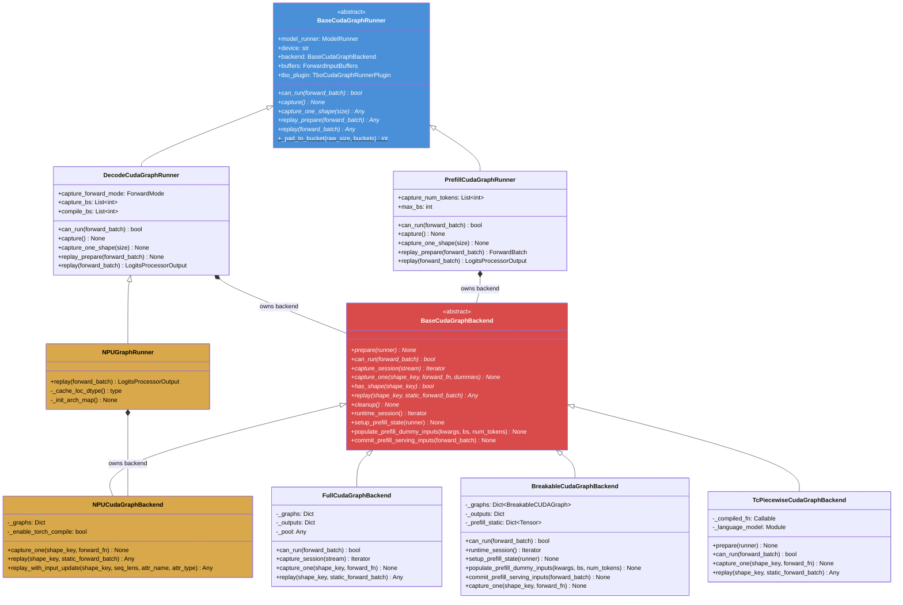
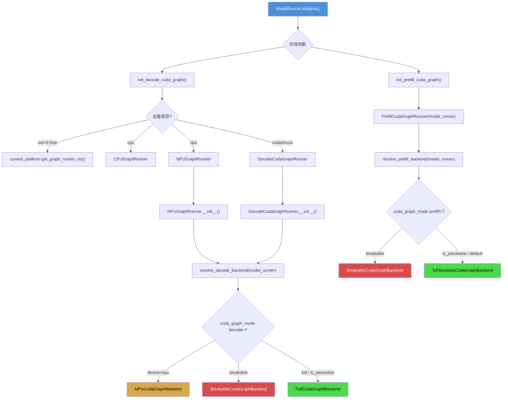
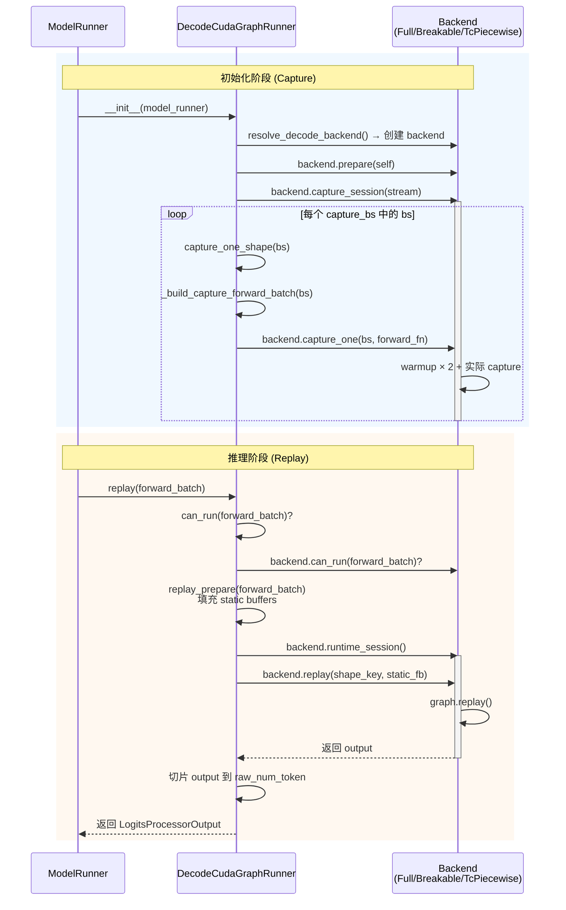
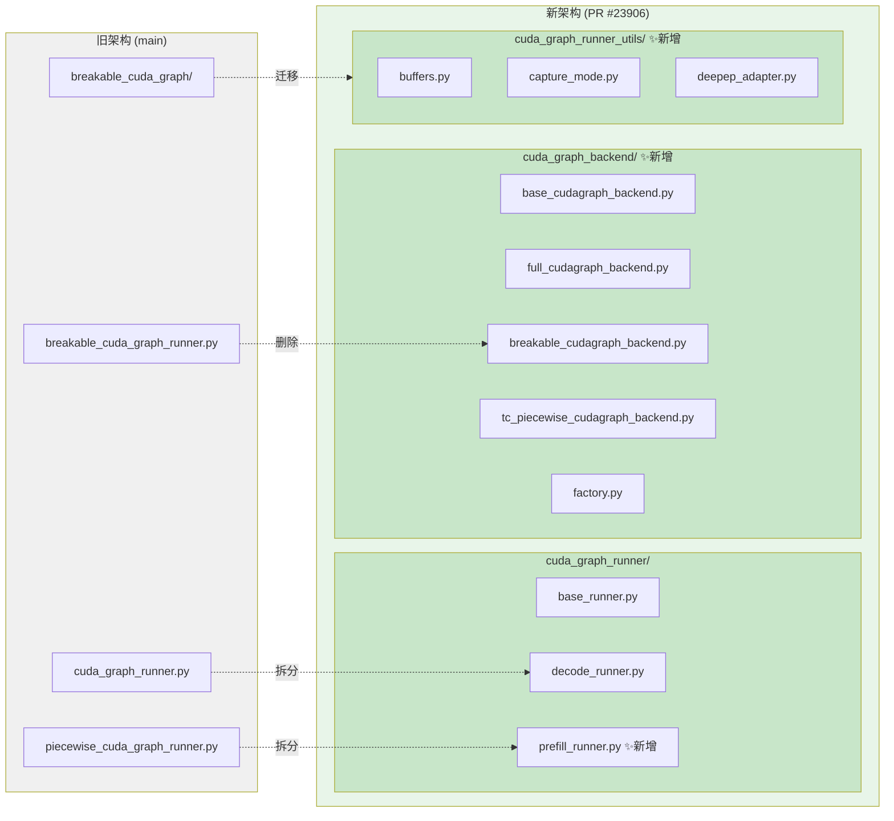

---

# PR #23906 完整分析报告：CUDA Graph Runner/Backend 重构

## 一、PR 概述

**标题：** `[Refactor] Cuda Graph Runner/Backend Refactor`
**作者：** Oasis-Git (Yuwei An)
**分支：** `cg-refactor` → `main`
**状态：** OPEN (WIP)
**规模：** +3730 / -2642 行，涉及 80 个文件

### 关联 Issue #23004

**标题：** `[RFC] Cuda Graph Runner Backend Refactor`

Issue 提出的核心问题：
- 当前有三种 CUDA Graph 实现（full、tc_piecewise、breakable），存在大量重复代码
- 目标是统一架构，支持 `(decode, prefill) × (full, breakable, tc_piecewise)` 的灵活组合
- 默认启用 breakable CUDA graph 用于 prefill

### 核心设计决策

1. **Runner/Backend 分离**：Runner 按**阶段**（decode/prefill）划分，Backend 按**捕获方式**（full/breakable/tc_piecewise）划分
2. **策略模式 + 工厂模式**：通过 `factory.py` 根据 `cuda_graph_mode` 配置动态选择 Backend
3. **新的 CLI 参数**：`--cuda-graph-mode` JSON 配置，支持每个阶段独立指定 backend

---

## 二、Mermaid 图表

### 2.1 类图：核心 Runner/Backend 架构



> 📂 文件位置：
> - `BaseCudaGraphRunner` → `python/sglang/srt/model_executor/cuda_graph_runner/base_runner.py`
> - `DecodeCudaGraphRunner` → `python/sglang/srt/model_executor/cuda_graph_runner/decode_runner.py`
> - `PrefillCudaGraphRunner` → `python/sglang/srt/model_executor/cuda_graph_runner/prefill_runner.py`
> - `NPUGraphRunner` → `python/sglang/srt/hardware_backend/npu/graph_runner/npu_graph_runner.py`
> - `BaseCudaGraphBackend` → `python/sglang/srt/model_executor/cuda_graph_backend/base_cudagraph_backend.py`
> - `FullCudaGraphBackend` → `python/sglang/srt/model_executor/cuda_graph_backend/full_cudagraph_backend.py`
> - `BreakableCudaGraphBackend` → `python/sglang/srt/model_executor/cuda_graph_backend/breakable_cudagraph_backend.py`
> - `TcPiecewiseCudaGraphBackend` → `python/sglang/srt/model_executor/cuda_graph_backend/tc_piecewise_cudagraph_backend.py`
> - `NPUCudaGraphBackend` → `python/sglang/srt/hardware_backend/npu/graph_runner/npu_cudagraph_backend.py`

### 2.2 流程图：Backend 选择与 Runner 创建



> 📂 工厂函数位于 `python/sglang/srt/model_executor/cuda_graph_backend/factory.py`

### 2.3 时序图：Decode CUDA Graph Capture + Replay



### 2.4 新旧目录结构对比



---

## 三、冲突分析：PR #23906 vs 本地 Commit

### 本地 Commit 概述

| Commit      | 描述                                                 | 修改文件               |
| ----------- | ---------------------------------------------------- | ---------------------- |
| `c68da6c39` | feat(npu): adapt breakable CUDA graph for Ascend NPU | 4 个文件，+532/-5 行   |
| `589103ebd` | test case                                            | 同上（包含在 diff 中） |

### 3.1 文件级冲突

| 本地修改的文件                                                                      | PR #23906 也修改?                | 冲突级别        |
| ----------------------------------------------------------------------------------- | -------------------------------- | --------------- |
| `python/sglang/srt/hardware_backend/npu/graph_runner/breakable_npu_graph_runner.py` | ❌ **未修改**（本地新增文件）    | ⚠️ 间接冲突     |
| `python/sglang/srt/model_executor/breakable_cuda_graph/breakable_cuda_graph.py`     | ✅ **已修改**（路径变更 + 微调） | 🔴 **直接冲突** |
| `python/sglang/srt/model_executor/model_runner.py`                                  | ✅ **已修改**（大幅重构）        | 🔴 **直接冲突** |
| `test/registered/breakable_cuda_graph/test_breakable_npu_graph.py`                  | ❌ **未修改**（本地新增文件）    | ⚠️ 间接冲突     |

### 3.2 详细冲突分析

#### 🔴 冲突 1：`model_runner.py`（严重）

**本地版本**（第 2835-2845 行）：
```python
if self.server_args.enable_breakable_cuda_graph:
    if _is_npu:
        from sglang.srt.hardware_backend.npu.graph_runner.breakable_npu_graph_runner import (
            BreakableNpuGraphRunner,
        )
        self.piecewise_cuda_graph_runner = BreakableNpuGraphRunner(self)
    else:
        self.piecewise_cuda_graph_runner = BreakableCudaGraphRunner(self)
```

**PR 版本**（第 2794-2967 行）：整个架构被重写：
- `init_device_graphs()` → 拆分为 `init_decode_cuda_graph()` + `init_prefill_cuda_graph()`
- `self.graph_runner` → `self.decode_cuda_graph_runner`
- `self.piecewise_cuda_graph_runner` → `self.prefill_cuda_graph_runner`
- BCG 的创建逻辑被移入 Backend 工厂（`factory.py`），不再在 `model_runner.py` 中选择
- `BreakableCudaGraphRunner` 类被删除，拆分为 `BreakableCudaGraphBackend`

**冲突原因：** 两个 commit 都大幅修改了同一文件的同一区域（graph runner 创建逻辑），但采用了完全不同的架构方向。本地 commit 在旧架构上添加 NPU 适配，PR 则彻底重构了架构。

#### 🔴 冲突 2：`breakable_cuda_graph.py`（中等）

**本地修改**（第 117-119 行）：简化了 `_is_capturing` 的调用：
```python
# 本地：用 _is_capturing() 替代 _capture_status() 的显式比较
if not _is_capturing(other.cuda_stream):
    return
```

**PR 变更：**
- 文件路径从 `model_executor/breakable_cuda_graph/breakable_cuda_graph.py` 迁移到 `model_executor/cuda_graph_backend_utils/breakable_cuda_graph/breakable_cuda_graph.py`
- `context.py` 中的 `is_in_piecewise_cuda_graph` 改名为 `is_in_tc_piecewise_cuda_graph`
- 删除了旧的 `piecewise_context_manager.py`

**冲突原因：** 路径变更意味着本地对旧路径文件的修改将无法直接应用。

#### ⚠️ 冲突 3：`breakable_npu_graph_runner.py`（间接冲突）

**本地新增文件：** `python/sglang/srt/hardware_backend/npu/graph_runner/breakable_npu_graph_runner.py`

这个文件继承自 `BreakableCudaGraphRunner`：
```python
from sglang.srt.model_executor.breakable_cuda_graph_runner import BreakableCudaGraphRunner

class BreakableNpuGraphRunner(BreakableCudaGraphRunner):
```

**PR 的影响：** `BreakableCudaGraphRunner`（旧文件 `breakable_cuda_graph_runner.py`）被**彻底删除**。取而代之的是 `BreakableCudaGraphBackend`（新文件 `breakable_cudagraph_backend.py`）。所以：
- 本地的 `BreakableNpuGraphRunner` 的父类不再存在
- PR 已在 NPU 路径上提供了新的实现（`NPUCudaGraphBackend` + `NPUGraphRunner`）

### 3.3 逻辑冲突

| 问题                               | 本地 Commit 的假设                                                 | PR #23906 的现实                                                                           |
| ---------------------------------- | ------------------------------------------------------------------ | ------------------------------------------------------------------------------------------ |
| BCG Runner 继承结构                | `BreakableNpuGraphRunner → BreakableCudaGraphRunner`               | `BreakableCudaGraphRunner` 已删除，改为 Backend 模式                                       |
| NPU BCG 支持方式                   | monkey patch `_capture_status`、`_is_capturing`、`torch.cuda` 别名 | PR 的 NPU 路径通过 `NPUCudaGraphBackend`（Full 模式），**不提供 NPU 的 Breakable Backend** |
| model_runner 中的 BCG 创建         | 在 `init_piecewise_cuda_graphs()` 中 if/else 分支                  | 在 `init_prefill_cuda_graph()` 中通过 factory 选择，BCG 是一种 backend 选项                |
| `enable_breakable_cuda_graph` 参数 | 使用 `server_args.enable_breakable_cuda_graph` 布尔参数            | 改为 `cuda_graph_mode` JSON 配置，`enable_breakable_cuda_graph` 被废弃                     |

### 3.4 依赖冲突

**PR 删除的接口（本地依赖）：**
1. `BreakableCudaGraphRunner` 类 — 本地 `BreakableNpuGraphRunner` 的父类
2. `from sglang.srt.model_executor.breakable_cuda_graph_runner import BreakableCudaGraphRunner` — import 路径失效
3. `server_args.enable_breakable_cuda_graph` — 参数被新的 `cuda_graph_mode` 替代

**PR 新增的 NPU 支持缺口：**
- PR 的 `factory.py` 中 `resolve_decode_backend()` 对 NPU 设备只返回 `NPUCudaGraphBackend`（Full 模式）
- **没有提供 NPU 的 Breakable Backend**
- `resolve_prefill_backend()` 根本没有 NPU 特殊处理

---

## 四、总结与建议

### 冲突严重程度：🔴 高

PR #23906 是一次**架构级重构**，彻底改变了 CUDA Graph 的组织方式。本地两个 commit 基于旧架构添加 NPU BCG 支持，与 PR 存在**结构性冲突**，无法通过简单 merge 解决。

### 建议

1. **如果要基于 PR #23906 继续：** 需要重写 NPU BCG 适配层。不再继承 `BreakableCudaGraphRunner`，而是创建 `NPUBreakableCudaGraphBackend`（继承 `BreakableCudaGraphBackend`），将 monkey patch 逻辑移入新 backend，并在 `factory.py` 中注册 NPU + breakable 的组合。

2. **如果 PR 先合入：** 本地 commit 需要完全重写，适配新的 Runner/Backend 分离架构。

3. **如果本地先合入：** PR 在 merge 时需要对 `model_runner.py` 和 NPU 相关文件做大量手动解决冲突。