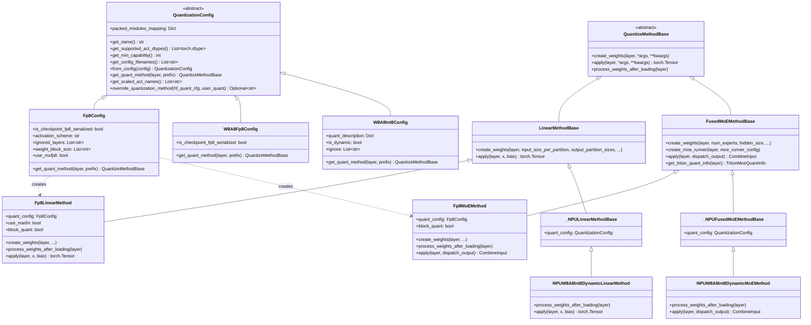
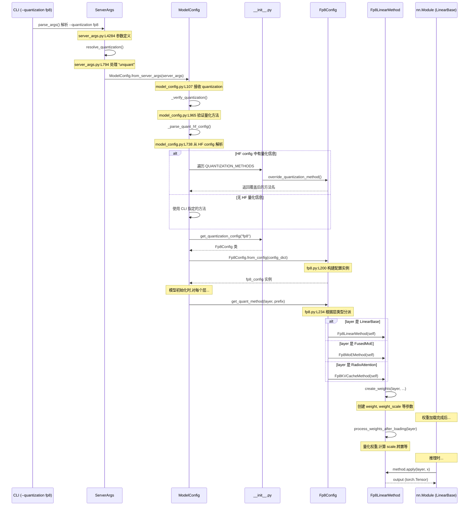

# 阶段 2：sglang 量化模块架构

## 目录

- [1. 核心类层次结构](#1-核心类层次结构)
- [2. 模块入口与注册机制](#2-模块入口与注册机制)
- [3. 配置解析链：从 CLI 到 QuantizeMethod](#3-配置解析链从-cli-到-quantizemethod)
- [4. 关键文件索引](#4-关键文件索引)
- [学习检查点](#学习检查点)

---

## 1. 核心类层次结构

### 1.1 类图



### 1.2 两层抽象设计

sglang 的量化架构采用**两层抽象**：

| 层级 | 类 | 职责 | 文件位置 |
|------|-----|------|---------|
| **Config 层** | `QuantizationConfig` 子类 | 解析配置、决定给每层分配哪种 Method | `base_config.py:L124` |
| **Method 层** | `QuantizeMethodBase` 子类 | 实际执行权重量化、前向计算 | `base_config.py:L18` |

**Config 层**的核心方法是 `get_quant_method(layer, prefix)`（`base_config.py:L221`）：
- 根据层的类型（`LinearBase`、`FusedMoE`、`RadixAttention`）返回不同的 Method
- 同一个 Fp8Config 可以同时管理 LinearMethod、MoEMethod、KVCacheMethod

**Method 层**的三个核心方法：
1. `create_weights()` — 在模型初始化时创建权重参数
2. `process_weights_after_loading()` — 权重加载后处理（量化、转置等）
3. `apply()` — 前向推理时的量化计算

### 1.3 GPU 与 NPU 的分层

```
python/sglang/srt/layers/quantization/      ← 通用量化逻辑（GPU 为主）
├── __init__.py                              ← 注册表 QUANTIZATION_METHODS
├── base_config.py                           ← 基类定义
├── fp8.py                                   ← FP8 GPU 实现
├── w8a8_fp8.py                              ← W8A8 FP8 GPU 实现
├── w8a8_int8.py                             ← W8A8 INT8 GPU 实现
└── ...

python/sglang/srt/hardware_backend/npu/quantization/  ← NPU 专用量化
├── linear_method_npu.py                     ← NPU Linear 量化方法
└── fused_moe_method_npu.py                  ← NPU MoE 量化方法
```

**关键设计决策**：NPU 的量化方法继承自同一套基类（`LinearMethodBase`、`FusedMoEMethodBase`），但实现完全独立。这使得 NPU 可以使用自己的硬件加速 API（`torch.ops.npu.*`），而不依赖 CUDA。

---

## 2. 模块入口与注册机制

### 2.1 注册表初始化

文件：`python/sglang/srt/layers/quantization/__init__.py`

```python
# __init__.py:L62-L88 — 基础注册表
BASE_QUANTIZATION_METHODS: Dict[str, Type[QuantizationConfig]] = {
    "fp8": Fp8Config,
    "mxfp8": Fp8Config,          # mxfp8 也用 Fp8Config，内部 use_mxfp8=True
    "w8a8_fp8": W8A8Fp8Config,
    "w8a8_int8": W8A8Int8Config,
    # ... 20+ 种方法
}

# __init__.py:L91-L96 — 条件注册（依赖硬件）
if is_cuda() or (_is_mxfp_supported and is_hip()):
    BASE_QUANTIZATION_METHODS.update({"mxfp4": Mxfp4Config})

# __init__.py:L107 — 最终注册表
QUANTIZATION_METHODS = {**BASE_QUANTIZATION_METHODS}
```

### 2.2 获取 Config 的函数

```python
# __init__.py:L110-L127
def get_quantization_config(quantization: str) -> Type[QuantizationConfig]:
    if quantization not in QUANTIZATION_METHODS:
        raise ValueError(...)
    if is_cpu() and cpu_has_amx_support():
        # CPU 有自己的子集
        return CPU_QUANTIZATION_METHODS[quantization]
    return QUANTIZATION_METHODS[quantization]
```

### 2.3 添加新量化方法只需两步

1. 在 `layers/quantization/` 下创建新文件，定义 `XXXConfig`（继承 `QuantizationConfig`）和 `XXXLinearMethod`（继承 `LinearMethodBase`）
2. 在 `__init__.py` 中导入并添加到 `BASE_QUANTIZATION_METHODS`

---

## 3. 配置解析链：从 CLI 到 QuantizeMethod

### 3.1 完整调用链（Sequence Diagram）



### 3.2 关键调用节点详解

#### 节点 1：CLI 参数解析

`python/sglang/srt/server_args.py:L4284-L4288`
```python
parser.add_argument(
    "--quantization",
    type=str,  # 量化方法名称，如 "fp8", "w8a8_int8" 等
    default=ServerArgs.quantization,
    help="The quantization method.",
)
```

#### 节点 2：量化验证

`python/sglang/srt/configs/model_config.py:L965-L1010`
```python
def _verify_quantization(self) -> None:
    supported_quantization = [*QUANTIZATION_METHODS]
    # 1. 检查 HF config 中是否有量化配置
    hf_config = self._parse_quant_hf_config()
    # 2. 遍历所有注册方法，检查是否有 override
    for _, method in QUANTIZATION_METHODS.items():
        quantization_override = method.override_quantization_method(
            quant_cfg, self.quantization
        )
    # 3. 如果 CLI 指定了量化方法，验证是否支持
    if self.quantization not in supported_quantization:
        raise ValueError(f"Unknown quantization method: {self.quantization}")
```

#### 节点 3：Config 创建与 Method 分派

`python/sglang/srt/layers/quantization/fp8.py:L234-L257`
```python
def get_quant_method(self, layer, prefix):
    if isinstance(layer, LinearBase):
        if is_layer_skipped(prefix, self.ignored_layers, ...):
            return UnquantizedLinearMethod()  # 跳过的层不量化
        return Fp8LinearMethod(self)          # 返回 FP8 Linear 方法
    elif isinstance(layer, FusedMoE):
        return Fp8MoEMethod(self)             # 返回 FP8 MoE 方法
    elif isinstance(layer, RadixAttention):
        return Fp8KVCacheMethod(self)         # 返回 FP8 KV Cache 方法
    return None
```

### 3.3 NPU 路径的接入点

NPU 的量化方法不在 `get_quant_method()` 中直接注册。而是在具体的 Config 类中根据 `is_npu()` 条件返回 NPU 特定的 Method：

```python
# 典型的 NPU 接入模式（伪代码）
if is_npu():
    return NPUW8A8Int8DynamicLinearMethod(quant_config)
else:
    return W8A8Int8LinearMethod(quant_config)
```

NPU 的 Method 类直接继承 `LinearMethodBase` / `FusedMoEMethodBase`，保证了接口一致。

---

## 4. 关键文件索引

### 4.1 核心基类

| 文件 | 行号 | 内容 |
|------|------|------|
| `python/sglang/srt/layers/quantization/base_config.py:L18` | `QuantizeMethodBase` | 所有量化方法的基类 |
| `python/sglang/srt/layers/quantization/base_config.py:L44` | `LinearMethodBase` | Linear 层量化方法基类 |
| `python/sglang/srt/layers/quantization/base_config.py:L84` | `FusedMoEMethodBase` | MoE 层量化方法基类 |
| `python/sglang/srt/layers/quantization/base_config.py:L124` | `QuantizationConfig` | 量化配置基类 |

### 4.2 注册与入口

| 文件 | 行号 | 内容 |
|------|------|------|
| `python/sglang/srt/layers/quantization/__init__.py:L62` | `BASE_QUANTIZATION_METHODS` | 量化方法注册表 |
| `python/sglang/srt/layers/quantization/__init__.py:L110` | `get_quantization_config()` | 根据名称获取 Config 类 |
| `python/sglang/srt/server_args.py:L4284` | `--quantization` 参数 | CLI 参数定义 |
| `python/sglang/srt/configs/model_config.py:L965` | `_verify_quantization()` | 量化方法验证与解析 |

### 4.3 FP8 实现

| 文件 | 行号 | 内容 |
|------|------|------|
| `python/sglang/srt/layers/quantization/fp8.py:L132` | `Fp8Config` | FP8 配置类 |
| `python/sglang/srt/layers/quantization/fp8.py:L269` | `Fp8LinearMethod` | FP8 Linear 方法 |
| `python/sglang/srt/layers/quantization/fp8.py:L784` | `Fp8MoEMethod` | FP8 MoE 方法 |
| `python/sglang/srt/layers/quantization/fp8.py:L1851` | `Fp8KVCacheMethod` | FP8 KV Cache 方法 |

### 4.4 W8A8 实现

| 文件 | 行号 | 内容 |
|------|------|------|
| `python/sglang/srt/layers/quantization/w8a8_fp8.py:L39` | `W8A8Fp8Config` | W8A8 FP8 配置 |
| `python/sglang/srt/layers/quantization/w8a8_fp8.py:L103` | `W8A8Fp8LinearMethod` | W8A8 FP8 Linear |
| `python/sglang/srt/layers/quantization/w8a8_int8.py:L63` | `W8A8Int8Config` | W8A8 INT8 配置 |
| `python/sglang/srt/layers/quantization/w8a8_int8.py:L155` | `W8A8Int8LinearMethod` | W8A8 INT8 Linear |

### 4.5 NPU 专用实现

| 文件 | 行号 | 内容 |
|------|------|------|
| `python/sglang/srt/hardware_backend/npu/quantization/linear_method_npu.py:L12` | `_NPULinearMethodBase` | NPU Linear 基类 |
| `python/sglang/srt/hardware_backend/npu/quantization/linear_method_npu.py:L79` | `NPUW8A8Int8DynamicLinearMethod` | NPU W8A8 动态量化 |
| `python/sglang/srt/hardware_backend/npu/quantization/linear_method_npu.py:L114` | `NPU_W4A4DynamicLinearMethod` | NPU W4A4 动态量化 |
| `python/sglang/srt/hardware_backend/npu/quantization/fused_moe_method_npu.py:L387` | `_NPUFusedMoEMethodBase` | NPU MoE 基类 |
| `python/sglang/srt/hardware_backend/npu/quantization/fused_moe_method_npu.py:L464` | `NPUW8A8Int8DynamicMoEMethod` | NPU W8A8 MoE |

---

## 学习检查点

完成本阶段后，你应该能回答以下问题：

1. **`QuantizationConfig` 和 `QuantizeMethodBase` 的关系是什么？一个 Config 可以产生多少种 Method？**
   > 提示：看 `Fp8Config.get_quant_method()` 在 `fp8.py:L234`

2. **如果用户通过 `--quantization fp8` 启动 sglang，请描述从 CLI 到 `Fp8LinearMethod.apply()` 的完整调用路径。**

3. **NPU 的量化方法和 GPU 的量化方法共享哪些基类？为什么这样设计？**
   > 提示：`_NPULinearMethodBase` 继承自 `LinearMethodBase`

4. **如何在 sglang 中注册一个全新的量化方法？需要修改哪些文件？**

5. **`_verify_quantization()` 做了哪些检查？如果 CLI 指定的量化方法与模型配置文件中的不一致会怎样？**
   > 提示：`model_config.py:L965`

---

> 下一阶段：[03_fp8_deep_dive.md](./03_fp8_deep_dive.md) — FP8 量化的代码级详解
