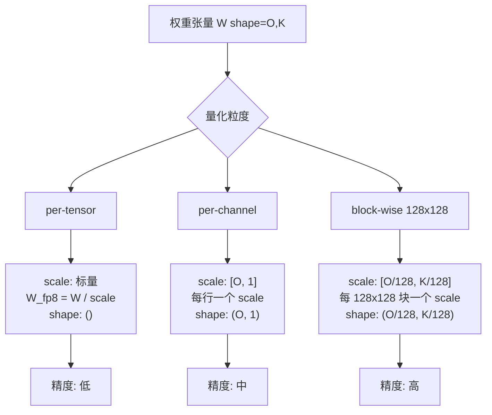
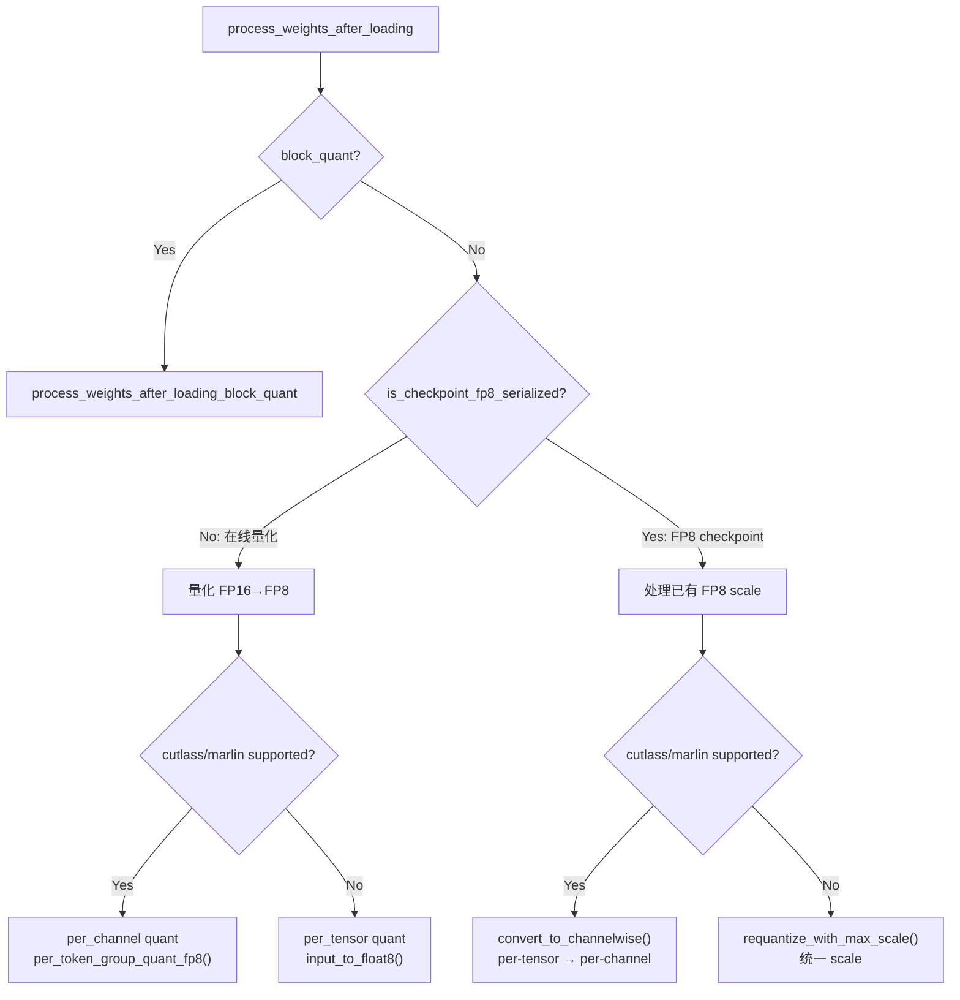
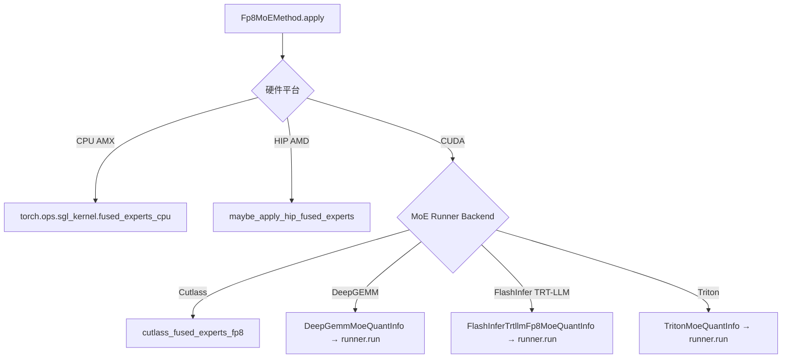
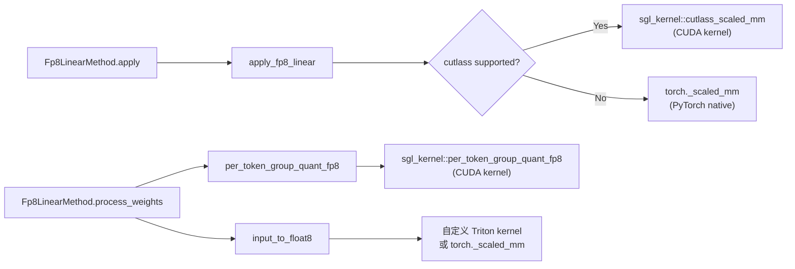

# 阶段 3：FP8 量化详解（Ascend NPU 重点）

## 目录

- [1. FP8 量化的数学原理](#1-fp8-量化的数学原理)
- [2. sglang FP8 代码走读：Fp8LinearMethod](#2-sglang-fp8-代码走读fp8linearmethod)
- [3. sglang FP8 代码走读：Fp8MoEMethod](#3-sglang-fp8-代码走读fp8moemethod)
- [4. fp8_kernel.py 中的 kernel 调用链](#4-fp8_kernelpy-中的-kernel-调用链)
- [5. NPU 适配切入点](#5-npu-适配切入点)
- [学习检查点](#学习检查点)

---

## 1. FP8 量化的数学原理

### 1.1 E4M3 vs E5M2

FP8 有两种编码格式，由 IEEE 754 标准定义：

**E4M3 (用于权重和前向激活)**

```
Bit layout: S EEEE MMM
S = 1 bit sign
E = 4 bit exponent (bias = 7)
M = 3 bit mantissa (隐含 1.)

值 = (-1)^S * 2^(E-7) * (1 + M/8)

特殊值：
  E=0, M=0  → ±0
  E=15, M=7 → NaN
  (没有 Inf)

范围: ±(1 + 0/8) * 2^(0-7) 到 ±(1 + 7/8) * 2^(15-7-1) = ±448
```

**E5M2 (用于梯度，推理中较少使用)**

```
Bit layout: S EEEEE MM
S = 1 bit sign
E = 5 bit exponent (bias = 15)
M = 2 bit mantissa (隐含 1.)

范围: ±57344
精度更低但范围更大
```

### 1.2 量化公式

sglang 中 FP8 量化的核心函数在 `fp8_kernel.py` 中，主要通过 `scaled_fp8_quant` 实现：

```
scale = max(|tensor|) / fp8_max   (fp8_max = 448.0 for E4M3)
quantized = round(tensor / scale)  # 转换为 FP8
dequantized = quantized * scale    # 反量化恢复近似值
```

### 1.3 三种量化粒度的对比



---

## 2. sglang FP8 代码走读：Fp8LinearMethod

`python/sglang/srt/layers/quantization/fp8.py:L269-L781`

### 2.1 类初始化

`fp8.py:L289-L314`

```python
class Fp8LinearMethod(LinearMethodBase):
    def __init__(self, quant_config: Union[Fp8Config, W4AFp8Config]):
        self.quant_config = quant_config
        self.cutlass_fp8_supported = cutlass_fp8_supported()

        # 不支持 FP8 硬件的 GPU 可以用 Marlin kernel 做 weight-only FP8
        self.use_marlin = False
        if _is_cuda:
            force_marlin = get_bool_env_var("SGLANG_FORCE_FP8_MARLIN")
            auto_enable = can_auto_enable_marlin_fp8()
            self.use_marlin = force_marlin or auto_enable

        self.use_mxfp8 = getattr(self.quant_config, "use_mxfp8", False)
        self.block_quant = (
            self.use_mxfp8 or self.quant_config.weight_block_size is not None
        )
```

关键决策逻辑：
- **block_quant = True** → 使用 block-wise 量化（128x128），精度更高
- **block_quant = False** → 使用 per-tensor 或 per-channel 量化
- **use_marlin = True** → 在不支持 FP8 计算的 GPU 上用 Marlin kernel

### 2.2 create_weights：创建权重参数

`fp8.py:L357-L454`

```python
def create_weights(self, layer, input_size_per_partition, output_partition_sizes,
                   input_size, output_size, params_dtype, ...):
    # 保存层属性
    layer.logical_widths = output_partition_sizes
    layer.input_size_per_partition = input_size_per_partition
    layer.output_size_per_partition = output_size_per_partition
    layer.orig_dtype = params_dtype

    # 权重数据类型取决于是否为 FP8 checkpoint
    weight_dtype = (
        torch.float8_e4m3fn    # FP8 checkpoint → 直接用 FP8
        if self.is_checkpoint_fp8_serialized
        else params_dtype       # FP16/BF16 checkpoint → 先用原精度加载
    )
    weight = ModelWeightParameter(data=torch.empty(..., dtype=weight_dtype), ...)
    layer.register_parameter("weight", weight)

    # FP8 checkpoint 需要额外创建 scale 参数
    if self.is_checkpoint_fp8_serialized:
        if self.block_quant:
            # block-wise: scale shape = (O/block_n, K/block_k)
            scale = BlockQuantScaleParameter(...)
            layer.register_parameter("weight_scale_inv", scale)
        else:
            # per-tensor: scale shape = (num_partitions,)
            scale = PerTensorScaleParameter(...)
            layer.register_parameter("weight_scale", scale)
```

**设计要点：**
- FP8 checkpoint 直接加载 FP8 权重 + scale → 无需在线量化
- FP16/BF16 checkpoint 先加载原始权重 → 在 `process_weights_after_loading` 中量化

### 2.3 process_weights_after_loading：权重后处理

`fp8.py:L592-L702`

这是**在线量化**的核心。分两个分支：



**在线量化路径**（`fp8.py:L598-L621`）：

```python
if not self.is_checkpoint_fp8_serialized:
    if self.cutlass_fp8_supported or self.use_marlin:
        # per-channel 量化：每行一个 scale
        qweight, weight_scale = per_token_group_quant_fp8(
            layer.weight, layer.weight.shape[-1]  # group_size = K（整行）
        )
        weight_scale = weight_scale.t().contiguous()
    else:
        # per-tensor 量化：整个张量一个 scale
        qweight, weight_scale = input_to_float8(layer.weight)

    layer.weight = Parameter(qweight.t(), requires_grad=False)
    layer.weight_scale = Parameter(weight_scale, requires_grad=False)
    layer.input_scale = None
```

### 2.4 apply：前向推理

`fp8.py:L704-L781`

```python
def apply(self, layer, x, bias=None) -> torch.Tensor:
    # 路径 1: Marlin kernel（不支持 FP8 计算的 GPU）
    if self.use_marlin:
        return apply_fp8_marlin_linear(...)

    # 路径 2: MXFP8
    if self.use_mxfp8:
        return self.w8a8_mxfp8_linear(...)

    # 路径 3: Block-wise 量化
    if self.block_quant:
        return self.w8a8_block_fp8_linear(
            input=x, weight=layer.weight,
            block_size=self.quant_config.weight_block_size,
            weight_scale=layer.weight_scale_inv,
            ...
        )

    # 路径 4: 标准 FP8（per-tensor 或 per-channel）
    return apply_fp8_linear(
        input=x, weight=layer.weight,
        weight_scale=layer.weight_scale,
        input_scale=layer.input_scale,
        ...
    )
```

---

## 3. sglang FP8 代码走读：Fp8MoEMethod

`python/sglang/srt/layers/quantization/fp8.py:L784-L1848`

### 3.1 MoE 的特殊性

MoE（Mixture of Experts）层的量化比 Linear 层复杂，因为：
- 每个专家有自己的权重（w13_weight, w2_weight）
- w13 是 gate+up 融合的权重（形状：num_experts, 2*intermediate, hidden）
- w2 是 down 投影权重（形状：num_experts, hidden, intermediate）

### 3.2 create_weights

`fp8.py:L830-L1054`

```python
def create_weights(self, layer, num_experts, hidden_size,
                   intermediate_size_per_partition, params_dtype, ...):
    # 创建 w13 (gate+up) 和 w2 (down) 权重
    w13_weight = torch.nn.Parameter(
        torch.empty(num_experts, w13_up_dim, hidden_size, dtype=params_dtype),
        requires_grad=False,
    )
    w2_weight = torch.nn.Parameter(
        torch.empty(num_experts, hidden_size, w2_up_dim, dtype=params_dtype),
        requires_grad=False,
    )
    layer.register_parameter("w13_weight", w13_weight)
    layer.register_parameter("w2_weight", w2_weight)

    # block-wise 量化的 scale
    if self.block_quant:
        w13_weight_scale = torch.nn.Parameter(
            scale_init(num_experts, 2*((intermediate+block_n-1)//block_n),
                       (hidden+block_k-1)//block_k, ...),
            requires_grad=False,
        )
        layer.register_parameter("w13_weight_scale_inv", w13_weight_scale)
        layer.register_parameter("w2_weight_scale_inv", w2_weight_scale)
```

### 3.3 process_weights_after_loading

`fp8.py:L1309-L1437`

MoE 的后处理有三种路径：

| 场景 | 处理方式 | 行号 |
|------|---------|------|
| HIP + INT4 | `process_weights_hip_int4()` | L1310 |
| Block quant | `process_weights_after_loading_block_quant()` | L1313 |
| 在线量化 (FP16→FP8) | 逐 expert 调用 `scaled_fp8_quant()` | L1318 |
| FP8 checkpoint | 合并 w13 的两个 scale 为一个 | L1349 |

**在线量化路径**（`fp8.py:L1318-L1341`）：
```python
elif not self.quant_config.is_checkpoint_fp8_serialized:
    for expert in range(layer.num_local_experts):
        w13_weight[expert, :, :], layer.w13_weight_scale[expert] = (
            scaled_fp8_quant(layer.w13_weight.data[expert, :, :])
        )
        w2_weight[expert, :, :], layer.w2_weight_scale[expert] = (
            scaled_fp8_quant(layer.w2_weight.data[expert, :, :])
        )
```

### 3.4 apply：MoE 前向推理

`fp8.py:L1557-L1739`

MoE 的 apply 比 Linear 复杂得多，需要处理多种后端：



---

## 4. fp8_kernel.py 中的 kernel 调用链

`python/sglang/srt/layers/quantization/fp8_kernel.py`

### 4.1 核心量化函数

| 函数 | 作用 | 调用位置 |
|------|------|---------|
| `scaled_fp8_quant(tensor)` | 将 tensor 量化为 FP8，返回 (quantized, scale) | `fp8.py:L1335` |
| `per_token_group_quant_fp8(tensor, group_size)` | 按 group 量化为 FP8 | `fp8.py:L607` |
| `input_to_float8(tensor)` | 简单的 per-tensor FP8 量化 | `fp8.py:L616` |
| `fp8_dtype` | 返回当前平台的 FP8 dtype（e4m3fn 或 e4m3fnuz） | 全局变量 |

### 4.2 量化调用链



---

## 5. NPU 适配切入点

### 5.1 NPU 现有文件结构

```
python/sglang/srt/hardware_backend/npu/quantization/
├── linear_method_npu.py       # NPU Linear 层量化
│   ├── _NPULinearMethodBase        (L12)  NPU Linear 基类
│   ├── NPUW8A8Int8LinearMethod     (L21)  W8A8 静态量化
│   ├── NPUW8A8Int8DynamicLinearMethod (L79)  W8A8 动态量化
│   └── NPU_W4A4DynamicLinearMethod (L114) W4A4 动态量化
└── fused_moe_method_npu.py   # NPU MoE 层量化
    ├── _NPUFusedMoEMethodBase      (L387) NPU MoE 基类
    ├── NPUW4A4Int4DynamicMoEMethod (L396) W4A4 MoE
    ├── NPUW8A8Int8DynamicMoEMethod (L464) W8A8 MoE
    ├── NPUW4A8Int8DynamicMoEMethod (L586) W4A8 MoE
    └── NPUW4A16Int4DynamicMoEMethod (L835) W4A16 MoE
```

### 5.2 GPU vs NPU 实现对比

以 W8A8 动态量化 Linear 层为例：

| 维度 | GPU (`W8A8Int8LinearMethod`) | NPU (`NPUW8A8Int8DynamicLinearMethod`) |
|------|-----|-----|
| **文件** | `w8a8_int8.py:L155` | `linear_method_npu.py:L79` |
| **权重量化** | `per_token_group_quant_fp8()` | 加载时已是 INT8 |
| **权重后处理** | `layer.weight.t()` | `layer.weight.transpose(0,1)` + `npu_format_cast()` |
| **激活量化** | `per_token_quant_int8(x)` | `torch.ops.npu.npu_dynamic_quant(x)` |
| **矩阵乘法** | `int8_scaled_mm(x_q, weight, ...)` | `torch.ops.npu.npu_quant_matmul(x, weight, ...)` |
| **scale 存储** | `layer.weight_scale` (per-channel) | `layer.weight_scale` (per-channel) |
| **依赖** | `sgl_kernel` (CUDA) | `torch.ops.npu.*` (Ascend CANN) |

### 5.3 NPU 特有的 API

NPU 使用华为 CANN 提供的 `torch.ops.npu.*` 算子：

| NPU 算子 | 作用 | 对应 GPU 操作 |
|----------|------|-------------|
| `npu_dynamic_quant(x)` | 动态量化输入为 INT8 | `per_token_quant_int8(x)` |
| `npu_quant_matmul(x, w, scale, ...)` | 量化矩阵乘法 | `int8_scaled_mm(x, w, ...)` |
| `npu_grouped_matmul(x, w, ...)` | 分组矩阵乘法 (MoE) | `invoke_fused_moe_kernel(...)` |
| `npu_format_cast(w)` | 权重格式转换 (NPU 5HD 等) | 直接使用默认格式 |
| `npu_moe_init_routing(...)` | MoE 路由初始化 | `torch.argsort(topk_ids)` |
| `npu_moe_finalize_routing(...)` | MoE 路由聚合 | 自定义 Triton kernel |
| `npu_dequant_swiglu_quant(...)` | 融合反量化+SiLU+量化 | 分步执行 |
| `npu_swiglu(x)` | 融合 SwiGLU 激活 | `F.silu(gate) * up` |
| `npu_convert_weight_to_int4pack(w)` | INT4 权重打包 | Marlin 打包格式 |

### 5.4 如果要为 NPU 适配 FP8

当前 NPU 的 W8A8 走的是 INT8 路径（`NPUW8A8Int8DynamicLinearMethod`）。如果要添加 FP8 支持，需要：

1. **创建 `NPUFp8LinearMethod`**（继承 `_NPULinearMethodBase`）
2. **在 `process_weights_after_loading` 中**：
   - 使用 NPU 的 FP8 量化 API（如果 CANN 支持）
   - 或使用 `torch.float8_e4m3fn` dtype + NPU GEMM
3. **在 `apply` 中**：
   - 激活量化：需要 NPU 版本的 per-token FP8 量化
   - 矩阵乘法：使用 `npu_quant_matmul` 或 `npu_grouped_matmul` 的 FP8 模式

---

## 学习检查点

完成本阶段后，你应该能回答以下问题：

1. **FP8 E4M3 的表示范围是多少？为什么推理场景不用 E5M2？**

2. **在 `Fp8LinearMethod.process_weights_after_loading` 中，在线量化（FP16→FP8）和离线量化（直接加载 FP8）的处理路径有什么区别？**
   > 提示：`fp8.py:L592` 中的 `if self.block_quant` 和 `if not self.is_checkpoint_fp8_serialized` 分支

3. **GPU 上的 `int8_scaled_mm` 和 NPU 上的 `npu_quant_matmul` 有什么本质区别？**
   > 提示：前者依赖 CUDA/CUTLASS，后者依赖 CANN

4. **MoE 层的 w13_weight 代表什么？为什么 w13 需要两个 scale？**
   > 提示：w13 是 gate_proj + up_proj 的融合，见 `fp8.py:L1405`

5. **如果要为 NPU 添加 FP8 支持，需要创建哪些类？需要修改哪些文件？**
   > 提示：参考 `linear_method_npu.py` 中 `NPUW8A8Int8DynamicLinearMethod` 的结构

---

> 下一阶段：[04_npu_adaptation_guide.md](./04_npu_adaptation_guide.md) — Ascend NPU 量化适配实战指南
