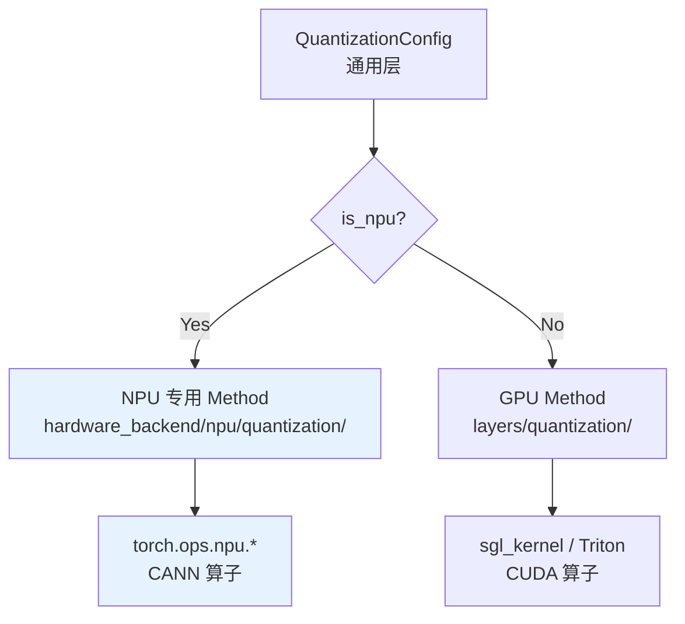
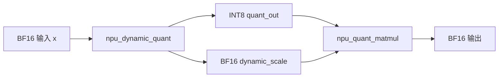
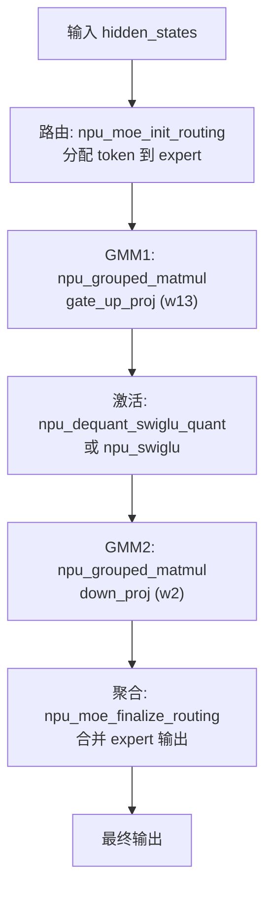
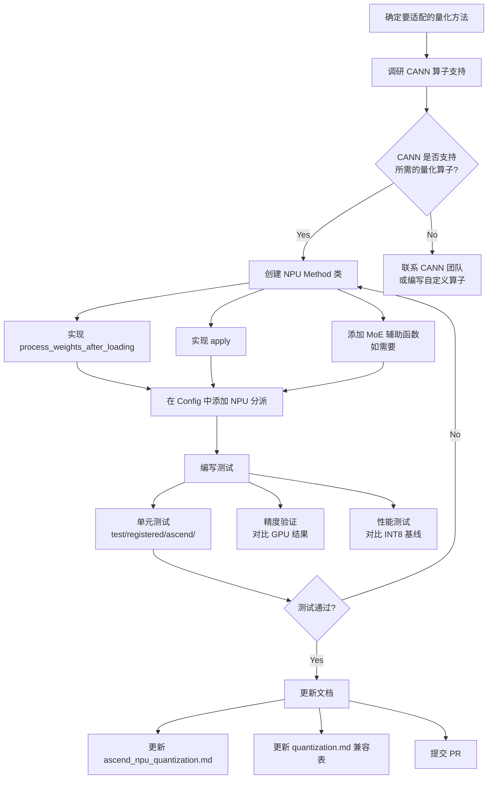

# 阶段 4：Ascend NPU 量化适配实战指南

## 目录

- [1. NPU hardware_backend 架构模式](#1-npu-hardware_backend-架构模式)
- [2. 已有 NPU 量化实现分析：linear_method_npu.py](#2-已有-npu-量化实现分析linear_method_npupy)
- [3. 已有 NPU 量化实现分析：fused_moe_method_npu.py](#3-已有-npu-量化实现分析fused_moe_method_npupy)
- [4. 新增 NPU 量化方法的步骤清单](#4-新增-npu-量化方法的步骤清单)
- [5. 从 GPU 移植到 NPU 的模式总结](#5-从-gpu-移植到-npu-的模式总结)
- [6. 适配工作流](#6-适配工作流)
- [学习检查点](#学习检查点)

---

## 1. NPU hardware_backend 架构模式

### 1.1 目录结构

```
python/sglang/srt/hardware_backend/npu/
├── __init__.py
├── quantization/                     ← NPU 量化模块
│   ├── linear_method_npu.py          ← Linear 层量化方法
│   └── fused_moe_method_npu.py       ← MoE 层量化方法
└── utils.py                          ← NPU 工具函数（npu_format_cast 等）
```

### 1.2 设计模式

NPU 量化模块遵循以下设计模式：



**核心原则：**
- NPU Method 继承与 GPU 相同的基类（`LinearMethodBase`、`FusedMoEMethodBase`）
- 实现完全独立，使用 `torch.ops.npu.*` 替代 CUDA kernel
- Config 层通过 `is_npu()` 条件分派到不同 Method

---

## 2. 已有 NPU 量化实现分析：linear_method_npu.py

`python/sglang/srt/hardware_backend/npu/quantization/linear_method_npu.py`

### 2.1 _NPULinearMethodBase（L12-L19）

```python
class _NPULinearMethodBase(LinearMethodBase):
    def __init__(self, quant_config=None):
        self.quant_config = quant_config
```

所有 NPU Linear 量化方法的基类。注意它没有实现 `create_weights` —— 这是因为权重创建逻辑在对应的 Config 类中（如 `CompressedTensorsConfig`），NPU Method 只负责后处理和前向。

### 2.2 NPUW8A8Int8DynamicLinearMethod（L79-L111）

这是 NPU 上最常用的动态量化方法，W8A8 动态量化。

#### process_weights_after_loading（L80-L88）

```python
def process_weights_after_loading(self, layer: torch.nn.Module):
    # 步骤 1: 转置权重 (O, K) → (K, O)，NPU GEMM 需要
    layer.weight.data = layer.weight.data.transpose(0, 1).contiguous()
    # 步骤 2: 格式转换为 NPU 专用格式（如 5HD）
    layer.weight.data = npu_format_cast(layer.weight.data)
    # 步骤 3: 展平 scale
    layer.weight_scale.data = layer.weight_scale.data.flatten()
```

#### apply（L90-L111）

```python
def apply(self, layer, x, bias=None) -> torch.Tensor:
    # 动态量化路径
    if isinstance(x, tuple):
        # 来自 malprolog kernel 的预量化结果
        original_dtype = torch.bfloat16
        quant_out, dynamic_scale = x
    else:
        # 在线动态量化：BF16 → INT8
        original_dtype = x.dtype
        quant_out, dynamic_scale = torch.ops.npu.npu_dynamic_quant(x)

    # NPU 量化矩阵乘法
    return torch.ops.npu.npu_quant_matmul(
        quant_out,           # INT8 输入
        layer.weight,        # INT8 权重
        layer.weight_scale,  # 权重 scale
        pertoken_scale=dynamic_scale.flatten(),  # 激活 scale
        bias=bias,
        output_dtype=original_dtype,  # 输出恢复为 BF16
    )
```

**关键 NPU 算子调用链：**



### 2.3 NPUW8A8Int8LinearMethod（L21-L76）

这是**静态量化**版本，与动态版本的区别：

| 维度 | 动态 (Dynamic) | 静态 (Static) |
|------|---------------|---------------|
| 激活量化 | 运行时 `npu_dynamic_quant(x)` | 使用预计算的 `layer.input_scale` |
| scale 来源 | 每次 inference 计算 | checkpoint 中保存 |
| 适用场景 | 通用 | 模型已离线量化 |
| 复杂度 | 低 | 需要额外处理 `deq_scale` |

静态版本的关键额外步骤（L33-L44）：
```python
# 从 input_scale 计算 NPU 需要的 dequant_scale
expanding_factor = layer.weight.data.shape[0]
layer.aclnn_input_scale = torch.nn.Parameter(
    layer.input_scale.data.repeat(expanding_factor).to(device="npu"),
    requires_grad=False,
)
layer.aclnn_input_scale_reciprocal = 1 / torch.nn.Parameter(
    layer.input_scale.data.repeat(expanding_factor).to(device="npu"),
    requires_grad=False,
)
```

### 2.4 NPU_W4A4DynamicLinearMethod（L114-L143）

W4A4（4bit 权重 + 4bit 激活）的动态量化。与 W8A8 的主要区别：

```python
def process_weights_after_loading(self, layer):
    layer.weight.data = layer.weight.data.transpose(0, 1).contiguous()
    layer.weight_scale.data = layer.weight_scale.data.flatten()
    # W4A4 特有：INT4 权重需要打包为 INT32 格式
    layer.weight.data = torch.ops.npu.npu_convert_weight_to_int4pack(
        layer.weight.data.to(torch.int32)
    )

def apply(self, layer, x, bias=None):
    original_dtype = x.dtype
    # 量化为 4bit 激活（注意 dst_type=torch.quint4x2）
    quant_out, dynamic_scale = torch.ops.npu.npu_dynamic_quant(
        x, dst_type=torch.quint4x2
    )
    return torch.ops.npu.npu_quant_matmul(...)
```

---

## 3. 已有 NPU 量化实现分析：fused_moe_method_npu.py

`python/sglang/srt/hardware_backend/npu/quantization/fused_moe_method_npu.py`

### 3.1 MoE 整体流程

NPU 的 MoE 推理分为 4 步：



### 3.2 NPUW8A8Int8DynamicMoEMethod（L464-L583）

#### process_weights_after_loading（L466-L491）

```python
def process_weights_after_loading(self, layer):
    # 转置权重：NPU GMM 需要 (K, N) 格式
    layer.w13_weight.data = npu_format_cast(
        layer.w13_weight.data.transpose(1, 2)
    )
    layer.w2_weight.data = npu_format_cast(
        layer.w2_weight.data.transpose(1, 2)
    )
    # 展平 scale
    layer.w13_weight_scale = torch.nn.Parameter(
        layer.w13_weight_scale.data.squeeze(-1), requires_grad=False
    )
    layer.w2_weight_scale = torch.nn.Parameter(
        layer.w2_weight_scale.data.squeeze(-1), requires_grad=False
    )
    # 额外保存 BF16 精度的 scale（NPU GMM 需要与输入同 dtype 的 scale）
    layer.w13_weight_scale_bf16 = torch.nn.Parameter(
        layer.w13_weight_scale.data.to(dtype=torch.bfloat16),
        requires_grad=False,
    )
    layer.w2_weight_scale_bf16 = torch.nn.Parameter(
        layer.w2_weight_scale.data.to(dtype=torch.bfloat16),
        requires_grad=False,
    )
```

#### apply（L493-L536）

```python
def apply(self, layer, dispatch_output):
    # 释放 FP32 scale 节省内存
    layer.w13_weight_scale = None
    layer.w2_weight_scale = None

    topk_weights, topk_ids, _ = topk_output

    if not torch.npu.is_current_stream_capturing():
        # Prefill 路径：使用 npu_fused_experts
        output = npu_fused_experts(
            hidden_states=hidden_states,
            w13=layer.w13_weight,
            w13_scale=layer.w13_weight_scale_bf16,
            w2=layer.w2_weight,
            w2_scale=layer.w2_weight_scale_bf16,
            topk_weights=topk_weights,
            topk_ids=topk_ids,
            top_k=topk_ids.shape[1],
        )
    else:
        # Decode 路径：使用 npu_fused_experts_w8a8_decode
        output = npu_fused_experts_w8a8_decode(...)
```

**重要设计：Prefill/Decode 分支**
- Prefill 使用 `npu_fused_experts()` — 使用 `npu_moe_init_routing` 初始化
- Decode 使用 `npu_fused_experts_w8a8_decode()` — 使用 `npu_moe_init_routing_v2`，支持 `quant_mode=1`
- 判断条件：`torch.npu.is_current_stream_capturing()` — CUDA graph 捕获时走 decode 路径

### 3.3 npu_fused_experts 函数详解（L103-L202）

这是 W8A8 MoE prefill 路径的核心函数：

```python
def npu_fused_experts(hidden_states, w13, w13_scale, w2, w2_scale,
                      topk_weights, topk_ids, top_k, **kwargs):
    # 1. 路由初始化：按 topk 分配 token
    hidden_states, expanded_row_idx, expanded_expert_idx = (
        torch.ops.npu.npu_moe_init_routing(
            hidden_states, row_idx=row_idx,
            expert_idx=topk_ids, active_num=num_tokens
        )
    )
    # 2. 计算 expert_tokens（每个 expert 处理多少 token）
    expert_tokens = torch.ops.npu.npu_moe_compute_expert_tokens(
        expanded_expert_idx, num_experts
    )

    # 3. GMM1: gate_up_proj（动态量化 + 分组矩阵乘法）
    hidden_states, pertoken_scale = torch.ops.npu.npu_dynamic_quant(hidden_states)
    hidden_states = torch.ops.npu.npu_grouped_matmul(
        x=[hidden_states], weight=[w13],
        scale=[w13_scale], per_token_scale=[pertoken_scale],
        split_item=2, group_list_type=0,
        group_type=0, group_list=expert_tokens,
        output_dtype=original_dtype,
    )[0]

    # 4. 融合激活：反量化 + SwiGLU + 量化（NPU 独有算子）
    hidden_states, pertoken_scale = torch.ops.npu.npu_dequant_swiglu_quant(
        hidden_states, activate_left=True, quant_mode=1,
    )

    # 5. GMM2: down_proj
    hidden_states = torch.ops.npu.npu_grouped_matmul(
        x=[hidden_states], weight=[w2],
        scale=[w2_scale], per_token_scale=[pertoken_scale],
        ...
    )[0]

    # 6. 路由聚合：合并各 expert 输出
    final_hidden_states = torch.ops.npu.npu_moe_finalize_routing(
        hidden_states, scales=topk_weights,
        expanded_src_to_dst_row=expanded_row_idx,
        export_for_source_row=topk_ids,
    )
```

### 3.4 NPUW4A4Int4DynamicMoEMethod（L396-L461）

W4A4 MoE 与 W8A8 的关键区别：

```python
def process_weights_after_loading(self, layer):
    # W4A4 特有：INT4 权重打包
    layer.w13_weight.data = self._pack_to_int32(
        layer.w13_weight.data.to(torch.int32)
    )
    # W4A4 特有：scale 从 FP32 转为 uint64（NPU INT4 格式）
    scale_np = layer.w13_weight_scale.data.cpu().numpy()
    scale_np.dtype = np.uint32
    scale_uint64_tensor = torch.from_numpy(
        scale_np.astype(np.int64)
    ).npu()
```

---

## 4. 新增 NPU 量化方法的步骤清单

### 4.1 Checklist

假设要为 NPU 添加一个新的量化方法（如 FP8）：

```markdown
## 新增 NPU 量化方法 Checklist

### 1. 创建 Method 类
- [ ] 在 linear_method_npu.py 中添加 NPUFp8LinearMethod
  - [ ] 继承 _NPULinearMethodBase
  - [ ] 实现 process_weights_after_loading()
  - [ ] 实现 apply()
- [ ] 在 fused_moe_method_npu.py 中添加 NPUFp8MoEMethod
  - [ ] 继承 _NPUFusedMoEMethodBase
  - [ ] 实现 process_weights_after_loading()
  - [ ] 实现 apply()
  - [ ] 如需要，添加独立的 npu_fused_experts_fp8() 辅助函数

### 2. 在 Config 中添加 NPU 分派
- [ ] 修改对应的 Config 类的 get_quant_method() 方法
  - 添加 if is_npu(): return NPUNewMethod(self) 分支
  - 或创建 NPU 专用的 Config 子类

### 3. 确认 NPU 算子支持
- [ ] 确认 CANN 版本是否支持所需的 torch.ops.npu.* 算子
- [ ] 确认算子的参数签名（scale dtype、quant_mode 等）
- [ ] 如需新算子，联系 CANN 团队或使用 Ascend C 自定义算子

### 4. 权重格式处理
- [ ] 确认权重的转置方向（NPU GMM 通常需要 (K, N) 格式）
- [ ] 确认是否需要 npu_format_cast() 格式转换
- [ ] 确认 scale 的 dtype（FP32 vs BF16 vs uint8）

### 5. 测试
- [ ] 添加单元测试到 test/registered/ascend/basic_function/quant/
- [ ] 测试 prefill 和 decode 两条路径
- [ ] 测试 TP（tensor parallel）场景
- [ ] 验证精度（对比 GPU FP8 结果）

### 6. 文档
- [ ] 更新 docs/platforms/ascend/ascend_npu_quantization.md 支持表
- [ ] 更新 docs/advanced_features/quantization.md 平台兼容性表
```

### 4.2 代码模板

以下是一个新增 NPU FP8 Linear Method 的代码模板：

```python
# 在 linear_method_npu.py 中添加

class NPUFp8LinearMethod(_NPULinearMethodBase):
    """NPU FP8 W8A8 动态量化 Linear 方法"""

    def process_weights_after_loading(self, layer: torch.nn.Module):
        # 1. 转置权重
        layer.weight.data = layer.weight.data.transpose(0, 1).contiguous()
        # 2. NPU 格式转换
        layer.weight.data = npu_format_cast(layer.weight.data)
        # 3. 处理 scale（具体取决于 CANN FP8 API）
        layer.weight_scale.data = layer.weight_scale.data.flatten()

    def apply(self, layer, x, bias=None) -> torch.Tensor:
        original_dtype = x.dtype
        # 1. 动态量化激活（需要 CANN FP8 量化 API）
        quant_out, dynamic_scale = torch.ops.npu.npu_dynamic_quant(
            x, dst_type=torch.float8_e4m3fn  # 或 CANN 的 FP8 量化接口
        )
        # 2. FP8 量化矩阵乘法
        return torch.ops.npu.npu_quant_matmul(
            quant_out,
            layer.weight,
            layer.weight_scale,
            pertoken_scale=dynamic_scale.flatten(),
            bias=bias,
            output_dtype=original_dtype,
        )
```

---

## 5. 从 GPU 移植到 NPU 的模式总结

### 5.1 算子映射表

| 功能 | GPU | NPU |
|------|-----|-----|
| 动态量化激活 | `per_token_quant_int8(x)` | `torch.ops.npu.npu_dynamic_quant(x)` |
| 量化矩阵乘法 | `int8_scaled_mm(a, b, scale_a, scale_b)` | `torch.ops.npu.npu_quant_matmul(x, w, scale, ...)` |
| 分组矩阵乘法 | `invoke_fused_moe_kernel(...)` | `torch.ops.npu.npu_grouped_matmul(...)` |
| 路由初始化 | `torch.argsort + scatter` | `torch.ops.npu.npu_moe_init_routing(...)` |
| 路由聚合 | 自定义 Triton kernel | `torch.ops.npu.npu_moe_finalize_routing(...)` |
| 权重格式转换 | 直接使用 | `npu_format_cast(w)` |
| 激活函数+量化 | `silu(gate)*up` + `quant` | `npu_dequant_swiglu_quant(...)` |
| 权重打包 | Marlin 打包 | `npu_convert_weight_to_int4pack(w)` |

### 5.2 权重处理差异

| 操作 | GPU | NPU |
|------|-----|-----|
| 权重转置 | `.t()` 或 `.transpose(0,1)` | `.transpose(0,1).contiguous()` + `npu_format_cast()` |
| scale dtype | `torch.float32` | `torch.float32` 或 `torch.bfloat16`（取决于算子要求） |
| MoE 权重形状 | `(E, 2*I, H)` 或 `(E, H, I)` | `(E, H, I)` 转置为 `(E, I, H)` |
| INT4 打包 | Marlin 格式 | `npu_convert_weight_to_int4pack` → INT32 打包 |

### 5.3 Prefill/Decode 分支处理

GPU 通常不区分 prefill/decode 的量化逻辑。NPU 需要区分：

| 场景 | GPU | NPU |
|------|-----|-----|
| 判断方式 | N/A | `torch.npu.is_current_stream_capturing()` |
| Prefill | 统一 kernel | `npu_fused_experts()` |
| Decode | 统一 kernel | `npu_fused_experts_w8a8_decode()` |
| 路由 API | N/A | `npu_moe_init_routing` vs `npu_moe_init_routing_v2` |

---

## 6. 适配工作流

### 6.1 完整适配流程图



### 6.2 关键文件修改清单

新增一个 NPU 量化方法时，需要修改的文件：

| 文件 | 修改内容 | 必须修改 |
|------|---------|---------|
| `python/sglang/srt/hardware_backend/npu/quantization/linear_method_npu.py` | 添加新的 Linear Method 类 | Yes |
| `python/sglang/srt/hardware_backend/npu/quantization/fused_moe_method_npu.py` | 添加新的 MoE Method 类 + 辅助函数 | Yes |
| 对应的 Config 类文件 | 在 `get_quant_method()` 中添加 `is_npu()` 分支 | Yes |
| `test/registered/ascend/basic_function/quant/` | 添加测试用例 | Yes |
| `docs/platforms/ascend/ascend_npu_quantization.md` | 更新支持表 | 推荐 |
| `docs/advanced_features/quantization.md` | 更新平台兼容性表 | 推荐 |

---

## 学习检查点

完成本阶段后，你应该能回答以下问题：

1. **NPU 的 `NPUW8A8Int8DynamicLinearMethod.apply()` 中的 `isinstance(x, tuple)` 分支处理什么场景？**
   > 提示：`linear_method_npu.py:L97` — 来自 malprolog kernel 的预量化结果

2. **为什么 NPU MoE 要区分 prefill 和 decode 路径？各自使用哪些不同的 NPU 算子？**
   > 提示：`fused_moe_method_npu.py:L512` — `npu_moe_init_routing` vs `npu_moe_init_routing_v2`

3. **`npu_dequant_swiglu_quant` 这个融合算子做了什么？为什么 NPU 需要这个融合而 GPU 不需要？**
   > 提示：它将反量化 + SwiGLU 激活 + 量化三步融合为一步

4. **如果要为 NPU 添加 MXFP8 支持，需要修改哪些文件？面临的最大挑战是什么？**
   > 提示：CANN 是否支持 MXFP8 的 block scale 格式（UE8M0）

5. **NPU 的 `npu_format_cast` 做了什么？为什么 GPU 不需要这一步？**
   > 提示：NPU 有特殊的内存布局格式（如 5HD、NZ 格式），GPU 使用默认的矩阵布局

---

> 恭喜！你已经完成了 sglang 量化模块的四个阶段学习。现在你应该具备了：
> - 量化基础知识（阶段 1）
> - sglang 量化架构理解（阶段 2）
> - FP8 代码级理解（阶段 3）
> - NPU 量化适配实战能力（阶段 4）
>
> 建议下一步：选择一个具体的 WIP 项（如 MXFP8 NPU 适配），按照 Checklist 开始实际开发。
