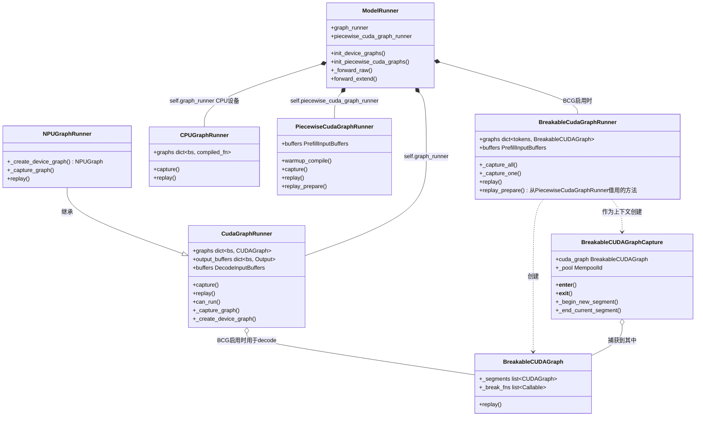
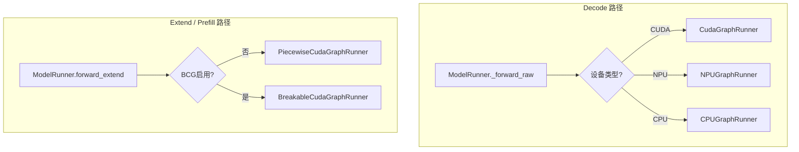
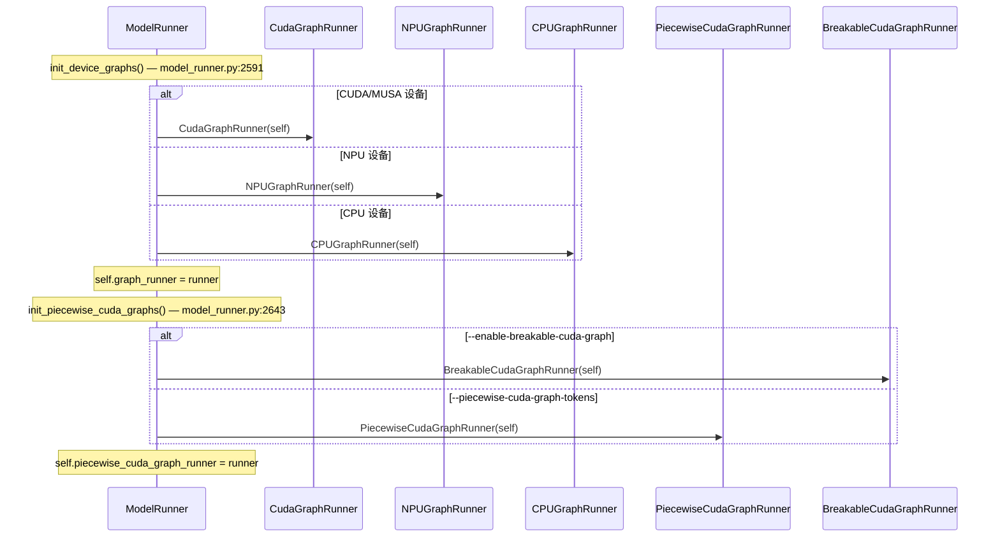
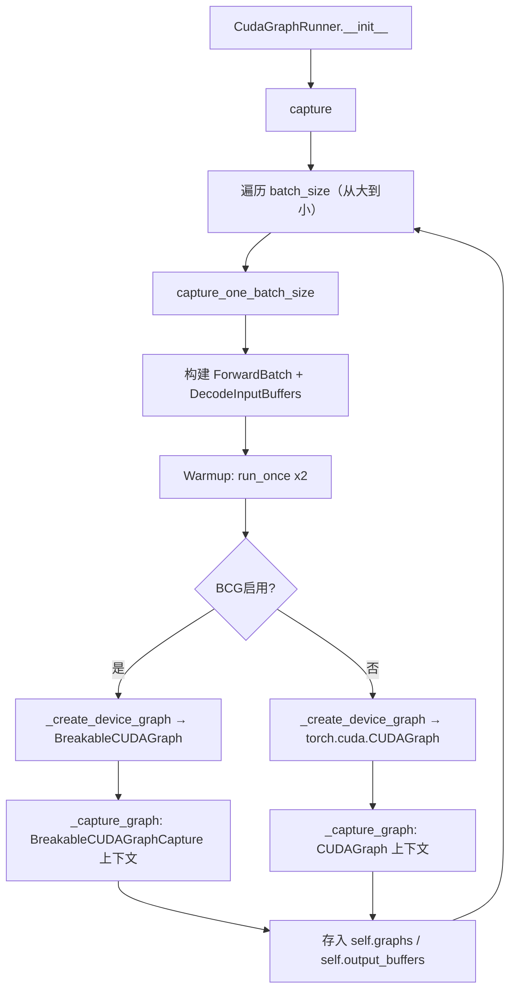
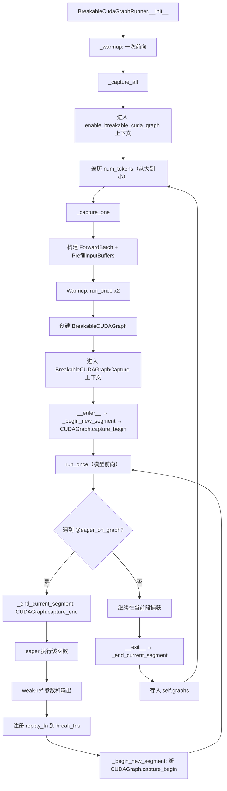
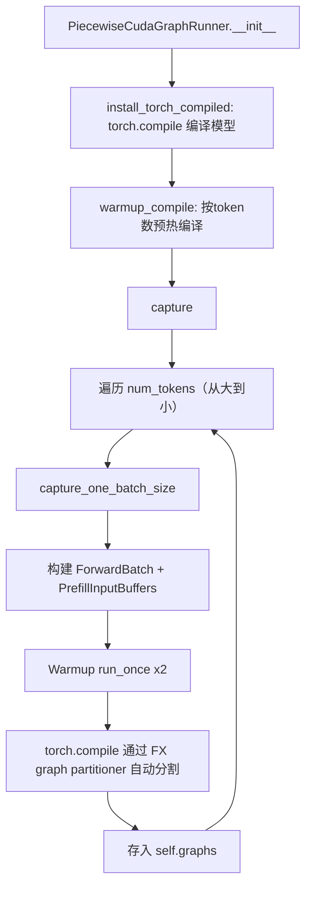
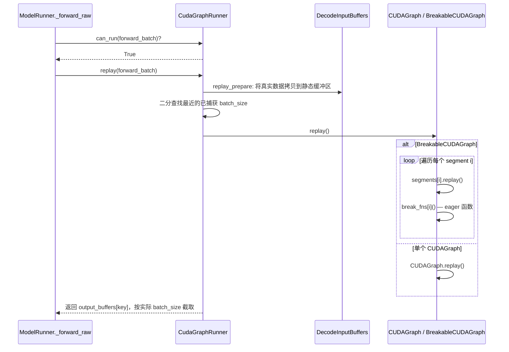
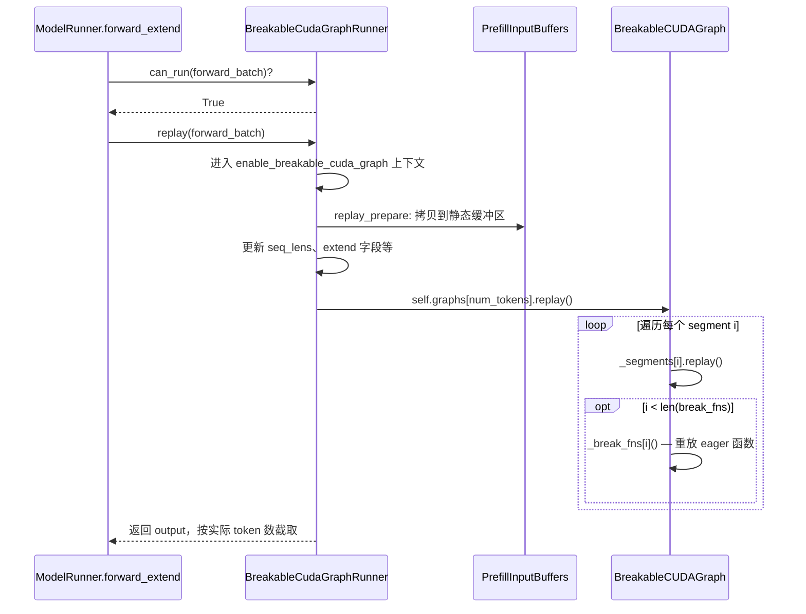
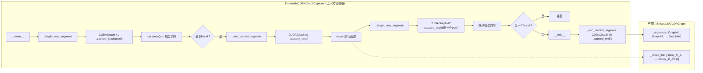
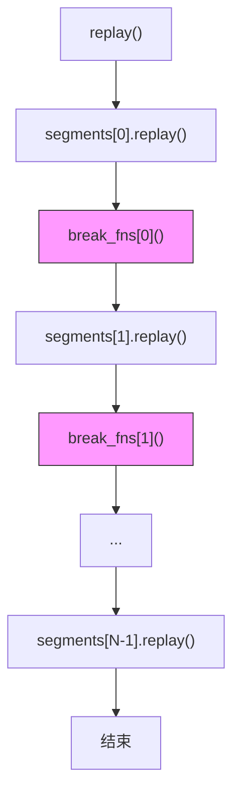

# SGLang Graph 特性 — 完整类层次结构

> 本文档梳理 sglang 中所有 graph 相关的类：定义位置、创建上下文、调用关系。
> 包含 mermaid 类图和流程图。

---

## 1. 类清单

所有路径相对于 `python/sglang/srt/`。

| 类 | 文件 | 行号 | 职责 |
|---|------|------|------|
| `CudaGraphRunner` | `model_executor/cuda_graph_runner.py` | 558 | Decode 模式 CUDA graph 捕获与重放 |
| `NPUGraphRunner` | `hardware_backend/npu/graph_runner/npu_graph_runner.py` | 73 | 昇腾 NPU 设备的 CudaGraphRunner 子类 |
| `CPUGraphRunner` | `model_executor/cpu_graph_runner.py` | 480 | CPU 设备 decode 路径，用 `torch.compile` |
| `PiecewiseCudaGraphRunner` | `model_executor/piecewise_cuda_graph_runner.py` | 145 | Extend 模式 PCG（torch.compile FX 分割） |
| `BreakableCudaGraphRunner` | `model_executor/breakable_cuda_graph_runner.py` | 71 | Extend 模式 BCG（eager break point） |
| `BreakableCUDAGraph` | `breakable_cuda_graph/breakable_cuda_graph.py` | 251 | 容器：CUDAGraph 段列表 + break 函数列表 |
| `BreakableCUDAGraphCapture` | `breakable_cuda_graph/breakable_cuda_graph.py` | 271 | 上下文管理器：管理多段捕获生命周期 |
| `eager_on_graph()` | `breakable_cuda_graph/breakable_cuda_graph.py` | 209 | 装饰器：在捕获中插入 graph break |
| `break_graph()` | `breakable_cuda_graph/breakable_cuda_graph.py` | 348 | 显式断点（函数体为空） |
| `DecodeInputBuffers` | `model_executor/cuda_graph_runner.py` | 133 | Decode 模式预分配 GPU 输入缓冲区 |
| `PrefillInputBuffers` | `model_executor/piecewise_cuda_graph_runner.py` | 72 | Extend 模式预分配 GPU 输入缓冲区 |
| `ForwardInputBuffers` | `model_executor/input_buffers.py` | 15 | 输入缓冲区管理基类 |

---

## 2. 类关系图



---

## 3. 两套并行的 Graph 系统

sglang 同时运行 **两套独立的 graph 系统**，一套用于 decode，一套用于 extend（prefill）：



| 系统 | Runner | Forward 模式 | 键 | Graph 技术 |
|------|--------|-------------|-----|-----------|
| Decode | `CudaGraphRunner` / `NPUGraphRunner` / `CPUGraphRunner` | DECODE, TARGET_VERIFY, IDLE | batch_size | `torch.cuda.CUDAGraph` / `torch.npu.NPUGraph` / `torch.compile` |
| Extend | `PiecewiseCudaGraphRunner` / `BreakableCudaGraphRunner` | EXTEND, MIXED | num_tokens | torch.compile FX 分割 **或** BreakableCUDAGraph 分段 |

---

## 4. 实例化 — 谁创建谁

所有 graph runner 由 `ModelRunner` 在初始化时创建。



---

## 5. Capture（捕获）流程

### 5A. Decode 捕获（CudaGraphRunner）



### 5B. Extend 捕获 — BCG（BreakableCudaGraphRunner）



### 5C. Extend 捕获 — PCG（PiecewiseCudaGraphRunner）



---

## 6. Replay（重放）流程

### 6A. Decode 重放



### 6B. Extend 重放 — BCG



---

## 7. BreakableCUDAGraph 内部工作机制



### BreakableCUDAGraph 重放



紫色节点 = 在 GPU graph 重放之间执行的 eager Python 函数。

---

## 8. 关键设计点

### 8.1 共享内存池

`BreakableCUDAGraph` 中所有段共享同一个 CUDA 内存池（`MempoolId_t`）。
- 段 N 分配的中间张量可以被段 N+1 复用
- 只要任意段的 CUDAGraph 存活，内存池就保持锁定（通过 `use_count`）
- `weak_ref_tensor` 视图在多次重放间保持有效

### 8.2 Stream 捕获 Hook

BCG 在捕获期间全局 hook `torch.cuda.Stream.wait_stream`，追踪 side stream 的
fork/join。在结束每个段之前（`_end_current_segment`），自动 join 所有已 fork 但
未 rejoin 的 stream，因为 `capture_end()` 在有参与捕获的 side stream 时会失败。

### 8.3 Weak-Ref 优化

`_weak_ref_if_tensor()` 对捕获的参数和输出创建弱引用视图，避免 Python 引用计数
阻止中间张量释放。存储生命周期由共享内存池的 `use_count` 管理。

### 8.4 方法借用（BreakableCudaGraphRunner）

`BreakableCudaGraphRunner` **不继承** `PiecewiseCudaGraphRunner`，而是通过
方法绑定借用 `replay_prepare`：

```python
replay_prepare = PiecewiseCudaGraphRunner.replay_prepare
```

避免深层继承，同时共享缓冲区准备逻辑。

### 8.5 Decode + BCG 组合

Decode 的 `CudaGraphRunner` 在设置 `SGLANG_USE_BREAKABLE_CUDA_GRAPH` 环境变量
时也可以使用 `BreakableCUDAGraph`。此时 `_create_device_graph()` 返回
`BreakableCUDAGraph` 而非 `torch.cuda.CUDAGraph`。

---

## 9. 文件索引

| 文件 | 包含的类/函数 |
|------|-------------|
| `model_executor/cuda_graph_runner.py` | `CudaGraphRunner`, `DecodeInputBuffers`, `DeepEPCudaGraphRunnerAdapter` |
| `model_executor/cpu_graph_runner.py` | `CPUGraphRunner` |
| `model_executor/piecewise_cuda_graph_runner.py` | `PiecewiseCudaGraphRunner`, `PrefillInputBuffers` |
| `model_executor/breakable_cuda_graph_runner.py` | `BreakableCudaGraphRunner` |
| `model_executor/model_runner.py:2591` | `init_device_graphs()` — 创建 decode runner |
| `model_executor/model_runner.py:2643` | `init_piecewise_cuda_graphs()` — 创建 extend runner |
| `breakable_cuda_graph/breakable_cuda_graph.py` | `BreakableCUDAGraph`, `BreakableCUDAGraphCapture`, `eager_on_graph()`, `break_graph()` |
| `breakable_cuda_graph/context.py` | `enable_breakable_cuda_graph()`, `is_in_breakable_cuda_graph()` |
| `breakable_cuda_graph/cuda_utils.py` | CUDA 运行时绑定辅助工具 |
| `breakable_cuda_graph/npu_utils.py` | NPU（昇腾 ACL）捕获状态检测 |
| `hardware_backend/npu/graph_runner/npu_graph_runner.py` | `NPUGraphRunner` |
| `compilation/piecewise_context_manager.py` | `enable_piecewise_cuda_graph()`, `ForwardContext` |
| `model_executor/input_buffers.py` | `ForwardInputBuffers`（基类） |
