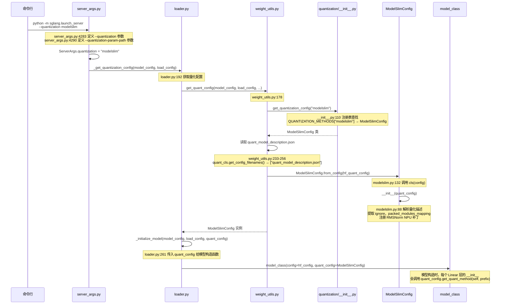
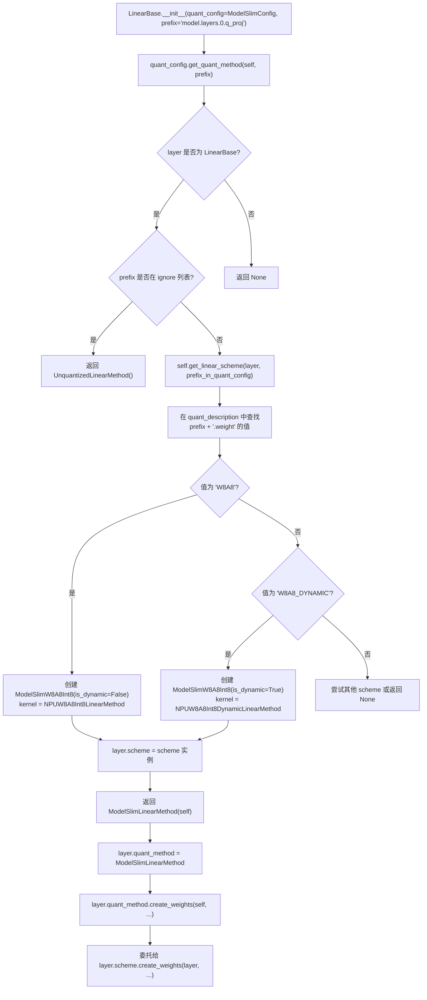
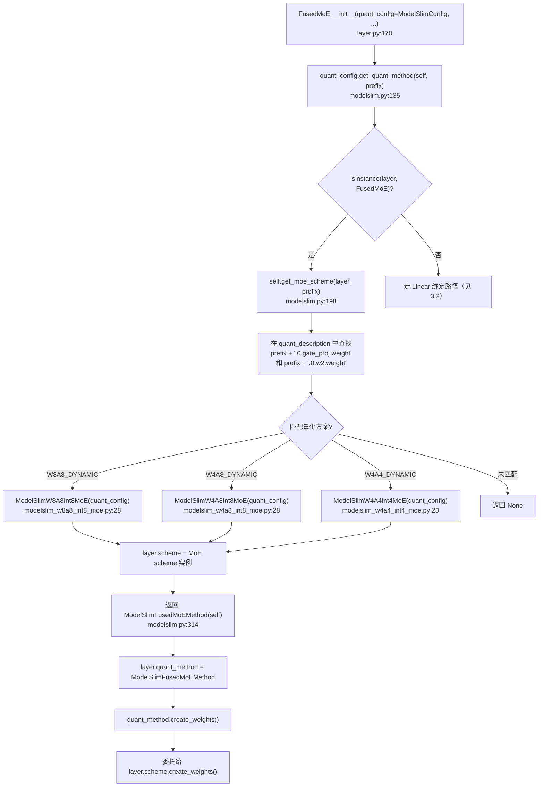
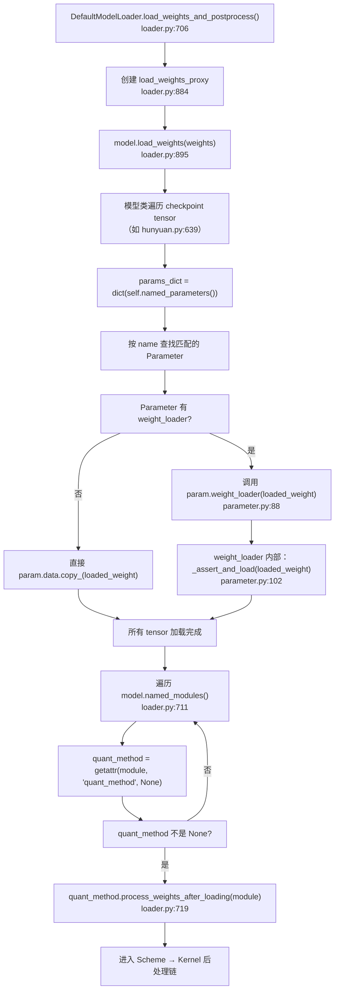
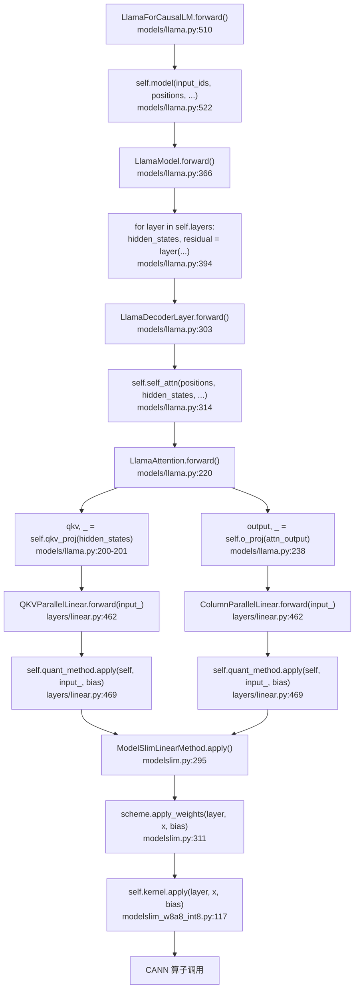
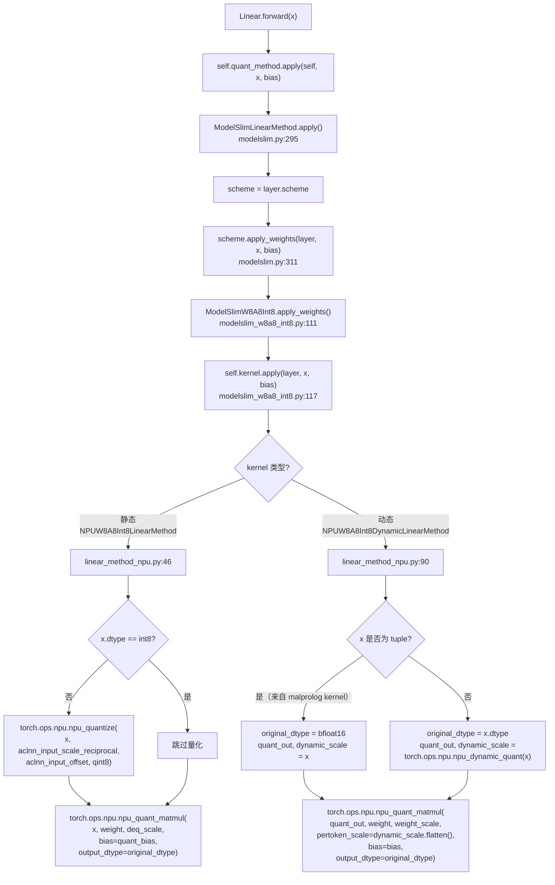

# NPU W8A8 INT8 量化完整调用链分析

> 本文档以 NPU W8A8 INT8 量化为例，从启动参数解析到实际推理执行，追踪完整的调用链路。
> 参考架构总览：[NPU 量化模块完整架构分析报告](./NPU%20量化模块完整架构分析报告.md)

---

## 第 1 章：启动与参数解析

### 1.1 职责概述

当用户通过命令行启动 sglang 服务并指定 `--quantization modelslim` 时，框架需要完成以下工作：
1. 解析命令行参数
2. 将量化方法名 `"modelslim"` 解析为 `ModelSlimConfig` 类
3. 从模型目录读取量化配置文件 `quant_model_description.json`
4. 实例化 `ModelSlimConfig` 并传递给模型

### 1.2 调用链



### 1.3 关键代码

**命令行参数定义**（`python/sglang/srt/server_args.py:4283-4298`）：

```python
# server_args.py:4283
parser.add_argument(
    "--quantization",
    type=str,
    default=ServerArgs.quantization,
    choices=QUANTIZATION_CHOICES,
    help="The quantization method.",
)
# server_args.py:4290
parser.add_argument(
    "--quantization-param-path",
    type=nullable_str,
    default=None,
    help="Path to the JSON file containing the KV cache scaling factors...",
)
```

【解释】`--quantization` 的 choices 包含所有注册的量化方法名，其中 `"modelslim"` 对应 NPU 专用量化。

**注册表查找**（`python/sglang/srt/layers/quantization/__init__.py:62-127`）：

```python
# __init__.py:86 — 注册表中 "modelslim" 映射到 ModelSlimConfig
BASE_QUANTIZATION_METHODS: Dict[str, Type[QuantizationConfig]] = {
    ...
    "modelslim": ModelSlimConfig,
    ...
}

# __init__.py:110 — 通过字符串查找量化配置类
def get_quantization_config(quantization: str) -> Type[QuantizationConfig]:
    if quantization not in QUANTIZATION_METHODS:
        raise ValueError(...)
    return QUANTIZATION_METHODS[quantization]
```

【解释】这是一个经典的注册表模式（Registry Pattern）。所有量化方法在导入时注册到字典中，运行时通过字符串名查找。

**量化配置文件读取**（`python/sglang/srt/model_loader/weight_utils.py:178-267`）：

```python
# weight_utils.py:184 — 通过注册表获取配置类
quant_cls = get_quantization_config(model_config.quantization)

# weight_utils.py:233 — 获取要查找的配置文件名
possible_config_filenames = quant_cls.get_config_filenames()

# weight_utils.py:254-256 — 读取 JSON 配置文件
quant_config_file = quant_config_files[0]
with open(quant_config_file) as f:
    config = json.load(f)
```

【解释】`ModelSlimConfig.get_config_filenames()` 返回 `["quant_model_description.json"]`（定义在 `modelslim.py:128`），框架会在模型目录中搜索这个文件并读取其内容。

**ModelSlimConfig 实例化**（`python/sglang/srt/layers/quantization/modelslim/modelslim.py:88-109`）：

```python
# modelslim.py:88
def __init__(self, quant_config: Dict[str, Any] = {}):
    super().__init__()
    self.quant_description = quant_config  # 完整的量化描述 JSON
    ignore = cast(List[str], quant_config.get("ignore", []))
    self.ignore = ignore if ignore is not None else []
    packed_modules_mapping = quant_config.get("packed_modules_mapping", {})
    self.packed_modules_mapping = (
        packed_modules_mapping if packed_modules_mapping is not None else {}
    )
    # modelslim.py:98-109 — 注册 RMSNorm NPU 补丁
    for name in self.quant_description.keys():
        if "norm.bias" in name:
            apply_module_patch("sglang.srt.layers.layernorm.RMSNorm", ...)
```

【解释】`quant_description` 是整个 `quant_model_description.json` 的内容，其中 key 是参数全路径（如 `model.layers.0.self_attn.q_proj.weight`），value 是量化类型（如 `"W8A8"` 或 `"W8A8_DYNAMIC"`）。这个字典在后续的 scheme 匹配中被直接查询。

**模型初始化时传递 quant_config**（`python/sglang/srt/model_loader/loader.py:261-281`）：

```python
# loader.py:261
def _initialize_model(model_config, load_config, quant_config=None):
    model_class, _ = get_model_architecture(model_config)
    return model_class(config=model_config.hf_config, quant_config=quant_config)
```

【解释】`quant_config`（即 `ModelSlimConfig` 实例）作为参数传入模型构造函数，模型内部每个 `LinearBase` 子类在 `__init__` 中会使用它。

### 1.4 完整启动流程补充

当前 1.2 的 sequenceDiagram 从 `server_args.py` 直接跳到了 `_get_quantization_config()`，中间省略了大量环节。以下是补全的完整启动调用链：

```mermaid
sequenceDiagram
    participant CLI as launch_server.py
    participant Args as ServerArgs
    participant Engine as Engine
    participant Subproc as Scheduler 子进程
    participant Sched as Scheduler
    participant Worker as TpModelWorker
    participant Runner as ModelRunner
    participant Loader as DefaultModelLoader
    participant QuantInit as quantization/__init__.py
    participant Config as ModelSlimConfig

    CLI->>Args: python -m sglang.launch_server<br/>launch_server.py:66
    CLI->>Args: prepare_server_args(sys.argv[1:])<br/>server_args.py:7081
    CLI->>Args: ServerArgs.from_cli_args(raw_args)<br/>server_args.py:7115
    Note over Args: ServerArgs.quantization = "modelslim"

    CLI->>Engine: launch_server(server_args)<br/>http_server.py:2313
    Engine->>Engine: Engine.__init__(**kwargs)<br/>engine.py:167
    Note over Engine: self.server_args = server_args<br/>engine.py:187

    Engine->>Subproc: _launch_subprocesses()<br/>engine.py:699
    Subproc->>Subproc: _launch_scheduler_processes()<br/>engine.py:577
    Note over Subproc: mp.Process(target=run_scheduler_process)<br/>启动子进程

    Subproc->>Sched: run_scheduler_process()<br/>scheduler.py:3764
    Sched->>Sched: Scheduler.__init__()<br/>scheduler.py:332
    Sched->>Sched: self.init_tp_worker()<br/>scheduler.py:636

    Sched->>Worker: TpModelWorker()<br/>tp_worker.py:340
    Worker->>Worker: _init_model_runner()<br/>tp_worker.py:340
    Worker->>Runner: ModelRunner()<br/>model_runner.py:301

    Runner->>Runner: self.load_model()<br/>model_runner.py:1193
    Runner->>Runner: get_model_loader()<br/>创建 DefaultModelLoader
    Runner->>Loader: loader.load_model()<br/>loader.py:675

    Loader->>Loader: _get_quantization_config(model_config, load_config)<br/>loader.py:192
    Loader->>Loader: get_quant_config()<br/>weight_utils.py:178
    Loader->>QuantInit: get_quantization_config("modelslim")<br/>__init__.py:110
    Note over QuantInit: QUANTIZATION_METHODS["modelslim"]<br/>→ ModelSlimConfig<br/>__init__.py:86
    QuantInit-->>Loader: ModelSlimConfig 类

    Loader->>Loader: 读取 quant_model_description.json<br/>weight_utils.py:233-256
    Loader->>Config: ModelSlimConfig.from_config(hf_quant_config)<br/>modelslim.py:132
    Config->>Config: __init__(quant_config)<br/>modelslim.py:88
    Note over Config: 解析 quant_description<br/>注册 RMSNorm NPU 补丁<br/>modelslim.py:98-109

    Loader-->>Runner: ModelSlimConfig 实例
    Runner->>Runner: _initialize_model(model_config, load_config, quant_config)<br/>loader.py:261
    Runner->>Runner: model_class(config=hf_config, quant_config=ModelSlimConfig)<br/>loader.py:281
    Note over Runner: LlamaModel.__init__() → make_layers()

    Runner->>Runner: make_layers(num_layers,<br/>lambda idx, prefix: LlamaDecoderLayer(...),<br/>prefix="model.layers")<br/>common.py:629
    Note over Runner: layer_fn = lambda idx, prefix:<br/>LlamaDecoderLayer(config, quant_config, idx, prefix)

    Runner->>Runner: LlamaDecoderLayer.__init__()<br/>models/llama.py:248

    Note over Runner: ====== 分支 A: Attention (Linear 量化) ======

    Runner->>Runner: self.self_attn = LlamaAttention(<br/>quant_config=quant_config,<br/>prefix="model.layers.{idx}.self_attn")<br/>models/llama.py:255

    Runner->>Runner: LlamaAttention.__init__()<br/>models/llama.py:165
    Note over Runner: 创建 qkv_proj 和 o_proj

    Runner->>Runner: self.qkv_proj = QKVParallelLinear(<br/>quant_config=quant_config,<br/>prefix="model.layers.{idx}.self_attn.qkv_proj")<br/>models/llama.py:165
    Runner->>Runner: QKVParallelLinear → super().__init__() →<br/>ColumnParallelLinear.__init__()<br/>linear.py:915-967
    Runner->>Runner: ColumnParallelLinear → super().__init__() →<br/>LinearBase.__init__(quant_config, prefix)<br/>linear.py:313-332
    Runner->>Runner: quant_config.get_quant_method(self, prefix)<br/>linear.py:181
    Note over Runner: isinstance(layer, LinearBase) → True<br/>modelslim.py:158 → get_linear_scheme()

    Note over Runner: ====== 分支 B: MLP (Linear 量化) ======

    Runner->>Runner: self.mlp = LlamaMLP(<br/>quant_config=quant_config,<br/>prefix="model.layers.{idx}.mlp")<br/>models/llama.py:291
    Runner->>Runner: LlamaMLP.__init__()<br/>models/llama.py:65
    Runner->>Runner: self.gate_up_proj = MergedColumnParallelLinear(<br/>quant_config, prefix="...gate_up_proj")<br/>models/llama.py:79
    Runner->>Runner: MergedColumnParallelLinear → super().__init__() →<br/>ColumnParallelLinear → LinearBase.__init__()<br/>linear.py:313-332
    Runner->>Runner: quant_config.get_quant_method(self, prefix)<br/>linear.py:181
    Note over Runner: isinstance(layer, LinearBase) → True<br/>modelslim.py:158 → get_linear_scheme()

    Note over Runner: ====== 分支 C: MoE 层（仅限 MoE 模型如 Llama4） ======

    Runner->>Runner: Llama4DecoderLayer.__init__()<br/>models/llama4.py:362
    Runner->>Runner: is_moe_layer = self._is_moe_layer(layer_id)<br/>models/llama4.py:394
    alt is_moe_layer == True
        Runner->>Runner: self.feed_forward = Llama4MoE(<br/>quant_config, prefix="...feed_forward")<br/>models/llama4.py:399
        Runner->>Runner: Llama4MoE.__init__()<br/>models/llama4.py:90
        Runner->>Runner: self.experts = FusedMoE(<br/>quant_config, prefix="...experts")<br/>models/llama4.py:117
        Runner->>Runner: FusedMoE.__init__()<br/>fused_moe/layer.py:160
        Runner->>Runner: self.quant_method = quant_config.get_quant_method(self, prefix)<br/>fused_moe/layer.py:280
        Note over Runner: isinstance(layer, FusedMoE) → True<br/>modelslim.py:166 → get_moe_scheme()
        Runner->>Runner: self.quant_method.create_weights(layer, ...)<br/>fused_moe/layer.py:286
    else is_moe_layer == False
        Runner->>Runner: self.feed_forward = LlamaMLP(...)<br/>models/llama4.py:406
        Note over Runner: 同分支 B 的 Linear 路径
    end

    Note over Runner: ====== 分支 D: KVCache 量化缩放因子加载 ======

    Runner->>Runner: 模型构造完成，返回 ModelRunner<br/>loader.py:281
    Runner->>Runner: load_weights_and_postprocess()<br/>loader.py:706
    Runner->>Runner: 权重加载 + process_weights_after_loading()
    Runner->>Runner: 检查 kv_cache_dtype == "fp8_e4m3"<br/>model_runner.py:1326
    alt kv_cache_dtype == fp8_e4m3 且 quantization_param_path 存在
        Runner->>Runner: model.load_kv_cache_scales(quantization_param_path)<br/>model_runner.py:1329
        Runner->>Runner: kv_cache_scales_loader(path, tp_rank, tp_size, ...)<br/>weight_utils.py:1535
        Note over Runner: 读取 JSON → QuantParamSchema 验证<br/>weight_utils.py:1557-1558
        Runner->>Runner: 遍历 layer_idx →<br/>layer.self_attn.attn.k_scale = scaling_factor<br/>layer.self_attn.attn.v_scale = scaling_factor<br/>models/llama.py:430-432
    else 无 quantization_param_path
        Note over Runner: KV cache 默认缩放因子 = 1.0<br/>model_runner.py:1343 警告日志
    end
```



**关键补充环节代码**：

```python
# launch_server.py:66 — 入口点
server_args = prepare_server_args(sys.argv[1:])
run_server(server_args)

# server_args.py:7081 — ServerArgs 创建
def prepare_server_args(argv: List[str]) -> ServerArgs:
    parser = argparse.ArgumentParser(prog="sglang serve")
    ServerArgs.add_cli_args(parser)
    raw_args = parser.parse_args(argv)
    return ServerArgs.from_cli_args(raw_args)

# engine.py:167 — Engine 初始化，启动子进程
def __init__(self, **kwargs):
    server_args = kwargs.get("server_args") or self.server_args_class(**kwargs)
    self.server_args = server_args
    # engine.py:699 — 启动子进程（TokenizerManager、Scheduler 等）
    self._launch_subprocesses(...)

# engine.py:577 — 通过 mp.Process 启动 Scheduler 子进程
proc = mp.Process(
    target=run_scheduler_process_func,
    args=(server_args, port_args, gpu_id, tp_rank, ...),
)

# scheduler.py:3764 — Scheduler 子进程入口
def run_scheduler_process(...):
    scheduler = Scheduler(...)

# scheduler.py:636 — Scheduler 创建 TpModelWorker
self.tp_worker = TpModelWorker(**worker_kwargs)

# tp_worker.py:340 — TpModelWorker 创建 ModelRunner
def _init_model_runner(self):
    self._model_runner = ModelRunner(
        model_config=self.model_config,
        mem_fraction_static=self.server_args.mem_fraction_static,
        gpu_id=self.gpu_id, tp_rank=self.tp_rank, ...
    )

# model_runner.py:301 — ModelRunner.__init__() 触发模型加载
def __init__(self, ...):
    ...
    self.load_model()  # model_runner.py:1193

# model_runner.py:1193 — ModelRunner.load_model()
def load_model(self):
    self.loader = get_model_loader(load_config=self.load_config, ...)
    self.model = self.loader.load_model(model_config=self.model_config, ...)

# loader.py:675 — DefaultModelLoader.load_model()
def load_model(self, *, model_config, device_config):
    model = _initialize_model(model_config, self.load_config, quant_config)
    self.load_weights_and_postprocess(model, self._get_all_weights(...), ...)
    return model.eval()

# common.py:629 — make_layers 创建模型层
def make_layers(num_hidden_layers, layer_fn, ...):
    modules = torch.nn.ModuleList(
        [PPMissingLayer(...) for _ in range(start_layer)]
        + get_offloader().wrap_modules(
            (layer_fn(idx=idx, prefix=add_prefix(idx, prefix))
             for idx in range(start_layer, end_layer)),
        )
        + [PPMissingLayer(...) for _ in range(end_layer, num_hidden_layers)]
    )

# models/llama.py:350 — LlamaModel 传入 layer_fn
self.layers, self.start_layer, self.end_layer = make_layers(
    config.num_hidden_layers,
    lambda idx, prefix: LlamaDecoderLayer(
        config=config, quant_config=quant_config,
        layer_id=idx, prefix=prefix
    ),
    prefix="model.layers",
)

# models/llama.py:248 — LlamaDecoderLayer 创建 Attention
class LlamaDecoderLayer(nn.Module):
    def __init__(self, config, layer_id=0, quant_config=None, prefix=""):
        ...
        self.self_attn = LlamaAttention(
            config=config, quant_config=quant_config,
            prefix=add_prefix("self_attn", prefix),  # → "model.layers.0.self_attn"
        )

# models/llama.py:165 — LlamaAttention 创建投影层
class LlamaAttention(nn.Module):
    def __init__(self, config, ..., quant_config=None, prefix=""):
        ...
        self.qkv_proj = QKVParallelLinear(
            hidden_size, self.head_dim, ...,
            quant_config=quant_config,
            prefix=add_prefix("qkv_proj", prefix),  # → "model.layers.0.self_attn.qkv_proj"
        )
        self.o_proj = RowParallelLinear(
            ..., quant_config=quant_config,
            prefix=add_prefix("o_proj", prefix),
        )

# linear.py:915 — QKVParallelLinear 调用父类 ColumnParallelLinear
class QKVParallelLinear(...):
    def __init__(self, ..., quant_config=None, prefix=""):
        super().__init__(  # → ColumnParallelLinear.__init__
            input_size, output_size, ..., quant_config, prefix
        )

# linear.py:313 — ColumnParallelLinear 调用父类 LinearBase
class ColumnParallelLinear(...):
    def __init__(self, ..., quant_config=None, prefix=""):
        super().__init__(  # → LinearBase.__init__
            input_size, output_size, ..., quant_config, prefix
        )

# linear.py:157 — LinearBase.__init__ 中触发量化绑定
class LinearBase(nn.Module):
    def __init__(self, ..., quant_config=None, prefix=""):
        ...
        self.quant_method = quant_config.get_quant_method(self, prefix=prefix)
```

**分支 B 补充：MLP 层（Linear 量化路径）**：

```python
# models/llama.py:291 — LlamaDecoderLayer 创建 MLP
self.mlp = LlamaMLP(
    hidden_size=self.hidden_size,
    intermediate_size=config.intermediate_size,
    hidden_act=config.hidden_act,
    quant_config=quant_config,
    prefix=add_prefix("mlp", prefix),  # → "model.layers.0.mlp"
)

# models/llama.py:65 — LlamaMLP.__init__() 创建两个 Linear 层
class LlamaMLP(nn.Module):
    def __init__(self, ..., quant_config=None, prefix=""):
        self.gate_up_proj = MergedColumnParallelLinear(
            hidden_size, [intermediate_size] * 2,
            quant_config=quant_config,
            prefix=add_prefix("gate_up_proj", prefix),  # → "model.layers.0.mlp.gate_up_proj"
        )   # models/llama.py:79
        self.down_proj = RowParallelLinear(
            intermediate_size, hidden_size,
            quant_config=quant_config,
            prefix=add_prefix("down_proj", prefix),  # → "model.layers.0.mlp.down_proj"
        )   # models/llama.py:88
```

【解释】LlamaDecoderLayer 的 MLP 分支创建两个 Linear 层：`gate_up_proj`（MergedColumnParallelLinear，融合 gate + up）和 `down_proj`（RowParallelLinear）。它们都继承自 LinearBase，在 `__init__` 中通过 `quant_config.get_quant_method()` 走 **Linear 量化绑定路径**（`modelslim.py:158-165`）。

**分支 C 补充：MoE 层（FusedMoE 量化路径）**：

对于 MoE 模型（如 Llama4），DecoderLayer 中 MLP 被 MoE 替代：

```python
# models/llama4.py:394-404 — Llama4DecoderLayer 根据 is_moe_layer 选择 MoE 或 MLP
is_moe_layer = self._is_moe_layer(layer_id)

if is_moe_layer:
    self.feed_forward = Llama4MoE(
        config=config, layer_id=layer_id,
        quant_config=quant_config,
        prefix=add_prefix("feed_forward", prefix),  # → "model.layers.{idx}.feed_forward"
    )   # models/llama4.py:399
else:
    self.feed_forward = LlamaMLP(...)  # 同分支 B

# models/llama4.py:90-126 — Llama4MoE.__init__() 创建 FusedMoE
class Llama4MoE(nn.Module):
    def __init__(self, config, layer_id, quant_config=None, prefix=""):
        self.router = ReplicatedLinear(
            config.hidden_size, config.num_local_experts,
            quant_config=None,  # router 不量化
            prefix=add_prefix("router", prefix),
        )   # models/llama4.py:103
        self.experts = FusedMoE(
            num_experts=config.num_local_experts,
            hidden_size=config.hidden_size,
            intermediate_size=intermediate_size_moe,
            quant_config=quant_config,
            prefix=add_prefix("experts", prefix),  # → "model.layers.{idx}.feed_forward.experts"
        )   # models/llama4.py:117

# fused_moe/layer.py:279-286 — FusedMoE.__init__() 中绑定量化方法
if quant_config is not None:
    self.quant_method = quant_config.get_quant_method(self, prefix)
    # → isinstance(layer, FusedMoE) == True
    # → modelslim.py:166-168 走 MoE 分支
if self.quant_method is None:
    self.quant_method = UnquantizedFusedMoEMethod(...)
self.quant_method.create_weights(layer=self, ...)

# modelslim.py:166-168 — ModelSlimConfig.get_quant_method() MoE 分支
elif isinstance(layer, FusedMoE):
    layer.scheme = self.get_moe_scheme(layer, prefix)
    return ModelSlimFusedMoEMethod(self)

# modelslim.py:198-224 — get_moe_scheme() 匹配 MoE 量化方案
def get_moe_scheme(self, layer, prefix):
    moe_quant_schemes = [
        ("W4A4_DYNAMIC", ModelSlimW4A4Int4MoE),
        ("W4A8_DYNAMIC", ModelSlimW4A8Int8MoE),
        ("W8A8_DYNAMIC", ModelSlimW8A8Int8MoE),
    ]
    moe_weight_suffixes = [".0.gate_proj.weight", ".0.w2.weight"]
    quant_schemes = [
        self.quant_description.get(prefix + suffix, "")
        for suffix in moe_weight_suffixes
    ]
    for scheme_name, scheme_class in moe_quant_schemes:
        if any(s == scheme_name for s in quant_schemes):
            return scheme_class(self)
```

【解释】MoE 层的量化绑定与 Linear 层的关键区别：
1. **判断条件**：`isinstance(layer, FusedMoE)` 而非 `isinstance(layer, LinearBase)`
2. **方案查找**：使用 `get_moe_scheme()` 而非 `get_linear_scheme()`，查找的 key 后缀是 `.0.gate_proj.weight` 和 `.0.w2.weight`（expert 的权重）
3. **返回的 Method**：`ModelSlimFusedMoEMethod` 而非 `ModelSlimLinearMethod`
4. **权重创建**：由 FusedMoE 在 `layer.py:286` 调用 `quant_method.create_weights()`

**分支 D 补充：KVCache 量化缩放因子加载**：

KVCache 量化与 Linear/MoE 量化是独立的路径，在权重加载完成后执行：

```python
# model_runner.py:1326-1348 — 模型加载完成后，检查 KVCache 量化需求
if self.server_args.kv_cache_dtype == "fp8_e4m3":
    if self.server_args.quantization_param_path is not None:
        if callable(getattr(self.model, "load_kv_cache_scales", None)):
            self.model.load_kv_cache_scales(
                self.server_args.quantization_param_path
            )   # model_runner.py:1329

# models/llama.py:417-436 — LlamaForCausalLM.load_kv_cache_scales()
def load_kv_cache_scales(self, quantization_param_path: str) -> None:
    tp_size = get_tensor_model_parallel_world_size()
    tp_rank = get_tensor_model_parallel_rank()
    for layer_idx, scaling_factor in kv_cache_scales_loader(
        quantization_param_path, tp_rank, tp_size,
        self.config.num_hidden_layers,
        self.config.__class__.model_type,
    ):   # models/llama.py:420
        if not isinstance(self.layers[layer_idx], nn.Identity):
            layer_self_attn = self.layers[layer_idx].self_attn
        if hasattr(layer_self_attn.attn, "k_scale"):
            layer_self_attn.attn.k_scale = scaling_factor
            layer_self_attn.attn.v_scale = scaling_factor

# weight_utils.py:1535-1560 — kv_cache_scales_loader() 读取 JSON 缩放因子
def kv_cache_scales_loader(filename, tp_rank, tp_size,
                           num_hidden_layers, model_type):
    with open(filename) as f:
        schema_dct = json.load(f)
        schema = QuantParamSchema.model_validate(schema_dct, context=context)
        layer_scales_map = schema.kv_cache.scaling_factor[tp_rank]
        return layer_scales_map.items()
```

【解释】KVCache 量化缩放因子的加载路径与 Linear/MoE 量化完全独立：
1. **触发条件**：`kv_cache_dtype == "fp8_e4m3"` 且 `quantization_param_path` 不为空
2. **数据来源**：外部 JSON 文件（不是模型 checkpoint），通过 `QuantParamSchema`（`weight_utils.py:1514`）验证结构
3. **作用对象**：每个 Attention 层的 `attn.k_scale` 和 `attn.v_scale`（定义在 `radix_attention.py:89-92`）
4. **用途**：在推理时对 KV cache 进行 FP8 量化和反量化（`flashinfer_backend.py:802,830`）
5. **默认行为**：如未提供 `quantization_param_path`，缩放因子默认为 1.0（`model_runner.py:1343` 警告）

#### 子进程架构说明

sglang 采用多进程架构，模型加载不发生在 Engine 主进程中：

```
Engine 主进程 (engine.py:167)
  │
  ├─ _launch_subprocesses() (engine.py:699)
  │    │
  │    ├─ 启动 TokenizerManager 子进程
  │    ├─ 启动 DetokenizerManager 子进程
  │    │
  │    └─ _launch_scheduler_processes() (engine.py:577)
  │         │
  │         └─ mp.Process(target=run_scheduler_process) (engine.py:577)
  │              │
  │              └─ Scheduler 子进程 (scheduler.py:332)
  │                   │
  │                   ├─ init_tp_worker() (scheduler.py:636)
  │                   │    │
  │                   │    └─ TpModelWorker (tp_worker.py:340)
  │                   │         │
  │                   │         └─ ModelRunner (model_runner.py:301)
  │                   │              │
  │                   │              └─ DefaultModelLoader.load_model() (loader.py:675)
  │                   │                   │
  │                   │                   ├─ _get_quantization_config() (loader.py:192)
  │                   │                   ├─ _initialize_model() (loader.py:261)
  │                   │                   └─ load_weights_and_postprocess() (loader.py:706)
  │                   │
  │                   └─ run_event_loop() — 推理循环
```

父进程与子进程通过 pipe（`pipe_writer.send()`）进行 IPC 通信，子进程初始化完成后发送结果回父进程。

### 1.5 RMSNorm NPU 补丁解释

在 `ModelSlimConfig.__init__()` 中（`modelslim.py:98-109`），当 `quant_description` 的键名包含 `"norm.bias"` 时，会对 `RMSNorm` 类进行 monkey-patch。

#### 为什么需要补丁？

NPU 的 W8A8 INT8 量化规范要求 RMSNorm 层添加 bias 参数。原始的 `RMSNorm`（`layernorm.py:175`）只有 `weight` 参数没有 `bias`，这与 NPU 量化规范不兼容。代码注释说明（`modelslim.py:46`）：

> The Ascend w8a8_int8 quantization requires adding a bias in rmsnorm

#### 补丁函数

**npu_wrapper_rmsnorm_init**（`modelslim.py:42-49`）—— 包装 `RMSNorm.__init__`：

```python
# modelslim.py:42
def npu_wrapper_rmsnorm_init(func):
    def init(self, hidden_size: int, **extra_args) -> None:
        func(self, hidden_size, **extra_args)  # 调用原始 __init__
        self.ignore_anti = True
        # 添加 NPU 量化所需的 bias 参数
        self.bias = torch.nn.Parameter(
            torch.zeros(hidden_size), requires_grad=False
        )
    return init
```

**npu_wrapper_rmsnorm_forward**（`modelslim.py:53-80`）—— 包装 `RMSNorm.forward_npu`：

```python
# modelslim.py:53
def npu_wrapper_rmsnorm_forward(func):
    def _rmsnorm_forward_oot(self, x, residual=None, post_residual_addition=None):
        if not x.is_contiguous():
            x = x.contiguous()
        if residual is not None:
            if post_residual_addition is not None:
                residual = residual + post_residual_addition
            from sgl_kernel_npu.norm.add_rmsnorm_bias import add_rmsnorm_bias
            out, residual_out = add_rmsnorm_bias(
                x, residual, self.weight.data, self.bias,
                self.variance_epsilon,
            )
            return out.to(x.dtype), residual_out
        # 无 residual 的路径：npu_rms_norm + bias
        out = torch.ops.npu.npu_rms_norm(
            x, self.weight.data, self.variance_epsilon
        )[0]
        out = out + self.bias
        return out.to(x.dtype)
    return _rmsnorm_forward_oot
```

**原始 RMSNorm 的对比**（`layernorm.py`）：

| 方法 | 原始实现 | NPU 补丁后 |
|------|---------|-----------|
| `__init__` | 只创建 `self.weight` | 额外创建 `self.bias`（零初始化） |
| `forward_npu` (有 residual) | `torch_npu.npu_add_rms_norm(residual, x, weight, eps)` | `add_rmsnorm_bias(x, residual, weight, bias, eps)` |
| `forward_npu` (无 residual) | `torch_npu.npu_rms_norm(x, weight, eps)[0]` | `npu_rms_norm(x, weight, eps)[0] + bias` |

#### 触发条件

```python
# modelslim.py:98-109
for name in self.quant_description.keys():
    if "norm.bias" in name:
        apply_module_patch(
            "sglang.srt.layers.layernorm.RMSNorm",
            "__init__", [npu_wrapper_rmsnorm_init],
        )
        apply_module_patch(
            "sglang.srt.layers.layernorm.RMSNorm",
            "forward_npu", [npu_wrapper_rmsnorm_forward],
        )
```

- `quant_description` 的 key 是参数全路径（如 `model.layers.0.input_layernorm.norm.bias`）
- 当量化配置文件中包含 `"norm.bias"` 键时，说明该模型在 NPU 上需要 RMSNorm 的 bias 支持
- `apply_module_patch` 是全局性补丁，影响所有 `RMSNorm` 实例
- 但只在 NPU 环境下且 `quant_description` 包含 `norm.bias` 时触发

---

## 第 2 章：类继承与组合关系

### 2.1 职责概述

W8A8 INT8 量化涉及三个层面的类：
- **Config 层**：`QuantizationConfig → ModelSlimConfig`，负责全局量化配置
- **Method 层**：`LinearMethodBase → _NPULinearMethodBase → ModelSlimLinearMethod`，作为"委托者"将调用转发给 Scheme
- **Scheme 层**：`BaseLinearScheme → ModelSlimLinearScheme → ModelSlimW8A8Int8`，负责权重注册
- **Kernel 层**：`LinearMethodBase → _NPULinearMethodBase → NPUW8A8Int8LinearMethod / NPUW8A8Int8DynamicLinearMethod`，负责推理计算

### 2.2 类图（Linear + MoE 完整体系）

```mermaid
classDiagram
    class QuantizationConfig {
        <<abstract>>
        +get_name() str
        +get_quant_method(layer, prefix) QuantizeMethodBase
        +get_supported_act_dtypes() List~dtype~
        +from_config(config) QuantizationConfig
    }

    class ModelSlimConfig {
        <<Linear,MoE>>
        +quant_description: Dict
        +ignore: List~str~
        +get_linear_scheme(layer, prefix) ModelSlimLinearScheme
        +get_moe_scheme(layer, prefix) ModelSlimMoEScheme
        +get_quant_method(layer, prefix) QuantizeMethodBase
    }

    %% ====== Linear 体系 ======

    class BaseLinearScheme {
        <<abstract,Linear>>
        +create_weights(*args, **kwargs)*
        +process_weights_after_loading(layer)*
        +apply_weights(layer, x, bias)*
    }

    class ModelSlimLinearScheme {
        <<abstract,Linear>>
        +create_weights(*args, **kwargs)*
        +process_weights_after_loading(layer)*
        +apply_weights(layer, x, bias)*
    }

    class ModelSlimW8A8Int8 {
        <<Linear>>
        +quant_config: Dict
        +is_dynamic: bool
        +kernel: _NPULinearMethodBase
        +create_weights(layer, ...)
        +process_weights_after_loading(layer)
        +apply_weights(layer, x, bias)
    }

    class ModelSlimW4A4Int4 {
        <<Linear>>
        +quant_config: Dict
        +kernel: _NPULinearMethodBase
        +create_weights(layer, ...)
        +apply_weights(layer, x, bias)
    }

    class LinearMethodBase {
        <<abstract,Linear>>
        +create_weights(layer, ...)*
        +apply(layer, x, bias)*
        +process_weights_after_loading(layer)
    }

    class _NPULinearMethodBase {
        <<Linear>>
        +quant_config: QuantizationConfig
    }

    class ModelSlimLinearMethod {
        <<Linear>>
        +quantization_config: ModelSlimConfig
        +create_weights(layer, ...)
        +process_weights_after_loading(layer)
        +apply(layer, x, bias)
    }

    class NPUW8A8Int8LinearMethod {
        <<Linear>>
        +process_weights_after_loading(layer)
        +apply(layer, x, bias)
    }

    class NPUW8A8Int8DynamicLinearMethod {
        <<Linear>>
        +process_weights_after_loading(layer)
        +apply(layer, x, bias)
    }

    class NPU_W4A4DynamicLinearMethod {
        <<Linear>>
        +process_weights_after_loading(layer)
        +apply(layer, x, bias)
    }

    %% ====== MoE 体系 ======

    class BaseMoEScheme {
        <<abstract,MoE>>
        +create_weights(*args, **kwargs)*
        +process_weights_after_loading(layer)*
        +apply(layer, dispatch_output)*
    }

    class ModelSlimMoEScheme {
        <<abstract,MoE>>
        +create_weights(*args, **kwargs)*
        +process_weights_after_loading(layer)*
        +apply(layer, dispatch_output)*
    }

    class ModelSlimW8A8Int8MoE {
        <<MoE>>
        +kernel: NPUW8A8Int8DynamicMoEMethod
        +create_weights(layer, ...)
        +process_weights_after_loading(layer)
    }

    class ModelSlimW4A8Int8MoE {
        <<MoE>>
        +kernel: NPUW4A8Int8DynamicMoEMethod
        +create_weights(layer, ...)
        +process_weights_after_loading(layer)
    }

    class ModelSlimW4A4Int4MoE {
        <<MoE>>
        +kernel: NPUW4A4Int4DynamicMoEMethod
        +create_weights(layer, ...)
        +process_weights_after_loading(layer)
    }

    class FusedMoEMethodBase {
        <<abstract,MoE>>
        +create_weights(layer, ...)*
        +apply(layer, ...)*
        +process_weights_after_loading(layer)
    }

    class _NPUFusedMoEMethodBase {
        <<MoE>>
    }

    class ModelSlimFusedMoEMethod {
        <<MoE>>
        +create_weights(layer, ...)
        +process_weights_after_loading(layer)
        +apply(layer, ...)
    }

    class NPUW8A8Int8DynamicMoEMethod {
        <<MoE>>
        +process_weights_after_loading(layer)
        +apply(layer, dispatch_output)
    }

    class NPUW4A8Int8DynamicMoEMethod {
        <<MoE>>
        +process_weights_after_loading(layer)
        +apply(layer, dispatch_output)
    }

    class NPUW4A4Int4DynamicMoEMethod {
        <<MoE>>
        +process_weights_after_loading(layer)
        +apply(layer, dispatch_output)
    }

    %% ====== 继承关系 ======

    QuantizationConfig <|-- ModelSlimConfig

    BaseLinearScheme <|-- ModelSlimLinearScheme
    ModelSlimLinearScheme <|-- ModelSlimW8A8Int8
    ModelSlimLinearScheme <|-- ModelSlimW4A4Int4

    LinearMethodBase <|-- _NPULinearMethodBase
    _NPULinearMethodBase <|-- ModelSlimLinearMethod
    _NPULinearMethodBase <|-- NPUW8A8Int8LinearMethod
    _NPULinearMethodBase <|-- NPUW8A8Int8DynamicLinearMethod
    _NPULinearMethodBase <|-- NPU_W4A4DynamicLinearMethod

    BaseMoEScheme <|-- ModelSlimMoEScheme
    ModelSlimMoEScheme <|-- ModelSlimW8A8Int8MoE
    ModelSlimMoEScheme <|-- ModelSlimW4A8Int8MoE
    ModelSlimMoEScheme <|-- ModelSlimW4A4Int4MoE

    FusedMoEMethodBase <|-- _NPUFusedMoEMethodBase
    _NPUFusedMoEMethodBase <|-- ModelSlimFusedMoEMethod
    _NPUFusedMoEMethodBase <|-- NPUW8A8Int8DynamicMoEMethod
    _NPUFusedMoEMethodBase <|-- NPUW4A8Int8DynamicMoEMethod
    _NPUFusedMoEMethodBase <|-- NPUW4A4Int4DynamicMoEMethod

    %% ====== 组合关系 ======

    ModelSlimW8A8Int8 --> _NPULinearMethodBase : kernel
    ModelSlimW4A4Int4 --> _NPULinearMethodBase : kernel
    ModelSlimW8A8Int8MoE --> NPUW8A8Int8DynamicMoEMethod : kernel
    ModelSlimW4A8Int8MoE --> NPUW4A8Int8DynamicMoEMethod : kernel
    ModelSlimW4A4Int4MoE --> NPUW4A4Int4DynamicMoEMethod : kernel

    ModelSlimConfig ..> ModelSlimW8A8Int8 : get_linear_scheme()
    ModelSlimConfig ..> ModelSlimLinearMethod : get_quant_method()
    ModelSlimConfig ..> ModelSlimW8A8Int8MoE : get_moe_scheme()
    ModelSlimConfig ..> ModelSlimFusedMoEMethod : get_quant_method()

    ModelSlimLinearMethod ..> ModelSlimW8A8Int8 : delegates to layer.scheme
    ModelSlimFusedMoEMethod ..> ModelSlimW8A8Int8MoE : delegates to layer.scheme
```



### 2.3 各类职责说明

#### Linear 体系

| 类名 | 文件路径 | 行号 | 职责 |
|------|---------|------|------|
| `QuantizationConfig` | `layers/quantization/base_config.py` | L124 | 抽象基类，定义量化配置接口 |
| `ModelSlimConfig` | `layers/quantization/modelslim/modelslim.py` | L83 | NPU 专用配置，解析 `quant_model_description.json`，分发 scheme |
| `BaseLinearScheme` | `layers/quantization/base_scheme.py` | L16 | Scheme 抽象基类（通用，GPU/NPU 共享） |
| `ModelSlimLinearScheme` | `layers/quantization/modelslim/schemes/modelslim_scheme.py` | L18 | NPU Linear Scheme 抽象基类 |
| `ModelSlimW8A8Int8` | `layers/quantization/modelslim/schemes/modelslim_w8a8_int8.py` | L20 | W8A8 INT8 具体方案，注册权重参数，持有 kernel 引用 |
| `ModelSlimW4A4Int4` | `layers/quantization/modelslim/schemes/modelslim_w4a4_int4.py` | L16 | W4A4 INT4 具体方案 |
| `LinearMethodBase` | `layers/quantization/base_config.py` | L44 | 量化方法抽象基类，定义 create_weights/apply 接口 |
| `_NPULinearMethodBase` | `hardware_backend/npu/quantization/linear_method_npu.py` | L12 | NPU 线性方法基类 |
| `ModelSlimLinearMethod` | `layers/quantization/modelslim/modelslim.py` | L261 | 委托者，将所有调用转发给 `layer.scheme` |
| `NPUW8A8Int8LinearMethod` | `hardware_backend/npu/quantization/linear_method_npu.py` | L21 | 静态 W8A8 kernel：权重后处理 + 量化 matmul |
| `NPUW8A8Int8DynamicLinearMethod` | `hardware_backend/npu/quantization/linear_method_npu.py` | L79 | 动态 W8A8 kernel：动态量化 + matmul |
| `NPU_W4A4DynamicLinearMethod` | `hardware_backend/npu/quantization/linear_method_npu.py` | L114 | 动态 W4A4 kernel |

#### MoE 体系

| 类名 | 文件路径 | 行号 | 职责 |
|------|---------|------|------|
| `BaseMoEScheme` | `layers/quantization/base_scheme.py` | L55 | MoE Scheme 抽象基类 |
| `ModelSlimMoEScheme` | `layers/quantization/modelslim/schemes/modelslim_scheme.py` | L57 | NPU MoE Scheme 抽象基类 |
| `ModelSlimW8A8Int8MoE` | `layers/quantization/modelslim/schemes/modelslim_w8a8_int8_moe.py` | L28 | W8A8 动态 MoE 方案 |
| `ModelSlimW4A8Int8MoE` | `layers/quantization/modelslim/schemes/modelslim_w4a8_int8_moe.py` | L28 | W4A8 动态 MoE 方案 |
| `ModelSlimW4A4Int4MoE` | `layers/quantization/modelslim/schemes/modelslim_w4a4_int4_moe.py` | L28 | W4A4 动态 MoE 方案 |
| `FusedMoEMethodBase` | `layers/quantization/base_config.py` | L84 | MoE 量化方法抽象基类 |
| `_NPUFusedMoEMethodBase` | `hardware_backend/npu/quantization/fused_moe_method_npu.py` | L387 | NPU MoE 方法基类 |
| `ModelSlimFusedMoEMethod` | `layers/quantization/modelslim/modelslim.py` | L314 | MoE 委托者，转发给 `layer.scheme` |
| `NPUW8A8Int8DynamicMoEMethod` | `hardware_backend/npu/quantization/fused_moe_method_npu.py` | L464 | W8A8 动态 MoE kernel |
| `NPUW4A8Int8DynamicMoEMethod` | `hardware_backend/npu/quantization/fused_moe_method_npu.py` | L586 | W4A8 动态 MoE kernel |
| `NPUW4A4Int4DynamicMoEMethod` | `hardware_backend/npu/quantization/fused_moe_method_npu.py` | L396 | W4A4 动态 MoE kernel |

### 2.4 架构总览图（Config → Method → Scheme → Kernel 四层）

```
┌───────────────────────────────────────────────────────┐
│                    Config 层                          │
│               负责量化配置选择                         │
│              (ModelSlimConfig)                        │
│         根据 quant_description 分发 Scheme            │
└───────────────────────────────────────────────────────┘
                            │
                            ▼
┌───────────────────────────────────────────────────────┐
│                    Method 层                          │
│     负责权重创建、后处理和推理执行的入口              │
│  (ModelSlimLinearMethod / ModelSlimFusedMoEMethod)  │
│          纯委托者，转发所有调用给 Scheme              │
└───────────────────────────────────────────────────────┘
                            │
                            ▼
┌───────────────────────────────────────────────────────┐
│                    Scheme 层                          │
│      负责具体量化方案实现（权重注册 + 委托 Kernel）   │
│  (ModelSlimW8A8Int8 / ModelSlimW8A8Int8MoE 等)     │
│          知道"权重长什么样"，持有 kernel 引用         │
└───────────────────────────────────────────────────────┘
                            │
                            ▼
┌───────────────────────────────────────────────────────┐
│                    Kernel 层                          │
│            负责底层 NPU 算子调用                      │
│  (NPUW8A8Int8*Method / NPUW8A8Int8DynamicMoEMethod)  │
│       知道"怎么计算"：后处理 + CANN 算子调用          │
└───────────────────────────────────────────────────────┘
```

### 2.5 核心设计：双向组合

```
ModelSlimLinearMethod（委托者）            ModelSlimW8A8Int8（Scheme）
  ├─ create_weights() → layer.scheme.create_weights()  ← 注册权重参数
  ├─ process_weights_after_loading() → layer.scheme     ← 委托
  │     .process_weights_after_loading()
  └─ apply() → layer.scheme.apply_weights()             ← 委托

ModelSlimW8A8Int8（Scheme）                NPUW8A8Int8*LinearMethod（Kernel）
  ├─ create_weights() → 自己实现            ├─ process_weights_after_loading()
  ├─ process_weights_after_loading()          → transpose, format_cast, flatten
  │     → self.kernel.process_weights_after_loading()
  └─ apply_weights()                        └─ apply()
        → self.kernel.apply()                  → CANN 算子调用
```

【解释】Scheme 负责"权重长什么样"（参数注册），Kernel 负责"怎么计算"（后处理 + 推理）。两者通过 `self.kernel` 组合，而不是继承。

### 2.6 NPU vs GPU 架构对比

#### GPU 传统模式（无 Scheme）

以 `W8A8Int8LinearMethod` 为代表（`w8a8_int8.py`），所有功能集中在一个类中：

```python
# w8a8_int8.py — GPU 传统模式，单类包含全部逻辑
class W8A8Int8LinearMethod(LinearMethodBase):
    def create_weights(self, layer, ...):
        weight = ModelWeightParameter(...)      # 注册权重
        weight_scale = ChannelQuantScaleParameter(...)
        layer.register_parameter("weight", weight)
        layer.register_parameter("weight_scale", weight_scale)

    def apply(self, layer, x, bias):
        output = int8_scaled_mm(x_q, layer.weight, x_scale, layer.weight_scale, ...)
        return output
```

#### GPU compressed_tensors 模式（有 Scheme，但自包含）

```python
# compressed_tensors_w8a8_int8.py — Scheme 自包含，apply_weights 直接调用算子
class CompressedTensorsW8A8Int8(CompressedTensorsLinearScheme):
    def apply_weights(self, layer, x, bias):
        x_q, x_scale = per_token_quant_int8(x)
        return int8_scaled_mm(x_q, layer.weight, x_scale, layer.weight_scale, ...)
        # 直接调用 int8_scaled_mm，不委托给单独的 Kernel 类

class NPUCompressedTensorsW8A8Int8(CompressedTensorsW8A8Int8):
    def __init__(self, ...):
        super().__init__(...)
        self.kernel = NPUW8A8Int8DynamicLinearMethod()  # NPU 变体才委托给 Kernel

    def apply_weights(self, layer, x, bias):
        return self.kernel.apply(layer, x, bias)
```

#### 三种模式对比表

| 维度 | GPU 传统模式 | GPU compressed_tensors | NPU modelslim |
|------|-------------|----------------------|---------------|
| 架构模式 | 单类 | Scheme 自包含 | **Scheme + Kernel + Method 三层** |
| `create_weights` | `W8A8Int8LinearMethod` | `CompressedTensorsW8A8Int8` | `ModelSlimW8A8Int8`（Scheme） |
| `process_weights_after_loading` | 同一个类 | 同一个类 | `NPUW8A8Int8*LinearMethod`（Kernel） |
| `apply` | 同一个类 | 同一个类（直接调 `int8_scaled_mm`） | Kernel 类（调 `npu_quant_matmul`） |
| Kernel 调用 | 直接调 `int8_scaled_mm` | 直接调 `int8_scaled_mm` | 委托给 `_NPULinearMethodBase` 子类 |
| 核心计算函数 | `int8_scaled_mm` | `int8_scaled_mm` | `npu_quant_matmul` / `npu_quantize` |
| 权重后处理 | `weight.t()` | `requantize_with_max_scale` | `transpose` + `npu_format_cast` + 创建 `aclnn_*` 参数 |
| 文件路径 | `w8a8_int8.py` | `compressed_tensors_w8a8_int8.py` | `modelslim_w8a8_int8.py` + `linear_method_npu.py` |

#### 关键架构差异

1. **GPU 两种模式**：无论有无 Scheme，`apply` 都直接调用 `int8_scaled_mm`——计算逻辑和权重管理在同一个或自包含的类中
2. **NPU modelslim 模式**：三层分离——Method（纯委托）→ Scheme（权重注册 + 委托）→ Kernel（实际计算）。这种分离是因为 NPU 的 CANN 算子有特殊的参数预处理需求（如 `aclnn_input_scale`、`npu_format_cast`），需要独立的 Kernel 层来管理

---

## 第 3 章：量化方法绑定流程

### 3.1 职责概述

当模型的每个 `LinearBase` 层初始化时，需要完成两件事：
1. **确定 Scheme**：根据该层在 `quant_model_description.json` 中的配置，选择对应的 Scheme 实例
2. **绑定 Method**：将 `ModelSlimLinearMethod` 设为该层的 `quant_method`，后续所有操作通过它委托

### 3.2 绑定流程图



### 3.3 关键代码

**LinearBase 绑定 quant_method**（`python/sglang/srt/layers/linear.py:157-181`）：

```python
# linear.py:157
class LinearBase(torch.nn.Module):
    def __init__(self, input_size, output_size, ..., quant_config=None, prefix=""):
        super().__init__()
        self.quant_config = quant_config
        if quant_config is None:
            self.quant_method = UnquantizedLinearMethod()
        else:
            # linear.py:181 — 调用 ModelSlimConfig.get_quant_method()
            self.quant_method = quant_config.get_quant_method(self, prefix=prefix)
```

【解释】每个 Linear 层在构造时，通过 `quant_config.get_quant_method()` 获取对应的量化方法。对于 modelslim，这返回一个 `ModelSlimLinearMethod` 实例。

**get_quant_method 分发**（`python/sglang/srt/layers/quantization/modelslim/modelslim.py:135-165`）：

```python
# modelslim.py:135
def get_quant_method(self, layer, prefix):
    if isinstance(layer, LinearBase):
        # modelslim.py:160-164 — 检查是否跳过
        if self.is_layer_skipped(prefix, ...):
            return UnquantizedLinearMethod()
        # modelslim.py:164 — 设置 layer.scheme
        layer.scheme = self.get_linear_scheme(layer, prefix_in_quant_config)
        # modelslim.py:165 — 返回委托者
        return ModelSlimLinearMethod(self)
    elif isinstance(layer, FusedMoE):
        layer.scheme = self.get_moe_scheme(layer, prefix)
        return ModelSlimFusedMoEMethod(self)
    return None
```

【解释】关键设计：`layer.scheme` 在此处被赋值。`layer.scheme` 是 Scheme 实例，`quant_method` 是 Method 实例。两者是不同的对象，Method 持有 Config 引用，通过 `layer.scheme` 间接访问 Scheme。

**Scheme 匹配**（`python/sglang/srt/layers/quantization/modelslim/modelslim.py:171-196`）：

```python
# modelslim.py:171
def get_linear_scheme(self, layer, prefix=None):
    # modelslim.py:179-183 — 配置驱动的 scheme 列表
    linear_quant_schemes = [
        ("W4A4_DYNAMIC", ModelSlimW4A4Int4),
        ("W8A8", ModelSlimW8A8Int8),
        ("W8A8_DYNAMIC", ModelSlimW8A8Int8),
    ]
    # modelslim.py:185 — 从 quant_description 中查找该层的量化类型
    quant_schemes = [self.quant_description.get(prefix + ".weight", "")]
    # modelslim.py:187-190 — 依次匹配
    for scheme_name, scheme_class in linear_quant_schemes:
        if any(s == scheme_name for s in quant_schemes):
            return scheme_class(quant_config=self.quant_description, prefix=prefix)
    return None
```

【解释】这是一个配置驱动的分发机制。注意 `"W8A8"` 和 `"W8A8_DYNAMIC"` 都映射到同一个类 `ModelSlimW8A8Int8`，但构造时 `is_dynamic` 参数不同，从而选择不同的 kernel。

**ReplicatedLinear 调用 create_weights**（`python/sglang/srt/layers/linear.py:208-237`）：

```python
# linear.py:228-237 — ReplicatedLinear.__init__()
assert self.quant_method is not None
self.quant_method.create_weights(
    self,                       # layer 自身
    self.input_size,
    [self.output_size],
    self.input_size,
    self.output_size,
    self.params_dtype,
    weight_loader=self.weight_loader,
)
```

【解释】`create_weights` 在 Linear 层构造函数中被调用，此时 `layer.scheme` 已经被 `get_quant_method` 设置好了。`ModelSlimLinearMethod.create_weights()` 会将调用委托给 `layer.scheme.create_weights()`。

### 3.4 MoE 绑定流程

当模型包含 FusedMoE 层时（如 Mixtral），`get_quant_method` 中的 `isinstance(layer, FusedMoE)` 分支被触发，进入 MoE 绑定路径。

#### MoE 绑定流程图



#### 关键代码

**get_moe_scheme 方法**（`python/sglang/srt/layers/quantization/modelslim/modelslim.py:198-224`）：

```python
# modelslim.py:198
def get_moe_scheme(self, layer, prefix):
    # modelslim.py:203-207 — 配置驱动的 MoE scheme 列表
    moe_quant_schemes = [
        ("W4A4_DYNAMIC", ModelSlimW4A4Int4MoE),
        ("W4A8_DYNAMIC", ModelSlimW4A8Int8MoE),
        ("W8A8_DYNAMIC", ModelSlimW8A8Int8MoE),
    ]
    # modelslim.py:209-212 — 使用 gate_proj 和 w2 的权重后缀查找
    moe_weight_suffixes = [".0.gate_proj.weight", ".0.w2.weight"]
    quant_schemes = [
        self.quant_description.get(prefix + suffix, "")
        for suffix in moe_weight_suffixes
    ]
    # modelslim.py:215-220 — 依次匹配
    for scheme_name, scheme_class in moe_quant_schemes:
        if any(s == scheme_name for s in quant_schemes):
            return scheme_class(self)
```

**ModelSlimFusedMoEMethod 的委托**（`python/sglang/srt/layers/quantization/modelslim/modelslim.py:314`）：

与 `ModelSlimLinearMethod` 类似，`ModelSlimFusedMoEMethod` 也是纯委托者：
- `create_weights()` → `layer.scheme.create_weights()`
- `process_weights_after_loading()` → `layer.scheme.process_weights_after_loading()` → `self.kernel.process_weights_after_loading()`
- `apply()` → `layer.scheme.apply()` → `self.kernel.apply()`

**MoE Scheme 与 Linear Scheme 的对比**：

| 维度 | Linear Scheme | MoE Scheme |
|------|--------------|------------|
| 查找键 | `prefix + ".weight"` | `prefix + ".0.gate_proj.weight"` 和 `".0.w2.weight"` |
| Scheme 基类 | `ModelSlimLinearScheme` | `ModelSlimMoEScheme` |
| Method 基类 | `ModelSlimLinearMethod`（继承 `_NPULinearMethodBase`） | `ModelSlimFusedMoEMethod`（继承 `_NPUFusedMoEMethodBase`） |
| Kernel 示例 | `NPUW8A8Int8DynamicLinearMethod` | `NPUW8A8Int8DynamicMoEMethod` |
| 权重结构 | 单个 weight 矩阵 | `w13_weight` + `w2_weight`（gate+up 合并 + down） |

---

## 第 4 章：权重创建与后处理

### 4.1 职责概述

权重处理分为两个阶段：
1. **create_weights()**：注册空的 Parameter 占位符，声明每种参数的类型和形状
2. **process_weights_after_loading()**：权重从 checkpoint 加载完毕后，进行 transpose、format cast 等转换

### 4.2 权重创建流程图

```mermaid
flowchart TD
    subgraph "create_weights 阶段"
        A["ModelSlimLinearMethod.create_weights()"] --> B["layer.scheme.create_weights()<br/>(ModelSlimW8A8Int8)"]
        B --> C["注册 weight: int8<br/>shape=[out, in]"]
        B --> D["注册 weight_scale: float<br/>shape=[out, 1]"]
        B --> E["注册 weight_offset: float<br/>shape=[out, 1]"]
        B --> F{"is_dynamic?"}
        F -->|否 静态| G["注册 input_scale: float<br/>shape=[1]"]
        G --> H["注册 input_offset: float<br/>shape=[1]"]
        H --> I["注册 quant_bias: int32<br/>shape=[out]"]
        I --> J["注册 deq_scale: float32/int64<br/>shape=[out]"]
        F -->|是 动态| K["（不注册额外参数）"]
    end

    subgraph "权重加载（由框架自动完成）"
        L["model.load_weights(weights)<br/>loader.py:708"]
    end

    subgraph "process_weights_after_loading 阶段"
        M["loader.py:711-719 遍历所有模块"]
        M --> N["quant_method.process_weights_after_loading(module)"]
        N --> O["ModelSlimLinearMethod.process_weights_after_loading()<br/>modelslim.py:266"]
        O --> P["layer.scheme.process_weights_after_loading(layer)<br/>modelslim.py:267"]
        P --> Q["self.kernel.process_weights_after_loading(layer)<br/>modelslim_w8a8_int8.py:109"]
        Q --> R{"is_dynamic?"}
        R -->|否 静态| S["NPUW8A8Int8LinearMethod<br/>linear_method_npu.py:23"]
        R -->|是 动态| T["NPUW8A8Int8DynamicLinearMethod<br/>linear_method_npu.py:81"]
    end
```



### 4.3 关键代码

**Scheme.create_weights() — 注册参数占位符**（`python/sglang/srt/layers/quantization/modelslim/schemes/modelslim_w8a8_int8.py:36-106`）：

```python
# modelslim_w8a8_int8.py:36
def create_weights(self, layer, input_size_per_partition, output_partition_sizes,
                   input_size, output_size, params_dtype, **extra_weight_attrs):
    weight_loader = extra_weight_attrs.get("weight_loader")
    output_size_per_partition = sum(output_partition_sizes)

    # modelslim_w8a8_int8.py:49-57 — 权重本体，int8 类型
    weight = ModelWeightParameter(
        data=torch.empty(
            (output_size_per_partition, input_size_per_partition), dtype=torch.int8
        ),
        input_dim=1, output_dim=0, weight_loader=weight_loader,
    )
    layer.register_parameter("weight", weight)

    # modelslim_w8a8_int8.py:59-64 — 权重量化 scale
    weight_scale = ChannelQuantScaleParameter(
        data=torch.empty((output_size_per_partition, 1), dtype=params_dtype),
        output_dim=0, weight_loader=weight_loader,
    )
    layer.register_parameter("weight_scale", weight_scale)

    # modelslim_w8a8_int8.py:66-71 — 权重量化 offset
    weight_offset = ChannelQuantScaleParameter(
        data=torch.empty((output_size_per_partition, 1), dtype=params_dtype),
        output_dim=0, weight_loader=weight_loader,
    )
    layer.register_parameter("weight_offset", weight_offset)

    # modelslim_w8a8_int8.py:73-106 — 静态模式额外参数
    if not self.is_dynamic:
        input_scale = PerTensorScaleParameter(...)    # 输入量化 scale
        layer.register_parameter("input_scale", input_scale)
        input_offset = PerTensorScaleParameter(...)   # 输入量化 offset
        layer.register_parameter("input_offset", input_offset)
        quant_bias = ChannelQuantScaleParameter(...)   # 量化偏置
        layer.register_parameter("quant_bias", quant_bias)
        # deq_scale 的 dtype 取决于 params_dtype
        if params_dtype == torch.bfloat16:
            deq_scale_dtype = torch.float32
        elif params_dtype == torch.float16:
            deq_scale_dtype = torch.int64
        deq_scale = ChannelQuantScaleParameter(...)   # 反量化 scale
        layer.register_parameter("deq_scale", deq_scale)
```

【解释】`create_weights` 只注册空 tensor，不填充数据。实际数据在 `model.load_weights()` 时从 checkpoint 加载。注意静态模式的参数更多，因为需要预计算输入量化参数。

**Kernel.process_weights_after_loading() — 静态模式**（`python/sglang/srt/hardware_backend/npu/quantization/linear_method_npu.py:21-44`）：

```python
# linear_method_npu.py:23 — NPUW8A8Int8LinearMethod
def process_weights_after_loading(self, layer):
    # transpose 权重，适配 NPU GEMM 要求
    layer.weight.data = layer.weight.data.transpose(0, 1).contiguous()
    # npu_format_cast 转换为 NPU 硬件加速格式
    layer.weight.data = npu_format_cast(layer.weight.data)
    # 展平 scale/offset
    layer.weight_scale.data = layer.weight_scale.data.flatten()
    if hasattr(layer, "weight_offset"):
        layer.weight_offset.data = layer.weight_offset.data.flatten()

    # 创建 CANN 算子所需的扩展参数
    expanding_factor = layer.weight.data.shape[0]
    layer.aclnn_input_scale = torch.nn.Parameter(
        layer.input_scale.data.repeat(expanding_factor).to(device="npu"),
        requires_grad=False,
    )
    layer.aclnn_input_scale_reciprocal = 1 / torch.nn.Parameter(
        layer.input_scale.data.repeat(expanding_factor).to(device="npu"),
        requires_grad=False,
    )
    layer.aclnn_input_offset = torch.nn.Parameter(
        layer.input_scale.data.repeat(expanding_factor).to(device="npu"),
        requires_grad=False,
    )
```

【解释】静态模式需要预创建 `aclnn_input_scale`、`aclnn_input_scale_reciprocal`、`aclnn_input_offset`，这些是 CANN `npu_quantize` 算子的输入参数，需要扩展到与 weight 维度匹配。

**Kernel.process_weights_after_loading() — 动态模式**（`python/sglang/srt/hardware_backend/npu/quantization/linear_method_npu.py:79-88`）：

```python
# linear_method_npu.py:81 — NPUW8A8Int8DynamicLinearMethod
def process_weights_after_loading(self, layer):
    layer.weight.data = layer.weight.data.transpose(0, 1).contiguous()
    layer.weight.data = npu_format_cast(layer.weight.data)
    layer.weight_scale.data = layer.weight_scale.data.flatten()
    if hasattr(layer, "weight_offset"):
        layer.weight_offset.data = layer.weight_offset.data.flatten()
    # 不创建 aclnn_* 参数，推理时动态计算
```

【解释】动态模式的 `process_weights_after_loading` 更简单：只做 transpose 和 format cast，不创建额外的量化参数，因为输入的量化 scale 在推理时动态计算。

### 4.4 权重加载完整链路

当前第 4 章跳过了 `model.load_weights()` 的内部逻辑。以下是完整的权重加载链路。

#### 权重加载流程图



#### 关键代码

**load_weights_and_postprocess 代理模式**（`python/sglang/srt/model_loader/loader.py:884-895`）：

```python
# loader.py:884
def load_weights_and_postprocess(self, model, weights, target_device):
    original_load_weights = model.load_weights

    def load_weights_proxy(weights):
        if QuantizedRLModelLoader.is_reload_scenario(model):
            QuantizedRLModelLoader.rebinding_and_load_weights(
                model, original_load_weights, weights
            )
        else:
            original_load_weights(weights)  # 调用模型自身的 load_weights

    model.load_weights = load_weights_proxy
    model.load_weights(weights)
```

**模型类 load_weights 示例**（以 `hunyuan.py:639` 为例）：

```python
# hunyuan.py:639
def load_weights(self, weights: Iterable[Tuple[str, torch.Tensor]]):
    expert_params_mapping = FusedMoE.make_expert_params_mapping(
        ckpt_gate_proj_name="gate_proj", ckpt_down_proj_name="down_proj",
        ckpt_up_proj_name="up_proj", num_experts=self.config.num_experts,
    )
    params_dict = dict(self.named_parameters())
    for name, loaded_weight in weights:
        if name in params_dict:
            param = params_dict[name]
            # 调用 Parameter 的 weight_loader
            if hasattr(param, 'weight_loader') and callable(param.weight_loader):
                param.weight_loader(loaded_weight)
```

**Parameter 的 weight_loader 机制**（`python/sglang/srt/layers/parameter.py:88-102`）：

```python
# parameter.py:88 — BasevLLMParameter
class BasevLLMParameter:
    def __init__(self, data: torch.Tensor, weight_loader: Callable):
        self._weight_loader = weight_loader

    @property
    def weight_loader(self):
        return self._weight_loader

    def _assert_and_load(self, loaded_weight: torch.Tensor):
        assert self.data.shape == loaded_weight.shape
        self.data.copy_(loaded_weight)  # 将 checkpoint 数据拷贝到 Parameter
```

**load_weights 完成后触发后处理**（`python/sglang/srt/model_loader/loader.py:706-719`）：

```python
# loader.py:706
@staticmethod
def load_weights_and_postprocess(model, weights, target_device):
    model.load_weights(weights)  # 先加载权重数据到参数中
    for _, module in model.named_modules():
        quant_method = getattr(module, "quant_method", None)
        if quant_method is not None:
            with device_loading_context(module, target_device):
                # loader.py:719 — 触发 process_weights_after_loading
                quant_method.process_weights_after_loading(module)
```

#### 关键机制说明

1. **Parameter 类型决定加载方式**：
   - `ModelWeightParameter`：通过 `input_dim` 和 `output_dim` 知道权重的维度含义
   - `ChannelQuantScaleParameter`：通过 `output_dim` 知道 scale 沿哪个维度分布
   - `PerTensorScaleParameter`：标量 scale，直接加载

2. **weight_loader 的作用**：在 `create_weights` 阶段注册时就绑定了加载函数。当 `model.load_weights` 遍历 checkpoint tensor 时，按参数名匹配到 Parameter，调用其 `weight_loader` 将数据填充进去

3. **加载到后处理的触发链**：`model.load_weights(weights)` → 遍历所有 module → 检查 `quant_method` 属性 → 调用 `process_weights_after_loading`

### 4.5 静态 vs 动态对比表

| 维度 | 静态 W8A8（`"W8A8"`） | 动态 W8A8（`"W8A8_DYNAMIC"`） |
|------|----------------------|------------------------------|
| Scheme 类 | `ModelSlimW8A8Int8` | `ModelSlimW8A8Int8`（同一个类） |
| Kernel 类 | `NPUW8A8Int8LinearMethod` | `NPUW8A8Int8DynamicLinearMethod` |
| 注册的参数 | weight, weight_scale, weight_offset, **input_scale, input_offset, quant_bias, deq_scale** | weight, weight_scale, weight_offset |
| 后处理额外步骤 | 创建 `aclnn_input_scale`、`aclnn_input_scale_reciprocal`、`aclnn_input_offset` | 无额外步骤 |
| 推理时输入量化 | 使用预计算的 scale（`npu_quantize`） | 使用动态计算的 scale（`npu_dynamic_quant`） |
| 适用场景 | 输入分布稳定，可预校准 | 输入分布变化大，需在线量化 |

---

## 第 5 章：推理执行流程

### 5.1 职责概述

推理时，每个 Linear 层的 forward 调用最终到达 `ModelSlimLinearMethod.apply()`，再委托给 Scheme，最终调用 NPU kernel 的 `apply()` 方法。

### 5.2 forward 完整调用栈

当前文档从 `Linear.forward(x)` 直接跳到 `quant_method.apply()`。以下补全从模型 forward 到 kernel 的完整调用栈。

#### 模型 forward → Linear forward 调用栈



#### Linear.forward() 实现

**ColumnParallelLinear.forward**（`python/sglang/srt/layers/linear.py:462-474`）：

```python
# linear.py:462
def forward(self, input_):
    bias = self.bias if not self.skip_bias_add else None
    assert self.quant_method is not None
    output_parallel = self.quant_method.apply(self, input_, bias)
    if self.gather_output:
        output = tensor_model_parallel_all_gather(output_parallel)
    else:
        output = output_parallel
    output_bias = self.bias if self.skip_bias_add else None
    return output, output_bias
```

**ReplicatedLinear.forward**（`python/sglang/srt/layers/linear.py:275-280`）：

```python
# linear.py:275
def forward(self, x: torch.Tensor):
    bias = self.bias if not self.skip_bias_add else None
    assert self.quant_method is not None
    output = self.quant_method.apply(self, x, bias)  # 传入 layer 自身、x、bias
    output_bias = self.bias if self.skip_bias_add else None
    return output, output_bias
```

#### 参数传递过程

| 调用环节 | 调用者 | 被调用者 | 关键参数 |
|---------|--------|---------|---------|
| `ColumnParallelLinear.forward(input_)` | Linear 层自身 | `self.quant_method.apply(self, input_, bias)` | `self`=layer 实例, `input_`=hidden_states |
| `ModelSlimLinearMethod.apply(layer, x, bias)` | Method | `layer.scheme.apply_weights(layer, x, bias)` | 同上传递 |
| `ModelSlimW8A8Int8.apply_weights(layer, x, bias)` | Scheme | `self.kernel.apply(layer, x, bias)` | 同上传递 |
| `NPUW8A8Int8*Method.apply(layer, x, bias)` | Kernel | CANN 算子 | 从 `layer.weight` 等属性读取权重 |

注意：每一层都将 `layer` 实例作为第一个参数传递。Kernel 的 `apply` 方法通过 `layer.weight`、`layer.weight_scale` 等属性访问该层的权重数据。

### 5.3 量化推理流程图（Method → Scheme → Kernel）



### 5.4 关键代码

**Method 委托到 Scheme**（`python/sglang/srt/layers/quantization/modelslim/modelslim.py:295-311`）：

```python
# modelslim.py:295
def apply(self, layer, x, bias=None):
    scheme = layer.scheme
    if scheme is None:
        raise ValueError("A scheme must be defined for each layer")
    return scheme.apply_weights(layer, x, bias=bias)
```

【解释】`ModelSlimLinearMethod` 是纯委托者，不包含任何计算逻辑，直接转发给 `layer.scheme`。

**Scheme 委托到 Kernel**（`python/sglang/srt/layers/quantization/modelslim/schemes/modelslim_w8a8_int8.py:111-117`）：

```python
# modelslim_w8a8_int8.py:111
def apply_weights(self, layer, x, bias=None):
    return self.kernel.apply(layer, x, bias)
```

【解释】Scheme 同样是纯委托，将调用转发给 `self.kernel`。注意 Scheme 和 Method 都不包含计算逻辑，实际计算在 Kernel 中。

**静态 Kernel.apply()**（`python/sglang/srt/hardware_backend/npu/quantization/linear_method_npu.py:46-76`）：

```python
# linear_method_npu.py:46
def apply(self, layer, x, bias=None):
    original_dtype = x.dtype
    # 步骤1：量化输入（如果还不是 int8）
    if original_dtype != torch.int8:
        x = torch.ops.npu.npu_quantize(
            x, layer.aclnn_input_scale_reciprocal,
            layer.aclnn_input_offset, torch.qint8, -1, False,
        )
    # 步骤2：处理 bias（TP 时只有 rank 0 加 bias）
    if isinstance(layer, RowParallelLinear) and layer.tp_rank > 0:
        quant_bias = None
    else:
        quant_bias = layer.quant_bias
    # 步骤3：量化矩阵乘法
    return torch.ops.npu.npu_quant_matmul(
        x, layer.weight, layer.deq_scale,
        bias=quant_bias, output_dtype=original_dtype,
    )
```

【解释】静态路径分为三步：① 用预计算的 scale 量化输入为 int8；② 处理 bias（TP 场景下避免重复加）；③ 调用 `npu_quant_matmul` 做量化矩阵乘法，`deq_scale` 用于将 int32 累加结果反量化回原始 dtype。

**动态 Kernel.apply()**（`python/sglang/srt/hardware_backend/npu/quantization/linear_method_npu.py:90-111`）：

```python
# linear_method_npu.py:90
def apply(self, layer, x, bias=None):
    # 处理来自 malprolog kernel 的特殊输入
    if isinstance(x, tuple):
        original_dtype = torch.bfloat16
        quant_out, dynamic_scale = x
    else:
        original_dtype = x.dtype
        # 步骤1：动态量化，同时输出量化结果和 per-token scale
        quant_out, dynamic_scale = torch.ops.npu.npu_dynamic_quant(x)
    # 步骤2：量化矩阵乘法，使用 per-token 动态 scale
    return torch.ops.npu.npu_quant_matmul(
        quant_out, layer.weight, layer.weight_scale,
        pertoken_scale=dynamic_scale.flatten(),
        bias=bias, output_dtype=original_dtype,
    )
```

【解释】动态路径的关键区别在于：不需要预计算的 input_scale，而是调用 `npu_dynamic_quant` 在线计算每个 token 的量化 scale。`pertoken_scale` 参数传递 per-token 粒度的 scale 给 `npu_quant_matmul`。

### 5.5 CANN 算子说明表

| 算子名 | 作用 | 输入 | 输出 | 使用场景 |
|--------|------|------|------|---------|
| `torch.ops.npu.npu_quantize` | 使用给定 scale/offset 将浮点 tensor 量化为 int8 | x(fp16/bf16), scale, offset, dtype | x(int8) | 静态模式：量化输入 |
| `torch.ops.npu.npu_dynamic_quant` | 动态量化浮点 tensor，自动计算 per-token scale | x(fp16/bf16), dst_type(可选) | (x_int8, pertoken_scale) | 动态模式：量化输入 |
| `torch.ops.npu.npu_quant_matmul` | 量化矩阵乘法，支持多种 scale 模式 | x(int8), weight(int8), scale, bias, pertoken_scale, output_dtype | result(fp16/bf16) | 两种模式：执行量化 GEMM |
| `torch.ops.npu.npu_format_cast` | 转换 tensor 为 NPU 硬件加速格式 | weight(tensor) | weight(tensor) | 后处理：权重格式转换 |

### 5.6 静态 vs 动态推理路径对比

```
静态路径：
  x(fp16) → npu_quantize(x, scale, offset) → x(int8)
           → npu_quant_matmul(x_int8, W_int8, deq_scale, bias) → output(fp16)

动态路径：
  x(fp16) → npu_dynamic_quant(x) → (x_int8, pertoken_scale)
           → npu_quant_matmul(x_int8, W_int8, weight_scale, pertoken_scale, bias) → output(fp16)
```

关键区别：
- 静态路径的 `npu_quant_matmul` 使用 `deq_scale`（全局反量化因子），输入通过 `npu_quantize` 单独量化
- 动态路径的 `npu_quant_matmul` 使用 `pertoken_scale`（per-token 动态 scale），输入通过 `npu_dynamic_quant` 一步量化

---

## 第 6 章：完整调用链总览

### 6.1 端到端调用链

```mermaid
flowchart LR
    subgraph "1. 启动阶段"
        A0["python -m sglang.launch_server<br/>launch_server.py:66"] --> A1["prepare_server_args()<br/>server_args.py:7081"]
        A1 --> A2["ServerArgs.quantization = 'modelslim'<br/>server_args.py:4284"]
        A2 --> A3["Engine.__init__()<br/>engine.py:167"]
        A3 --> A4["DefaultModelLoader.load_model()<br/>loader.py:675"]
        A4 --> A5["_get_quantization_config()<br/>loader.py:192"]
        A5 --> A6["get_quant_config()<br/>weight_utils.py:178"]
        A6 --> A7["get_quantization_config('modelslim')<br/>__init__.py:110"]
        A7 --> A8["ModelSlimConfig 类查找<br/>__init__.py:86"]
        A8 --> A9["读取 quant_model_description.json<br/>weight_utils.py:233"]
        A9 --> A10["ModelSlimConfig(quant_config)<br/>modelslim.py:88"]
        A10 --> A11["注册 RMSNorm NPU 补丁<br/>modelslim.py:98-109"]
    end

    subgraph "2. 模型初始化"
        B0["_initialize_model()<br/>loader.py:261"] --> B1["get_model_architecture()<br/>utils.py:193"]
        B1 --> B2["model_class(quant_config=ModelSlimConfig)<br/>loader.py:281"]
        B2 --> B3["make_layers() 创建模型层<br/>common.py:629"]
        B3 --> B4["LinearBase.__init__()<br/>linear.py:157"]
        B4 --> B5["quant_config.get_quant_method(layer, prefix)<br/>modelslim.py:135"]
        B5 --> B6{"Linear or MoE?"}
        B6 -->|"Linear"| B7["get_linear_scheme() 匹配 W8A8<br/>modelslim.py:171"]
        B6 -->|"MoE"| B8["get_moe_scheme() 匹配 W8A8_DYNAMIC<br/>modelslim.py:198"]
        B7 --> B9["layer.scheme = ModelSlimW8A8Int8"]
        B8 --> B10["layer.scheme = ModelSlimW8A8Int8MoE"]
        B9 --> B11["返回 ModelSlimLinearMethod"]
        B10 --> B12["返回 ModelSlimFusedMoEMethod"]
        B11 --> B13["layer.quant_method = Method"]
        B12 --> B13
    end

    subgraph "3. 权重创建"
        C0["quant_method.create_weights()"] --> C1["ModelSlim*Method.create_weights()"]
        C1 --> C2["layer.scheme.create_weights()"]
        C2 --> C3["注册 weight/scale/offset 等 Parameter"]
    end

    subgraph "4. 权重加载"
        D0["load_weights_and_postprocess()<br/>loader.py:706"] --> D1["model.load_weights(weights)<br/>loader.py:884"]
        D1 --> D2["遍历 checkpoint tensor"]
        D2 --> D3["param.weight_loader(loaded_weight)<br/>parameter.py:88"]
        D3 --> D4["数据填充到 Parameter"]
    end

    subgraph "5. 权重后处理"
        E0["遍历 model.named_modules()<br/>loader.py:711"] --> E1["quant_method.process_weights_after_loading()"]
        E1 --> E2["Method → Scheme → Kernel"]
        E2 --> E3{"静态 or 动态?"}
        E3 -->|"静态"| E4["transpose + format_cast<br/>+ 创建 aclnn_* 参数<br/>linear_method_npu.py:23"]
        E3 -->|"动态"| E5["transpose + format_cast<br/>linear_method_npu.py:81"]
    end

    subgraph "6. 推理执行"
        F0["LlamaForCausalLM.forward()<br/>models/llama.py:510"] --> F1["LlamaModel → DecoderLayer → Attention<br/>models/llama.py:366-303-220"]
        F1 --> F2["qkv_proj.forward(hidden_states)<br/>layers/linear.py:462"]
        F2 --> F3["quant_method.apply(layer, x, bias)<br/>layers/linear.py:469"]
        F3 --> F4["Method → Scheme → Kernel"]
        F4 --> F5{"静态 or 动态?"}
        F5 -->|"静态"| F6["npu_quantize → npu_quant_matmul(deq_scale)<br/>linear_method_npu.py:46"]
        F5 -->|"动态"| F7["npu_dynamic_quant → npu_quant_matmul(pertoken_scale)<br/>linear_method_npu.py:90"]
    end

    A11 --> B0
    B13 --> C0
    C3 --> D0
    D4 --> E0
    E4 --> F0
    E5 --> F0
```



### 6.2 调用链文件索引

| 阶段 | 文件 | 关键函数/类 | 行号 |
|------|------|------------|------|
| **启动阶段** | | | |
| 入口 | `launch_server.py` | `run_server()` | L66 |
| CLI 参数 | `server_args.py` | `prepare_server_args()` | L7081 |
| CLI 参数 | `server_args.py` | `--quantization` 参数定义 | L4284 |
| Engine 初始化 | `entrypoints/engine.py` | `Engine.__init__()` | L167 |
| 模型加载 | `model_loader/loader.py` | `DefaultModelLoader.load_model()` | L675 |
| 量化配置 | `model_loader/loader.py` | `_get_quantization_config()` | L192 |
| 注册表 | `layers/quantization/__init__.py` | `QUANTIZATION_METHODS` 字典 | L86 |
| 注册表查找 | `layers/quantization/__init__.py` | `get_quantization_config()` | L110 |
| 配置文件读取 | `model_loader/weight_utils.py` | `get_quant_config()` | L178 |
| Config 初始化 | `layers/quantization/modelslim/modelslim.py` | `ModelSlimConfig.__init__()` | L88 |
| RMSNorm 补丁 | `layers/quantization/modelslim/modelslim.py` | `npu_wrapper_rmsnorm_init` | L42 |
| RMSNorm 补丁 | `layers/quantization/modelslim/modelslim.py` | `npu_wrapper_rmsnorm_forward` | L53 |
| 原始 RMSNorm | `layers/layernorm.py` | `RMSNorm.__init__()` | L175 |
| **模型初始化** | | | |
| 模型初始化 | `model_loader/loader.py` | `_initialize_model()` | L261 |
| 架构查找 | `models/utils.py` | `get_model_architecture()` | L193 |
| 层创建 | `layers/common.py` | `make_layers()` | L629 |
| Linear 绑定 | `layers/linear.py` | `LinearBase.__init__()` | L157 |
| MoE 绑定 | `layers/moe/fused_moe_triton/layer.py` | `FusedMoE.__init__()` | L170 |
| 方法分发 | `layers/quantization/modelslim/modelslim.py` | `get_quant_method()` | L135 |
| Linear Scheme | `layers/quantization/modelslim/modelslim.py` | `get_linear_scheme()` | L171 |
| MoE Scheme | `layers/quantization/modelslim/modelslim.py` | `get_moe_scheme()` | L198 |
| **权重创建** | | | |
| Linear 权重 | `layers/quantization/modelslim/schemes/modelslim_w8a8_int8.py` | `create_weights()` | L36 |
| MoE 权重 | `layers/quantization/modelslim/schemes/modelslim_w8a8_int8_moe.py` | `create_weights()` | L38 |
| **权重加载** | | | |
| 加载入口 | `model_loader/loader.py` | `load_weights_and_postprocess()` | L706 |
| 代理加载 | `model_loader/loader.py` | `load_weights_proxy()` | L884 |
| Parameter 基类 | `layers/parameter.py` | `BasevLLMParameter.weight_loader` | L88 |
| 权重后处理（静态） | `hardware_backend/npu/quantization/linear_method_npu.py` | `NPUW8A8Int8LinearMethod.process_weights_after_loading()` | L23 |
| 权重后处理（动态） | `hardware_backend/npu/quantization/linear_method_npu.py` | `NPUW8A8Int8DynamicLinearMethod.process_weights_after_loading()` | L81 |
| MoE 后处理 | `hardware_backend/npu/quantization/fused_moe_method_npu.py` | `NPUW8A8Int8DynamicMoEMethod.process_weights_after_loading()` | L466 |
| **推理执行** | | | |
| 模型 forward | `models/llama.py` | `LlamaForCausalLM.forward()` | L510 |
| 模型 forward | `models/llama.py` | `LlamaModel.forward()` | L366 |
| DecoderLayer | `models/llama.py` | `LlamaDecoderLayer.forward()` | L303 |
| Attention | `models/llama.py` | `LlamaAttention.forward()` | L220 |
| QKV 投影 | `layers/linear.py` | `ColumnParallelLinear.forward()` | L462 |
| Linear forward | `layers/linear.py` | `ReplicatedLinear.forward()` | L275 |
| Method 委托 | `layers/quantization/modelslim/modelslim.py` | `ModelSlimLinearMethod.apply()` | L295 |
| Scheme 委托 | `layers/quantization/modelslim/schemes/modelslim_w8a8_int8.py` | `apply_weights()` | L111 |
| 推理（静态） | `hardware_backend/npu/quantization/linear_method_npu.py` | `NPUW8A8Int8LinearMethod.apply()` | L46 |
| 推理（动态） | `hardware_backend/npu/quantization/linear_method_npu.py` | `NPUW8A8Int8DynamicLinearMethod.apply()` | L90 |
| **类体系** | | | |
| Config 基类 | `layers/quantization/base_config.py` | `QuantizationConfig` | L124 |
| Method 基类 | `layers/quantization/base_config.py` | `LinearMethodBase` | L44 |
| MoE Method 基类 | `layers/quantization/base_config.py` | `FusedMoEMethodBase` | L84 |
| Scheme 基类 | `layers/quantization/base_scheme.py` | `BaseLinearScheme` | L16 |
| MoE Scheme 基类 | `layers/quantization/base_scheme.py` | `BaseMoEScheme` | L55 |
| Method 委托 | `layers/quantization/modelslim/modelslim.py` | `ModelSlimLinearMethod` | L261 |
| MoE Method 委托 | `layers/quantization/modelslim/modelslim.py` | `ModelSlimFusedMoEMethod` | L314 |
| NPU Method 基类 | `hardware_backend/npu/quantization/linear_method_npu.py` | `_NPULinearMethodBase` | L12 |
| NPU MoE Method 基类 | `hardware_backend/npu/quantization/fused_moe_method_npu.py` | `_NPUFusedMoEMethodBase` | L387 |

### 6.3 数据流总结

```
quant_model_description.json
  {"model.layers.0.q_proj.weight": "W8A8", ...}
       │
       ▼
  ModelSlimConfig.quant_description
       │
       ▼ (get_linear_scheme 查找 prefix + ".weight")
  ModelSlimW8A8Int8(is_dynamic=False, kernel=NPUW8A8Int8LinearMethod)
       │
       ▼ (create_weights 注册空参数)
  layer.weight(int8), layer.weight_scale(float), ..., layer.deq_scale(float32)
       │
       ▼ (load_weights 从 checkpoint 填充数据)
  实际权重值
       │
       ▼ (process_weights_after_loading: transpose + format_cast)
  NPU 格式的权重 + aclnn_* 扩展参数
       │
       ▼ (apply: npu_quantize + npu_quant_matmul)
  推理结果 (float16/bfloat16)
```
