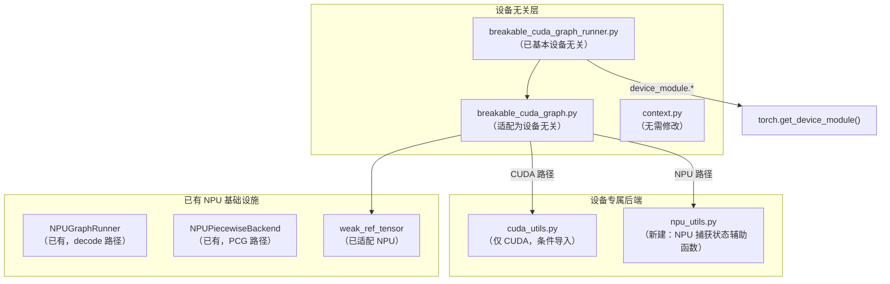
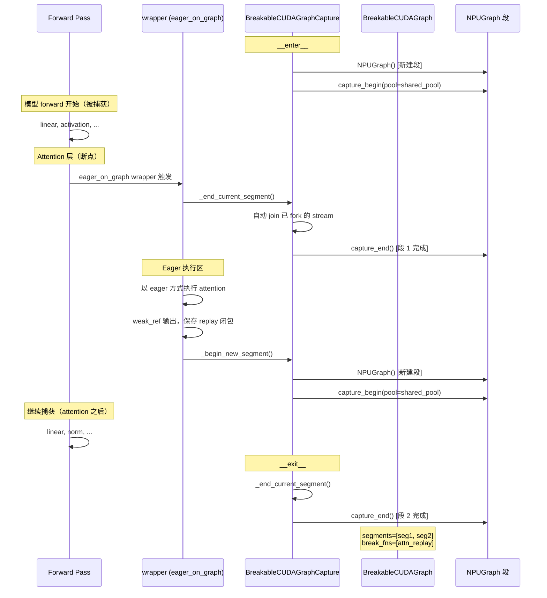
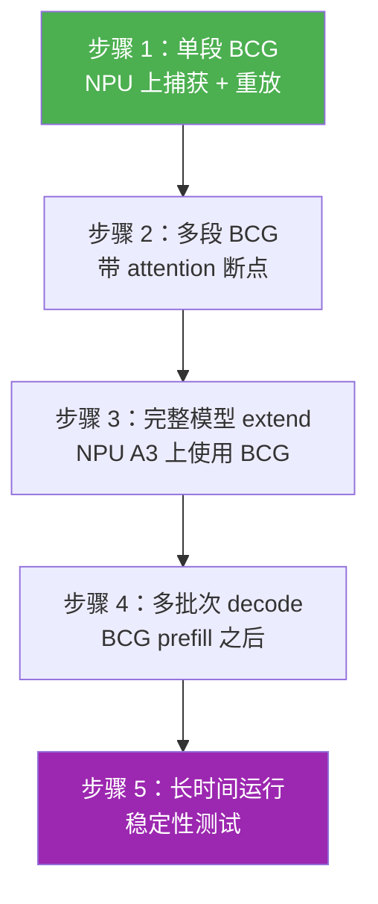
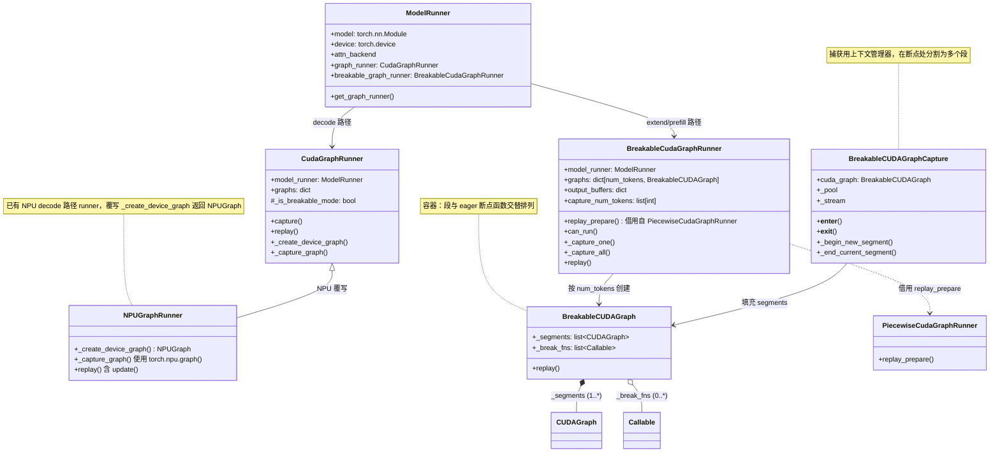
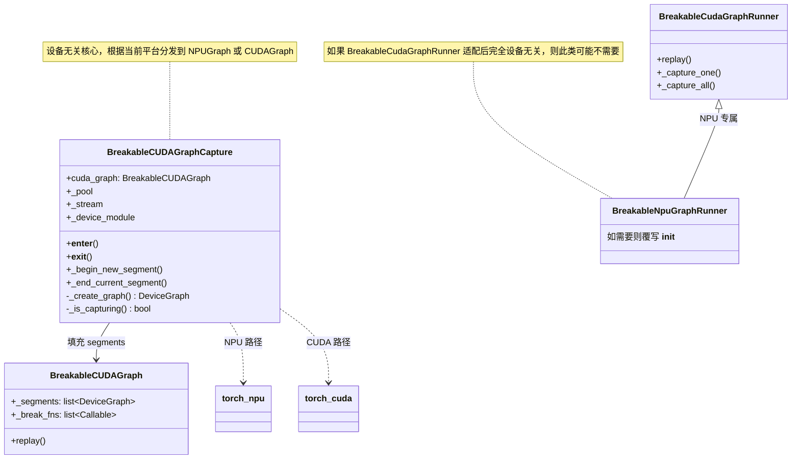

# Breakable CUDA Graph (BCG) — 华为 Ascend NPU A3 适配方案

> **目标平台**: 华为 Ascend NPU A3 (torch_npu 后端)
> **上游 PR**: #22218 (Breakable CUDA Graph)
> **日期**: 2026-04-28

---

## 第一部分：差距分析 (Gap Analysis)

### 1.1 API 对比表：CUDA Graph vs Ascend NPU Graph

| 能力 | CUDA (`torch.cuda`) | Ascend NPU (`torch.npu`) | 是否可用 |
|---|---|---|---|
| Graph 对象 | `torch.cuda.CUDAGraph()` | `torch.npu.NPUGraph()` | **可用** |
| 捕获开始 | `graph.capture_begin(pool=pool)` | `graph.capture_begin(pool=pool)` | **可用** |
| 捕获结束 | `graph.capture_end()` | `graph.capture_end()` | **可用** |
| 重放 | `graph.replay()` | `graph.replay()` | **可用** |
| 上下文管理器 | `torch.cuda.graph(g, pool=p)` | `torch.npu.graph(g, pool=p, auto_dispatch_capture=True)` | **可用** |
| 内存池句柄 | `device_module.graph_pool_handle()` | `device_module.graph_pool_handle()` | **可用**（设备无关） |
| 共享内存池 | 向多个 graph 传入相同的 `pool` tuple | 相同模式可用 | **可用** |
| Stream 捕获状态 | `cuda.bindings.runtime.cudaStreamGetCaptureInfo(ptr)` | `torch.npu.is_current_stream_capturing()` -> `bool` | **部分可用** — API 形态不同 |
| Stream 对象 | `torch.cuda.Stream()` | `torch.npu.Stream()` | **可用** |
| Stream 上下文 | `torch.cuda.stream(s)` | `torch.npu.stream(s)` | **可用** |
| 当前 Stream | `torch.cuda.current_stream()` | `torch.npu.current_stream()` | **可用** |
| Stream 等待 | `stream.wait_stream(other)` | `stream.wait_stream(other)` | **可用** |
| Stream 原始指针 | `stream.cuda_stream` (int) | **无直接等价物** | **阻塞项** — 见 1.3 |
| 弱引用 Tensor | `sgl_kernel.weak_ref_tensor` | `torch_npu._C._weak_ref_tensor` | **可用**（已适配） |
| 错误检查 | `cuda.bindings.runtime` + `cudaGetErrorString` | **无等价物** | **阻塞项** — 见 1.3 |

### 1.2 CUDA 专属调用完整清单

扫描范围：
- `breakable_cuda_graph/breakable_cuda_graph.py`
- `breakable_cuda_graph/cuda_utils.py`
- `breakable_cuda_graph/context.py`
- `breakable_cuda_graph_runner.py`

#### `breakable_cuda_graph.py` (BCG 核心引擎)

| 行号 | CUDA 调用 | NPU 替代方案 | 状态 |
|---|---|---|---|
| 33-35 | `from cuda.bindings import runtime as rt` | 不需要；替换调用方 | **删除** |
| 63 | `ContextVar[torch.cuda.Stream \| None]` | `ContextVar[torch.npu.Stream \| None]` 或设备无关类型 | **替换** |
| 66 | `ContextVar[set[torch.cuda.Stream] \| None]` | 同上 | **替换** |
| 71 | `torch.cuda.current_stream(device)` | `device_module.current_stream(device)` | **替换**（设备无关） |
| 78-81 | `_capture_status(stream_ptr)` 使用 `rt.cudaStreamGetCaptureInfo` | `torch.npu.is_current_stream_capturing()`（无 stream 参数） | **重新设计** |
| 84-89 | `_is_capturing(stream_ptr)` 使用 `_capture_status()` + `rt.cudaStreamCaptureStatus` | `torch.npu.is_current_stream_capturing()` -> bool | **重新设计** |
| 101 | `_hooked_wait_stream(self: torch.cuda.Stream, other: torch.cuda.Stream)` | `self: torch.npu.Stream, other: torch.npu.Stream` 或泛型 | **替换** |
| 112 | `capturing.cuda_stream`（原始 stream 指针） | **NPU 无等价物** | **阻塞项** |
| 113-114 | `self.cuda_stream == cap_ptr` 比较 | NPU stream 通过 `is` 或 `.npu_stream` 进行身份比较（未验证） | **待调查** |
| 118 | `_capture_status(other.cuda_stream)` | `torch.npu.is_current_stream_capturing()`（无 stream 参数） | **重新设计** |
| 135-136 | `torch.cuda.Stream.wait_stream` hook 安装 | `torch.npu.Stream.wait_stream` hook 安装 | **替换** |
| 146 | `torch.cuda.Stream.wait_stream` hook 恢复 | `torch.npu.Stream.wait_stream` hook 恢复 | **替换** |
| 249 | `torch.cuda.current_stream()` | `device_module.current_stream()` | **替换** |
| 275 | `stream: torch.cuda.Stream \| None = None` 参数类型 | 设备无关的 stream 类型 | **替换** |
| 293 | `torch.cuda.stream(self._stream)` | `device_module.stream(self._stream)` | **替换** |
| 317 | `torch.cuda.CUDAGraph()` | `torch.npu.NPUGraph()` 或设备无关工厂函数 | **替换** |
| 318-319 | `graph.capture_begin(pool=..., capture_error_mode=...)` | `graph.capture_begin(pool=...)`（NPU 可能不支持 `capture_error_mode`） | **待调查** |
| 333 | `graph.capture_end()` | `graph.capture_end()` | **无需修改** |
| 330 | `_is_capturing(side.cuda_stream)` | `torch.npu.is_current_stream_capturing()` | **重新设计** |

#### `cuda_utils.py` (CUDA 错误处理)

| 行号 | CUDA 调用 | NPU 替代方案 | 状态 |
|---|---|---|---|
| 17-19 | `from cuda.bindings import runtime as rt` | **NPU 不需要此文件** | **删除** |
| 22-30 | `_cudaGetErrorString(error)` 使用 `rt.cudaGetErrorString` | NPU 无等价物；移除 | **删除** |
| 33-53 | `checkCudaErrors(result)` 使用 `rt.cudaError_t` | NPU 无等价物；移除 | **删除** |

**结论**：`cuda_utils.py` 完全是 CUDA 专属的。对于 NPU，其调用方（`_capture_status`、`_is_capturing`）需要重新设计为使用 `torch.npu.is_current_stream_capturing()`，从而完全消除对 `cuda_utils.py` 的依赖。

#### `context.py` (BCG 运行时状态)

| 行号 | CUDA 调用 | NPU 替代方案 | 状态 |
|---|---|---|---|
| *无* | 无 CUDA 专属代码 | 不适用 | **无需修改** |

#### `breakable_cuda_graph_runner.py` (BCG Runner)

| 行号 | CUDA 调用 | NPU 替代方案 | 状态 |
|---|---|---|---|
| 155 | `torch.int64 if not is_npu() else torch.int32` | 已适配 NPU | **无需修改** |
| 88 | `torch.get_device_module(self.device)` | 已设备无关 | **无需修改** |
| 133-134 | `device_module.graph_pool_handle()`, `set_graph_pool_id()` | 已设备无关 | **无需修改** |
| 346-348 | `BreakableCUDAGraph()` + `BreakableCUDAGraphCapture(...)` | 依赖核心 BCG 适配 | **无需修改**（继承修复） |

### 1.3 阻塞项分析

#### 阻塞项 1：Stream 原始指针 (`stream.cuda_stream`)

**位置**：`breakable_cuda_graph.py:112-114`

```python
cap_ptr = capturing.cuda_stream  # int: CUDA 原始 stream 句柄
is_self_cap = self is capturing or self.cuda_stream == cap_ptr
is_other_cap = other is capturing or other.cuda_stream == cap_ptr
```

**用途**：被 hook 的 `wait_stream` 通过比较原始 stream 指针，判断参与 `wait_stream()` 调用的 stream 是捕获 stream（主 stream）还是旁路 stream。从而实现捕获期间旁路 stream 的 fork/join 跟踪。

**NPU 调查**：
- `torch.npu.Stream` 可能不暴露 `.cuda_stream`。等价属性可能是 `.npu_stream`，但**尚未验证**。
- **缓解策略**：仅使用 `stream is capturing` 对象身份比较（去掉指针比较）。如果不重复创建 stream 对象，`is` 检查足够。或者通过 NPU Stream 暴露的原生句柄属性进行比较。

**风险**：中等 — 通过 `is` 身份比较 + 调查 NPU Stream 原生句柄属性大概率可解决。

#### 阻塞项 2：`cuda.bindings.runtime` 捕获状态查询

**位置**：`breakable_cuda_graph.py:78-89`、`cuda_utils.py`

```python
def _capture_status(stream_ptr: int) -> "rt.cudaStreamCaptureStatus":
    status, *_ = checkCudaErrors(rt.cudaStreamGetCaptureInfo(stream_ptr))
    return status

def _is_capturing(stream_ptr: int) -> bool:
    return (
        _capture_status(stream_ptr)
        == rt.cudaStreamCaptureStatus.cudaStreamCaptureStatusActive
    )
```

**用途**：检查某个 CUDA stream 是否处于 graph 捕获模式。在 `_hooked_wait_stream` 中用于判断旁路 stream 是否参与捕获，在 `_end_current_segment` 中用于自动 join 已 fork 的旁路 stream。

**NPU 等价物**：`torch.npu.is_current_stream_capturing()` 返回 `bool`，但**仅限当前 stream**。不接受 stream 指针参数。

**API 形态差异**：
- CUDA: `cudaStreamGetCaptureInfo(stream_ptr)` -> `cudaStreamCaptureStatus` 枚举（可检查任意 stream）
- NPU: `torch.npu.is_current_stream_capturing()` -> `bool`（仅检查当前 stream）

**缓解策略**：
1. 在 `_end_current_segment`（第 330 行）：将 `_is_capturing(side.cuda_stream)` 替换为——切换到 `side` stream、调用 `is_current_stream_capturing()`、再切回。或者通过 set 跟踪已 fork 的 stream，假设未显式 join 的仍在捕获中。
2. 在 `_hooked_wait_stream`（第 118 行）：`_capture_status(other.cuda_stream)` 的检查保护了一次 `wait_stream` 调用——简化为仅通过 ContextVar 检查是否处于捕获上下文。

**风险**：中等 — 需要重新设计 `_is_capturing` 和 `_capture_status`，使其无需 per-stream 状态查询。通过 ContextVar 状态跟踪捕获状态是可行的替代方案。

#### 阻塞项 3：`capture_error_mode` 参数

**位置**：`breakable_cuda_graph.py:318-319`

```python
graph.capture_begin(
    pool=self._pool, capture_error_mode=self._capture_error_mode
)
```

**需要调查**：`capture_error_mode` 参数（`"global"`、`"thread_local"` 等）控制 CUDA 的捕获错误传播。torch_npu 源码中 `NPUGraph.capture_begin(pool)` 的签名**不包含** `capture_error_mode`。

**缓解策略**：对 NPU 省略该参数。NPU 默认行为可能与 `"global"` 模式一致。如果在多线程捕获时出现问题，可能需要添加 NPU 专属的错误处理。

**风险**：低 — 大概率不需要此参数即可工作。

### 1.4 可行性结论

| 方面 | 可行性 | 说明 |
|---|---|---|
| 分段捕获 (begin/end) | **可行** | `NPUGraph.capture_begin/end` 已确认 |
| 共享内存池 | **可行** | 相同的 pool 传递模式可用 |
| 断点 eager 执行 | **可行** | 段间的 eager 模式与设备无关 |
| 弱引用 Tensor | **可行** | 已适配：`torch_npu._C._weak_ref_tensor` |
| Stream 跟踪 (fork/join) | **需要重新设计** | 必须替换 `cuda_stream` 指针和 per-stream 捕获状态 |
| 错误处理工具 | **删除** | NPU 更简单的 `is_current_stream_capturing()` 不需要 |

**总体结论**：BCG 在 NPU A3 上**基本可行**。核心机制（分段级 graph 捕获 + 共享内存池）可直接映射。Stream 管理代码因 API 形态差异需要重新设计，但不存在概念上的不兼容。

---

## 第二部分：适配方案

### 2.1 目标架构



### 2.2 适配后的 BCG 捕获序列（NPU）



### 2.3 文件变更清单

| 文件 | 改动范围 | 风险 | 说明 |
|---|---|---|---|
| `breakable_cuda_graph/breakable_cuda_graph.py` | **大** | **高** | 核心适配：将所有 `torch.cuda.*` 替换为设备无关调用；重新设计 `_capture_status` / `_is_capturing`；替换 stream 指针比较 |
| `breakable_cuda_graph/cuda_utils.py` | **小** | **低** | CUDA 路径保持不变；NPU 路径不导入它 |
| `breakable_cuda_graph/npu_utils.py` | **新建** | **中** | NPU 专属捕获状态辅助函数（封装 `is_current_stream_capturing`） |
| `breakable_cuda_graph/context.py` | **无** | **无** | 无需修改 |
| `breakable_cuda_graph_runner.py` | **小** | **低** | 已设备无关；可能需要少量 NPU 专属检查 |
| `cuda_graph_runner.py` | **小** | **中** | 为 NPU 添加 BCG 使用门控；NPU 可能需要单独的 `_create_device_graph()` 覆写 |

### 2.4 分阶段实施计划

#### 阶段 1：设备抽象层（基础设施）

**目标**：使 `breakable_cuda_graph.py` 设备无关，不改变 CUDA 上的行为。

- [ ] **1.1** 在 `breakable_cuda_graph.py` 中创建设备检测辅助函数：
  ```python
  from sglang.srt.utils import is_npu as _is_npu_platform

  def _get_device_module():
      if _is_npu_platform():
          return torch.npu
      return torch.cuda
  ```
- [ ] **1.2** 将 `torch.cuda.Stream` 类型注解替换为泛型 stream 类型：
  ```python
  # 修改前：
  _current_stream_var: ContextVar[torch.cuda.Stream | None]
  # 修改后：
  _current_stream_var: ContextVar[torch.Stream | None]  # 基类
  ```
  或在模块级别使用条件导入。
- [ ] **1.3** 将 `torch.cuda.current_stream()` 替换为 `device_module.current_stream()`
- [ ] **1.4** 将 `torch.cuda.stream(s)` 替换为 `device_module.stream(s)`
- [ ] **1.5** 将 `torch.cuda.CUDAGraph()` 替换为设备无关的 graph 工厂函数：
  ```python
  def _create_graph():
      if _is_npu_platform():
          return torch.npu.NPUGraph()
      return torch.cuda.CUDAGraph()
  ```

**验证**：所有 CUDA 测试仍通过。无行为变化。

#### 阶段 2：捕获状态重新设计

**目标**：将基于 `cuda.bindings.runtime` 的捕获状态替换为设备无关机制。

- [ ] **2.1** 创建 `npu_utils.py`，包含 NPU 捕获状态辅助函数：
  ```python
  # npu_utils.py
  def is_stream_capturing(stream=None):
      """检查给定（或当前）stream 是否正在 NPU 上捕获。"""
      if stream is not None:
          # NPU 不支持 per-stream 查询
          # 改为通过 ContextVar 状态跟踪
          raise NotImplementedError("NPU 不支持 per-stream 捕获状态查询")
      return torch.npu.is_current_stream_capturing()
  ```
- [ ] **2.2** 重新设计 `_is_capturing()`，使用 ContextVar 跟踪替代 per-stream CUDA API：
  ```python
  def _is_capturing(stream=None) -> bool:
      if _is_npu_platform():
          # NPU 路径：使用 is_current_stream_capturing()
          # 旁路 stream 通过 _forked_streams_var 跟踪
          return torch.npu.is_current_stream_capturing()
      else:
          # CUDA 路径：原始实现
          return _capture_status(stream) == rt.cudaStreamCaptureStatus.cudaStreamCaptureStatusActive
  ```
- [ ] **2.3** 重新设计 `_end_current_segment()`，处理 NPU 已 fork stream 的自动 join（无需 per-stream 捕获查询）：
  ```python
  def _end_current_segment(self) -> None:
      main_stream = get_current_stream()
      forked = _forked_streams_var.get()
      if forked:
          for side in list(forked):
              # CUDA：检查 _is_capturing(side.cuda_stream)
              # NPU：假设已 fork 的 stream 仍在捕获中，直接 join
              _original_wait_stream(main_stream, side)
          forked.clear()
      self.cuda_graph._segments[-1].capture_end()
  ```
- [ ] **2.4** 从 NPU 代码路径中移除 `cuda_utils.py` 导入（CUDA 路径保留）。

**验证**：BCG 捕获在 NPU 上成功，包含 graph 断点。

#### 阶段 3：Stream 指针和 Hook 适配

**目标**：使 `wait_stream` hook 在 NPU 上工作。

- [ ] **3.1** 将 `capturing.cuda_stream` 指针比较替换为对象身份 + 设备无关的 stream 句柄：
  ```python
  # 修改前：
  cap_ptr = capturing.cuda_stream
  is_self_cap = self is capturing or self.cuda_stream == cap_ptr

  # 修改后：
  is_self_cap = self is capturing
  if not is_self_cap and hasattr(self, 'cuda_stream'):
      is_self_cap = self.cuda_stream == capturing.cuda_stream
  if not is_self_cap and hasattr(self, 'npu_stream'):
      is_self_cap = self.npu_stream == capturing.npu_stream
  ```
  或者仅依赖 `is` 身份比较（更简单，通常足够）。
- [ ] **3.2** 适配 `wait_stream` hook 目标：
  ```python
  def _install_wait_stream_hook():
      if _is_npu_platform():
          _original_wait_stream = torch.npu.Stream.wait_stream
          torch.npu.Stream.wait_stream = _hooked_wait_stream
      else:
          _original_wait_stream = torch.cuda.Stream.wait_stream
          torch.cuda.Stream.wait_stream = _hooked_wait_stream
  ```
- [ ] **3.3** 简化 `_hooked_wait_stream`，避免 per-stream 捕获状态查询：
  ```python
  def _hooked_wait_stream(self, other):
      # ... 为 NPU 简化 fork 跟踪逻辑 ...
      if _is_npu_platform():
          # NPU：不检查 other stream 的捕获状态
          # 仅跟踪 fork/join 并执行 wait
          if is_self_cap:
              forked.discard(other)
          else:
              forked.add(self)
          _original_wait_stream(self, other)
      else:
          # CUDA：包含捕获状态检查的原始逻辑
          ...
  ```

**验证**：NPU graph 捕获期间 stream fork/join 跟踪正确工作。

#### 阶段 4：集成与 Runner 适配

**目标**：将 BCG 与 NPU graph runner 基础设施对接。

- [ ] **4.1** 新建 `BreakableNpuGraphRunner` 或在现有 `BreakableCudaGraphRunner` 内部根据设备类型进行门控：
  ```python
  class BreakableNpuGraphRunner(BreakableCudaGraphRunner):
      def __init__(self, model_runner):
          super().__init__(model_runner)

      # 如需要，覆写 NPU 专属初始化
  ```
  或者：在 `BreakableCudaGraphRunner.__init__` 中根据设备类型进行分支。
- [ ] **4.2** 处理 NPU 的 `capture_error_mode`：
  ```python
  def _begin_new_segment(self) -> None:
      graph = _create_graph()  # 设备无关
      kwargs = {"pool": self._pool}
      if not _is_npu_platform():
          kwargs["capture_error_mode"] = self._capture_error_mode
      graph.capture_begin(**kwargs)
      self.cuda_graph._segments.append(graph)
  ```
- [ ] **4.3** 如果 NPU 需要，添加 `graph_task_group_begin/end` 调用（测试期间调查）：
  ```python
  # NPU 可能需要 task group 标记来实现多段捕获
  if _is_npu_platform():
      torch.npu.graph_task_group_begin(stream)
  ```
- [ ] **4.4** 添加 NPU BCG 的环境变量门控：
  ```python
  # 在 cuda_graph_runner.py 或 model_runner.py 中
  if is_npu() and envs.SGLANG_USE_BREAKABLE_CUDA_GRAPH.get():
      return BreakableNpuGraphRunner(model_runner)
  ```

**验证**：NPU 上端到端 extend prefill 使用 BCG 正常工作。

#### 阶段 5：测试与加固

- [ ] **5.1** 单元测试：NPUGraph 段捕获/重放
- [ ] **5.2** 单元测试：带 eager 函数的断点
- [ ] **5.3** 集成测试：NPU 上完整模型 forward 使用 BCG
- [ ] **5.4** 性能基准：NPU 上 BCG vs eager
- [ ] **5.5** 内存稳定性测试：验证共享内存池 + weak_ref 正确工作

### 2.5 依赖关系图


---

## 第三部分：验证计划

### 3.1 单元验证（每个 API 替换）

| 测试项 | 验证内容 | 通过标准 |
|---|---|---|
| NPUGraph 捕获 | `NPUGraph().capture_begin(pool)` + `capture_end()` | 无错误，graph 对象创建成功 |
| NPUGraph 重放 | 捕获一个简单加法操作，然后重放 | 输出与 eager 结果一致 |
| 共享内存池 | 两个段共享同一个 pool | 内存被复用，无 OOM |
| 断点插入 | `eager_on_graph(True)` 装饰器分割捕获 | 两个段被创建，break_fn 被记录 |
| `is_current_stream_capturing()` | 捕获期间返回 `True`，捕获外返回 `False` | 返回正确的布尔值 |
| `torch.npu.Stream.wait_stream` hook | hook 安装/卸载正常 | 捕获后原始函数被恢复 |
| 弱引用 Tensor | 段间输出被弱引用 | 跨重放的存储保持有效 |

### 3.2 集成验证



| 步骤 | 描述 | 验证方法 |
|---|---|---|
| 1 | 在 NPU 上将模型 forward 捕获为单个 BCG 段（无断点） | 重放输出与 eager 一致 |
| 2 | 启用 attention 层断点，捕获多段 BCG | 所有段被捕获，break_fns 正确执行 |
| 3 | 通过 `BreakableCudaGraphRunner.replay()` 运行完整 extend prefill | 输出 logits 与 eager extend 一致 |
| 4 | BCG prefill 后，使用现有 NPUGraphRunner 运行 decode | decode 生成正确的 token |
| 5 | 运行 1000+ 次 prefill+decode 循环 | 无内存泄漏，无 graph 损坏 |

### 3.3 性能基准设计

| 基准测试 | 配置 | 指标 |
|---|---|---|
| NPU eager extend | `--disable-cuda-graph` | Tokens/sec，延迟 p50/p99 |
| NPU BCG extend | `--enable-breakable-cuda-graph` | Tokens/sec，延迟 p50/p99 |
| NPU BCG vs CUDA BCG | 相同模型，相同 batch size | 吞吐量比值 |

**预期结果**：根据 PR #22218 中 CUDA BCG 的基准数据，NPU 上 BCG 相对于 eager extend/prefill 应有 1.2x-2x 的吞吐量提升。

### 3.4 故障排查指南

| 症状 | 可能原因 | 解决方法 |
|---|---|---|
| `capture_begin()` 抛出 `RuntimeError: graph capture is not supported` | NPU 驱动/固件版本过旧 | 升级 CANN 至 >= 8.0.RCx |
| `capture_end()` 抛出 `aclError` | graph 中包含不支持的算子 | 检查算子兼容性列表；在不支持的算子前添加断点 |
| 重放输出全为零 | 重放前输入缓冲区未填充 | 验证 `replay_prepare` 是否将输入数据拷贝到静态缓冲区 |
| 跨重放的内存泄漏 | `weak_ref_tensor` 未释放内存池内存 | 检查 pool use_count；确保段 graph 没有被重复创建 |
| `is_current_stream_capturing()` 始终返回 `False` | 在错误的 stream 上调用 | 确保捕获在传入 `BreakableCUDAGraphCapture` 的 stream 上进行 |
| Stream hook 未拦截 | `torch.npu.Stream.wait_stream` 是不同的方法对象 | 验证 hook 目标与实际的 `wait_stream` 属性一致 |
| `NPUGraph.capture_begin()` 不接受 `capture_error_mode` | API 差异 | 对 NPU 省略该参数（见阶段 2.2） |
| 捕获期间旁路 stream 死锁 | 段结束前已 fork 的 stream 未 join | 检查 `_end_current_segment` 自动 join 逻辑 |
| Graph 重放崩溃并报 `ACL_ERROR_RT_AICORE_OVER_FLOW` | 捕获的 graph 超出 AICore 内存 | 减少 `capture_num_tokens` 或增加更多断点 |

### 3.5 实施前关键调查项

在开始阶段 1 之前，需要在 NPU A3 实机上验证以下事项：

1. **`torch.npu.Stream` 属性**：是否有 `.npu_stream`、`.stream_ptr` 或类似的原生句柄访问属性？在 NPU 上运行：`print(dir(torch.npu.Stream()))`。
2. **`NPUGraph.capture_begin` 签名**：是否接受 `capture_error_mode` 参数？运行：`import inspect; print(inspect.signature(torch.npu.NPUGraph.capture_begin))`。
3. **`graph_task_group_begin/end` 需求**：多段捕获（capture_begin/end，然后在新的 graph 上用相同的 pool 再次 capture_begin/end）是否需要 task group 标记？
4. **Stream `wait_stream` 可 hook 性**：`torch.npu.Stream.wait_stream` 是否可以像 `torch.cuda.Stream.wait_stream` 一样被 monkey-patch？
5. **跨 NPUGraph 的内存池共享**：向多个 `NPUGraph.capture_begin(pool=...)` 传入相同的 pool tuple 是否与 CUDA 行为一致？

---

## 附录 A：类关系图



## 附录 B：适配后类图


