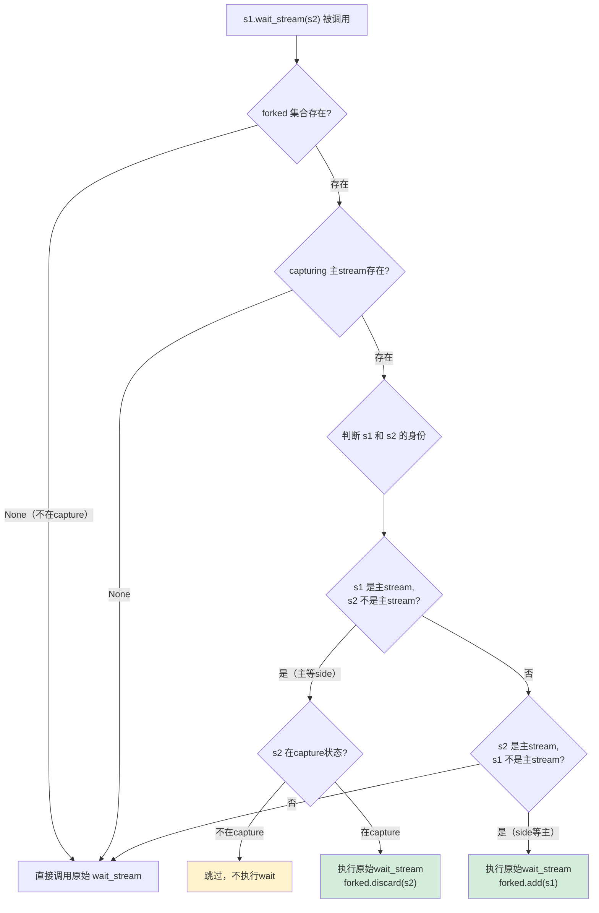
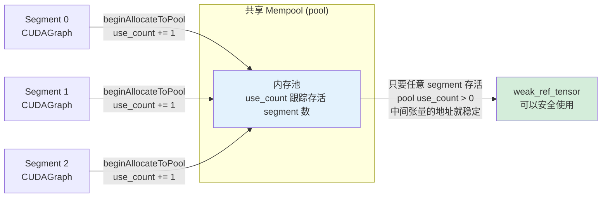
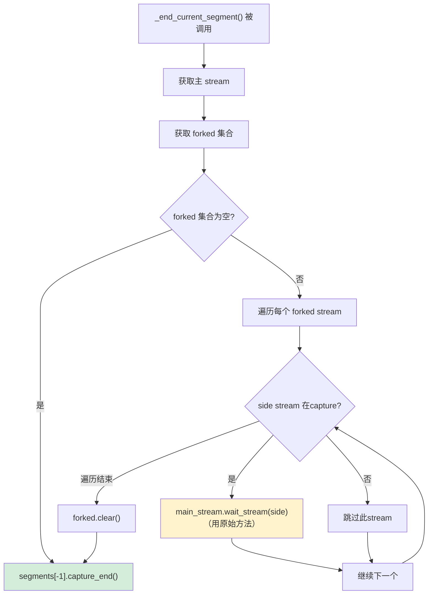
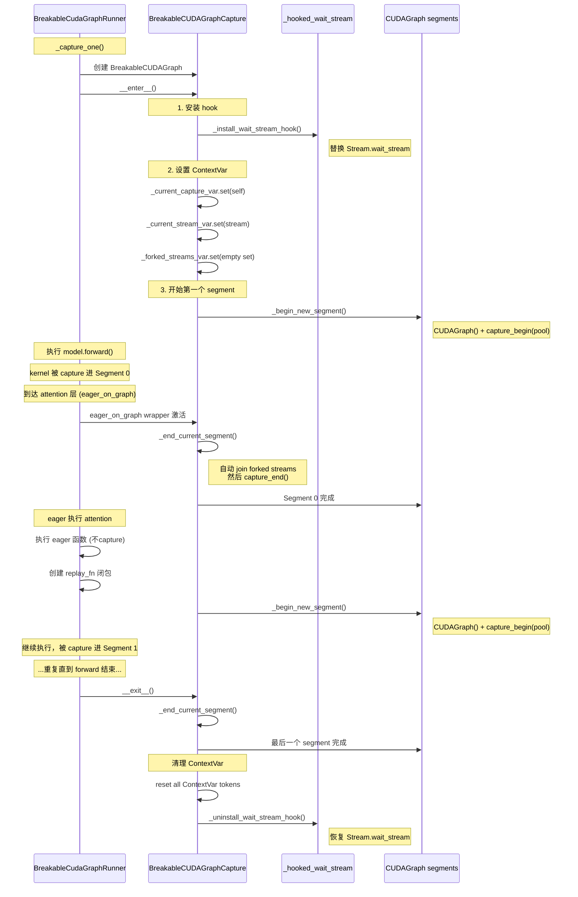
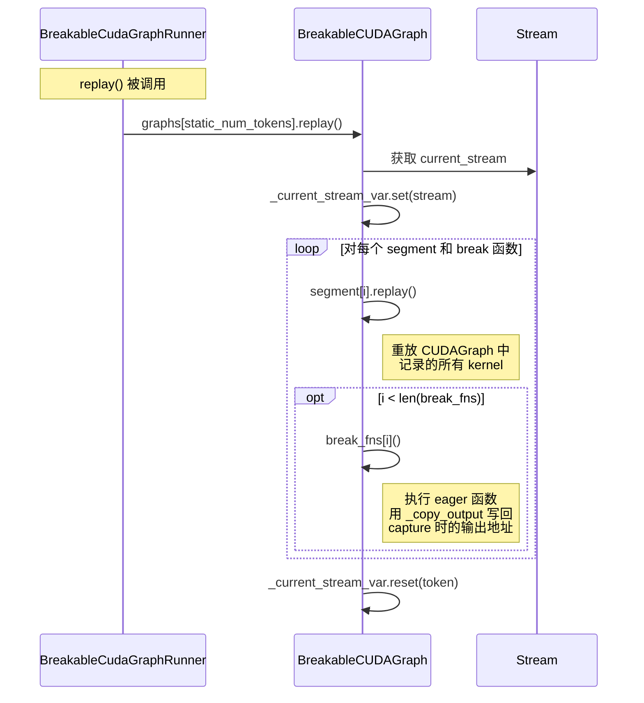
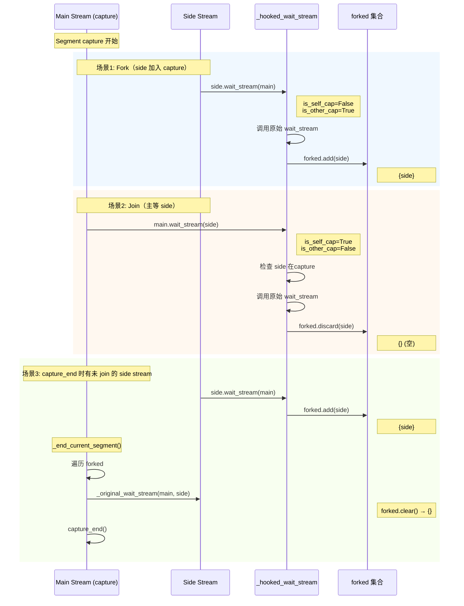
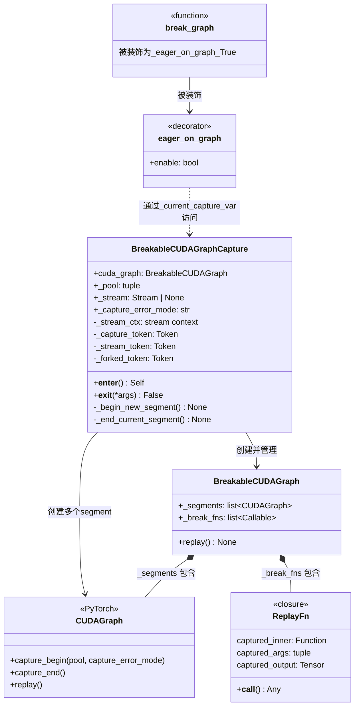
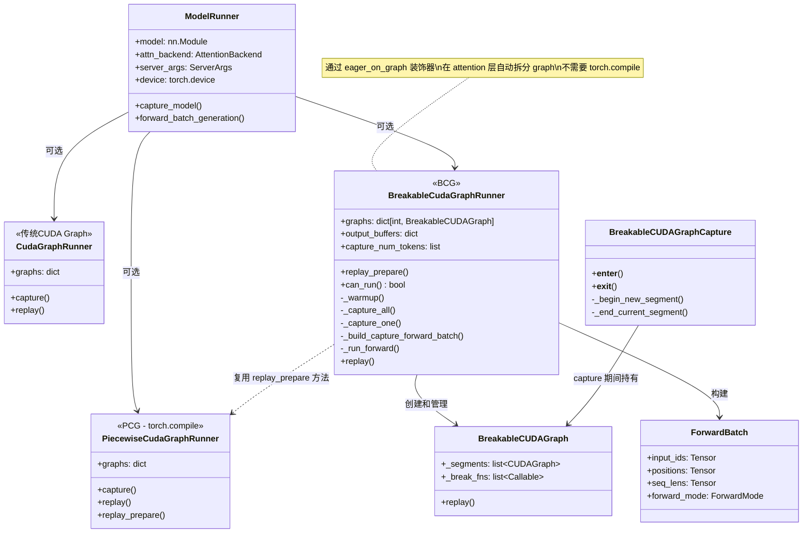
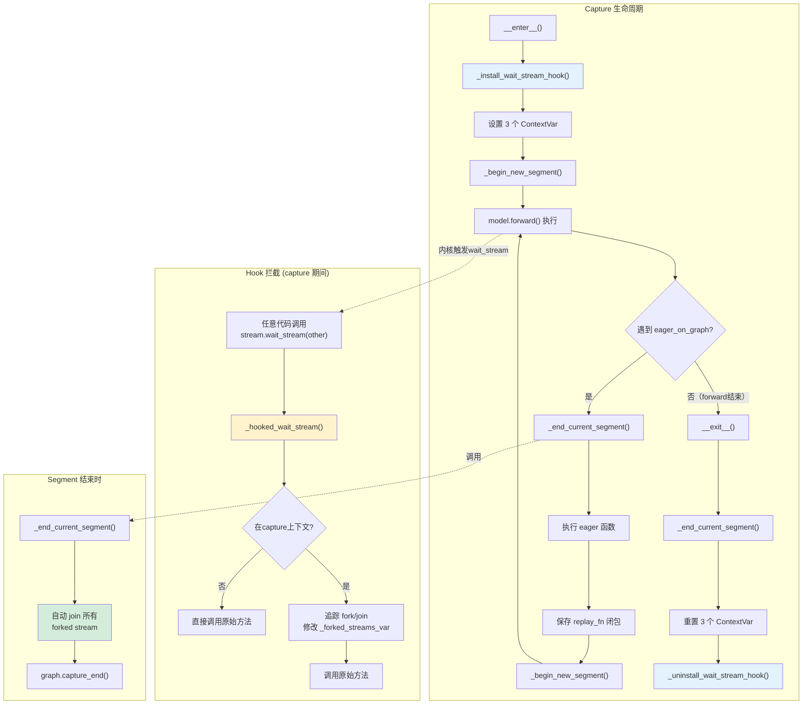

# BCG Stream 管理：从基础到源码逐行解读

> 本文档深入讲解 Breakable CUDA Graph (BCG) 中的 stream 管理机制。从 CUDA Stream 基础知识出发，
> 逐行解读 `_install_wait_stream_hook`、`_hooked_wait_stream`、`_end_current_segment` 等核心函数，
> 并用 Mermaid 图展示完整流程。

---

## 目录

1. [CUDA Stream 基础知识](#1-cuda-stream-基础知识)
2. [ContextVar 状态管理](#2-contextvar-状态管理)
3. [Hook 机制详解](#3-hook-机制详解)
4. [Segment 管理详解](#4-segment-管理详解)
5. [完整流程图](#5-完整流程图)
6. [类图关系](#6-类图关系)

---

## 1. CUDA Stream 基础知识

### 1.1 什么是 Stream

CUDA Stream 是 GPU 上的**任务队列**。你提交到同一个 stream 的操作会按顺序执行，不同 stream 之间的操作可以并行执行。

```
┌─────────────────────────────────────────────────────┐
│                      GPU                            │
│                                                     │
│  Stream 0 (default):  [kernel_A] → [kernel_B] → ... │
│                        顺序执行，不可重叠            │
│                                                     │
│  Stream 1:            [kernel_C] → [kernel_D] → ... │
│  Stream 2:            [kernel_E] → [kernel_F] → ... │
│                        ↑ Stream 1 和 2 可以并行     │
└─────────────────────────────────────────────────────┘
```

**类比**：想象 GPU 是一个工厂，stream 是工厂里的流水线。一条流水线上的工序必须按顺序做，但不同流水线可以同时工作。

### 1.2 Stream 的核心操作

| 操作 | PyTorch API | 含义 |
|------|-------------|------|
| 创建 stream | `s = torch.cuda.Stream()` | 创建一条新 stream |
| 设置当前 stream | `torch.cuda.stream(s)` | 让后续操作提交到 stream `s` |
| 获取当前 stream | `torch.cuda.current_stream()` | 获取当前活跃的 stream |
| 等待另一个 stream | `s1.wait_stream(s2)` | `s1` 等待 `s2` 完成所有已提交的操作 |
| 同步 | `torch.cuda.synchronize()` | CPU 等待所有 stream 上的所有操作完成 |

### 1.3 `wait_stream` 详解

`wait_stream` 是理解 BCG stream 管理的关键。它的语义是：

```python
stream_A.wait_stream(stream_B)
```

意思是：**stream_A 暂停，等 stream_B 上所有已提交的操作完成后再继续**。

```
时间 →     ──────────────────────────────────────────►

stream_B:  [op1][op2][op3]
                         ↓ 完成
stream_A:  [op4]  ←等待→  [op5][op6]
                         ↑ wait_stream 触发点
```

**实际用途**：当一个 stream 需要用另一个 stream 产出的数据时，必须先 `wait_stream` 确保数据已就绪。

### 1.4 Stream 分叉与汇合 (Fork/Join)

在 CUDA 编程中，"fork" 和 "join" 是 stream 操作的模式：

```
                    ┌─── Stream 1 (side) ───┐
                    │                        │
Main Stream ────────┤                        ├─── Main Stream 继续
                    │                        │
                    └─── Stream 2 (side) ───┘

Fork: 主 stream 把任务分发到 side stream
Join: 主 stream 用 wait_stream 等待 side stream 完成
```

在 PyTorch 内部，很多操作（比如 tensor parallel 通信、data loading）会自动 fork 出 side stream。
BCG 必须追踪这些 side stream，因为 **CUDA Graph capture 要求在 `capture_end()` 时所有参与 capture 的 stream 都已汇合**。

### 1.5 CUDA Graph 对 Stream 的限制

CUDA Graph capture 期间有严格限制：

| 限制 | 说明 |
|------|------|
| 只能在**一个** stream 上 capture | `capture_begin(pool=...)` 绑定当前 stream |
| Side stream 可以参与 capture | 但它们必须通过 `wait_stream` 加入 capture 作用域 |
| `capture_end()` 时不能有未汇合的 side stream | 否则会报 `cudaErrorStreamCaptureUnsupported` |
| Capture 期间不能做 CPU 同步 | 如 `torch.cuda.synchronize()` |

BCG 的核心挑战是：**在 `capture_end()` 之前，自动汇合所有 forked 但未 join 的 side stream**。
这就是 `_hooked_wait_stream` 和 `_forked_streams_var` 存在的原因。

---

## 2. ContextVar 状态管理

BCG 使用 Python 的 `contextvars.ContextVar` 在调用栈中传递状态。
这比全局变量更安全，能正确处理多线程和异步场景。

### 2.1 三个 ContextVar

```python
# breakable_cuda_graph.py:60-68

_current_capture_var: ContextVar["BreakableCUDAGraphCapture | None"] = ContextVar(
    "current_capture", default=None
)
```
- **作用**：存储当前活跃的 `BreakableCUDAGraphCapture` 上下文
- **谁读它**：`eager_on_graph` 装饰器的 wrapper（第 204 行）
- **谁写它**：`BreakableCUDAGraphCapture.__enter__` 设置，`__exit__` 重置

```python
_current_stream_var: ContextVar[torch.cuda.Stream | None] = ContextVar(
    "current_stream", default=None
)
```
- **作用**：存储 capture 期间使用的主 stream
- **谁读它**：`get_current_stream()`（第 72 行）、`_hooked_wait_stream`（第 107 行）
- **谁写它**：`__enter__` 设置，`__exit__` 重置；`BreakableCUDAGraph.replay()` 也会设置

```python
_forked_streams_var: ContextVar[set[torch.cuda.Stream] | None] = ContextVar(
    "forked_streams", default=None
)
```
- **作用**：追踪在 capture 期间被 fork 出但尚未 join 回来的 side stream 集合
- **谁读它**：`_hooked_wait_stream`（读取并修改）、`_end_current_segment`（读取并清理）
- **谁写它**：`__enter__` 初始化为空 set，`__exit__` 重置

### 2.2 ContextVar 生命周期

```python
# __enter__ 中：
self._capture_token = _current_capture_var.set(self)        # 保存旧值，设为新值
self._stream_token = _current_stream_var.set(stream)         # 同上
self._forked_token = _forked_streams_var.set(set())          # 初始化空集合

# __exit__ 中：
_current_capture_var.reset(self._capture_token)              # 恢复旧值
_current_stream_var.reset(self._stream_token)                # 恢复旧值
_forked_streams_var.reset(self._forked_token)                # 恢复旧值
```

`set()` 返回一个 token，`reset(token)` 恢复到 set 之前的状态。这类似栈的 push/pop，支持嵌套。

---

## 3. Hook 机制详解

### 3.1 全局变量

```python
# breakable_cuda_graph.py:96-98

_original_wait_stream: Callable | None = None   # 保存原始的 wait_stream 方法
_hook_lock = threading.Lock()                    # 防止多线程并发安装/卸载 hook
_hook_refcount = 0                               # 引用计数，支持嵌套 capture
```

**为什么需要引用计数？**

`BreakableCUDAGraphCapture` 是可以嵌套的。如果外层 capture 已经安装了 hook，
内层 capture 不应该重复安装，也不应该在内层退出时卸载 hook。引用计数确保：
- 第一次 `__enter__`：安装 hook，refcount = 1
- 嵌套 `__enter__`：refcount = 2，不重复安装
- 内层 `__exit__`：refcount = 1，不卸载
- 外层 `__exit__`：refcount = 0，卸载 hook

### 3.2 `_install_wait_stream_hook()` 逐行解读

```python
# breakable_cuda_graph.py:131-137

def _install_wait_stream_hook():
    global _original_wait_stream, _hook_refcount   # 声明修改全局变量
    with _hook_lock:                               # 加锁，防止多线程竞争
        if _hook_refcount == 0:                    # 第一个安装者？
            _original_wait_stream = torch.cuda.Stream.wait_stream  # ① 保存原始方法
            torch.cuda.Stream.wait_stream = _hooked_wait_stream     # ② 替换为 hook
        _hook_refcount += 1                        # 引用计数 +1
```

**逐行解析：**

| 行 | 代码 | 含义 |
|----|------|------|
| 1 | `global _original_wait_stream, _hook_refcount` | 声明要修改模块级全局变量 |
| 2 | `with _hook_lock:` | 获取线程锁，确保同一时刻只有一个线程在操作 hook |
| 3 | `if _hook_refcount == 0:` | 只有第一个调用者才真正安装 hook |
| 4 | `_original_wait_stream = torch.cuda.Stream.wait_stream` | **保存原始方法**到变量。`torch.cuda.Stream.wait_stream` 是一个 unbound method |
| 5 | `torch.cuda.Stream.wait_stream = _hooked_wait_stream` | **猴子补丁**：把类方法替换成我们的 hook。之后所有 `stream.wait_stream(other)` 调用都会先经过 `_hooked_wait_stream` |
| 6 | `_hook_refcount += 1` | 计数器递增 |

**调用时机**：`BreakableCUDAGraphCapture.__enter__()` 的第一行（第 291 行）。

### 3.3 `_hooked_wait_stream()` 逐行解读

这是 BCG stream 管理的核心。它拦截所有 `wait_stream` 调用来追踪 fork/join。

```python
# breakable_cuda_graph.py:101-129

def _hooked_wait_stream(self: torch.cuda.Stream, other: torch.cuda.Stream):
```

**函数签名解析**：当它被赋值给 `torch.cuda.Stream.wait_stream` 后，调用 `s1.wait_stream(s2)` 时，
`self` 就是 `s1`，`other` 就是 `s2`。这是 Python 的 descriptor protocol —— 绑定方法会自动传入实例。

```python
    assert _original_wait_stream is not None         # ① 安全检查
```
确保 hook 已安装（`_original_wait_stream` 在安装时被赋值）。

```python
    forked = _forked_streams_var.get()                # ② 获取 forked stream 集合
    if forked is None:                                # ③
        _original_wait_stream(self, other)            # ④
        return
```
**③④**：如果 `forked` 是 `None`，说明我们不在 BCG capture 上下文中（`_forked_streams_var` 默认值是 `None`）。
此时直接调用原始 `wait_stream`，不做任何追踪。

```python
    capturing = _current_stream_var.get()             # ⑤ 获取 capture 的主 stream
    if capturing is None:                             # ⑥
        _original_wait_stream(self, other)            # ⑦
        return
```
**⑤⑥⑦**：如果主 capture stream 没有设置，同样不在 capture 上下文，直接调用原始方法。

```python
    cap_ptr = capturing.cuda_stream                   # ⑧ 主 stream 的底层 C 指针
```
`cuda_stream` 属性返回一个 `int`，是该 stream 在 CUDA runtime 中的原生指针地址。
用来做 stream 身份比较（两个不同的 `torch.cuda.Stream` 对象可能指向同一个底层 stream）。

```python
    is_self_cap = self is capturing or self.cuda_stream == cap_ptr    # ⑨
    is_other_cap = other is capturing or other.cuda_stream == cap_ptr # ⑩
```
**⑨⑩**：判断 `self` 和 `other` 是否就是 capture 的主 stream。
用两种方式判断：Python 对象身份（`is`）和底层指针相等（`==`）。指针比较是因为 PyTorch 可能创建
不同的 Stream 对象包装同一个底层 CUDA stream。

```python
    if is_self_cap and not is_other_cap:              # ⑪ 主 stream 等 side stream
```
场景：**主 stream 等待一个 side stream**。这是 "join" 操作 —— side stream 的任务完成后，主 stream 才继续。

```python
        if (                                                          # ⑫
            _capture_status(other.cuda_stream)                        # ⑬
            != rt.cudaStreamCaptureStatus.cudaStreamCaptureStatusActive  # ⑭
        ):
            return                                                    # ⑮
```
**⑫-⑮**：如果 `other`（side stream）并**不在** capture 状态（比如它是一个普通的数据加载 stream），
则**跳过**这个 wait_stream 调用。在 CUDA graph capture 期间，对非 capture stream 做 wait_stream
会导致 capture 失败。这是一种防御性编程。

```python
        _original_wait_stream(self, other)             # ⑯ 执行真正的 wait_stream
        forked.discard(other)                          # ⑰ 从 forked 集合中移除 other
```
**⑯**：调用原始 `wait_stream` 完成 join。
**⑰**：`discard(other)` 表示这个 side stream 已经 join 回主 stream，不再是 "forked" 状态。

```python
    elif is_other_cap and not is_self_cap:             # ⑱ side stream 等主 stream
        _original_wait_stream(self, other)             # ⑲ 执行 wait_stream
        forked.add(self)                               # ⑳ 记录 self 为新 forked stream
```
**⑱-⑳**：side stream 等待主 stream。这表示 side stream 正在加入 capture 作用域。
把它加入 `forked` 集合，以便后续 `_end_current_segment` 能找到它并确保汇合。

```python
    else:                                              # ㉑ 其他情况
        _original_wait_stream(self, other)             # ㉒ 直接执行
```
**㉑-㉒**：包括：两者都是主 stream、两者都不是主 stream、两者都是 side stream。
这些情况不需要追踪，直接执行原始方法。

### 3.4 `_hooked_wait_stream` 决策流程图



### 3.5 `_uninstall_wait_stream_hook()` 逐行解读

```python
# breakable_cuda_graph.py:140-147

def _uninstall_wait_stream_hook():
    global _original_wait_stream, _hook_refcount
    with _hook_lock:                                  # ① 加锁
        _hook_refcount -= 1                           # ② 引用计数 -1
        if _hook_refcount == 0:                       # ③ 最后一个使用者退出？
            assert _original_wait_stream is not None   # ④ 安全断言
            torch.cuda.Stream.wait_stream = _original_wait_stream  # ⑤ 恢复原始方法
            _original_wait_stream = None               # ⑥ 清空引用
```

**调用时机**：`BreakableCUDAGraphCapture.__exit__()` 中（第 313 行），在 `finally` 块里，确保即使出错也能卸载。

---

## 4. Segment 管理详解

### 4.1 Segment 的概念

BCG 把一次 model forward 拆成多个 **segment**（段），每个 segment 是一个独立的 `torch.cuda.CUDAGraph`。

```
Model Forward Pass:
┌─────────────┐    ┌──────────────┐    ┌─────────────┐
│  Segment 0  │ ── │ Eager Break  │ ── │  Segment 1  │ ── ...
│ (CUDAGraph) │    │ (attention)  │    │ (CUDAGraph) │
└─────────────┘    └──────────────┘    └─────────────┘
```

- **Segment**：一段连续的 CUDA kernel 序列，被捕获为一个 `torch.cuda.CUDAGraph`
- **Eager Break**：在 segment 之间的空隙，以 eager 模式执行（不被捕获进 graph）
- **Break 点通常在 attention 层**：因为 attention 的输入/输出 shape 是动态的（序列长度变化）

### 4.2 `_begin_new_segment()` 逐行解读

```python
# breakable_cuda_graph.py:316-321

def _begin_new_segment(self) -> None:
    graph = torch.cuda.CUDAGraph()                                   # ①
    graph.capture_begin(                                              # ②
        pool=self._pool, capture_error_mode=self._capture_error_mode # ③
    )
    self.cuda_graph._segments.append(graph)                           # ④
```

| 行 | 代码 | 含义 |
|----|------|------|
| ① | `graph = torch.cuda.CUDAGraph()` | 创建一个新的空 CUDAGraph 对象 |
| ② | `graph.capture_begin(...)` | 开始 capture：从此刻起，提交到当前 stream 的所有 CUDA 操作都会被记录到 graph 中 |
| ③ | `pool=self._pool` | **共享内存池**。所有 segment 使用同一个 pool，这意味着 segment 0 分配的内存可以被 segment 1 复用。这是 BCG 不需要 "bridge buffer" 的关键。`capture_error_mode` 控制 capture 期间的错误处理策略 |
| ④ | `self.cuda_graph._segments.append(graph)` | 把新 segment 添加到 `BreakableCUDAGraph` 的 segments 列表 |

**共享内存池的意义**：



**调用时机**：
1. `__enter__()` 的最后一行（第 300 行）：开始第一个 segment
2. `eager_on_graph` wrapper 中（第 232 行）：eager 函数执行完毕后，开始下一个 segment

### 4.3 `_end_current_segment()` 逐行解读

```python
# breakable_cuda_graph.py:323-333

def _end_current_segment(self) -> None:
    # Auto-join any side streams forked during this segment but not joined.
    main_stream = get_current_stream()                               # ①
    forked = _forked_streams_var.get()                                # ②
    if forked:                                                        # ③
        assert _original_wait_stream is not None                      # ④
        for side in list(forked):                                     # ⑤
            if _is_capturing(side.cuda_stream):                       # ⑥
                _original_wait_stream(main_stream, side)              # ⑦
        forked.clear()                                                # ⑧
    self.cuda_graph._segments[-1].capture_end()                       # ⑨
```

| 行 | 代码 | 含义 |
|----|------|------|
| ① | `main_stream = get_current_stream()` | 获取当前的主 capture stream。这个函数先查 ContextVar，没有则返回默认 stream |
| ② | `forked = _forked_streams_var.get()` | 获取当前 forked 但未 join 的 side stream 集合 |
| ③ | `if forked:` | 如果集合非空（有未汇合的 side stream） |
| ④ | `assert _original_wait_stream is not None` | 确保 hook 已安装 |
| ⑤ | `for side in list(forked):` | **注意用 `list()` 拷贝**：因为遍历时 `_hooked_wait_stream` 可能修改集合，直接遍历 set 会报 RuntimeError |
| ⑥ | `if _is_capturing(side.cuda_stream):` | 检查 side stream 是否仍在 capture 状态。可能某些 side stream 已经自然退出了 capture |
| ⑦ | `_original_wait_stream(main_stream, side)` | **用原始方法**（不是 hook）让主 stream 等待 side stream。这确保 side stream 的所有操作被汇合 |
| ⑧ | `forked.clear()` | 清空集合，为下一个 segment 做准备 |
| ⑨ | `self.cuda_graph._segments[-1].capture_end()` | 结束当前 segment 的 capture。此调用会把所有记录的 kernel 打包成一个可重放的 graph |

**为什么用 `_original_wait_stream` 而不是直接 `main_stream.wait_stream(side)`？**

因为此时 hook 还在生效。如果用 hook 版本，它会再次尝试追踪 fork/join，产生不必要的逻辑。
我们这里明确知道要做什么（强制 join 所有 side stream），所以绕过 hook 直接调用原始方法。

**调用时机**：
1. `eager_on_graph` wrapper 中（第 211 行）：在执行 eager 函数之前，结束上一个 segment
2. `__exit__()` 中（第 305 行）：capture 上下文退出时，结束最后一个 segment

### 4.4 `_end_current_segment` 流程图



---

## 5. 完整流程图

### 5.1 Capture 完整流程



### 5.2 Replay 完整流程



### 5.3 Stream 分叉追踪时序图

下图展示 capture 过程中一个典型的 stream 分叉/汇合场景：



---

## 6. 类图关系

### 6.1 BCG 核心类图



### 6.2 BCG Runner 在 sglang 架构中的位置



### 6.3 Hook 和 ContextVar 协作图



---

## 总结

BCG 的 stream 管理解决了一个核心问题：**CUDA Graph capture 要求所有参与 capture 的 stream 在 `capture_end()` 时都已汇合，但 PyTorch 内部会在各种地方自动 fork side stream（如 tensor parallel 通信）**。

解决方案的三板斧：

| 机制 | 作用 |
|------|------|
| **`_install_wait_stream_hook`** | 猴子补丁 `wait_stream`，拦截所有 stream 等待操作 |
| **`_hooked_wait_stream`** | 追踪 fork/join，维护 `forked` 集合 |
| **`_end_current_segment`** | 在结束 segment 前，自动 join 所有未汇合的 side stream，然后安全地 `capture_end()` |

三个 ContextVar 贯穿始终，确保状态在调用栈中正确传递：

| ContextVar | 值的含义 |
|------------|----------|
| `_current_capture_var` | 当前活跃的 capture 上下文（告诉 `eager_on_graph` 是否在 capture 中） |
| `_current_stream_var` | capture 的主 stream（用于判断哪个是主、哪个是 side） |
| `_forked_streams_var` | 被 fork 出但未 join 的 side stream 集合 |
