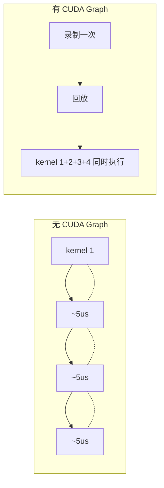
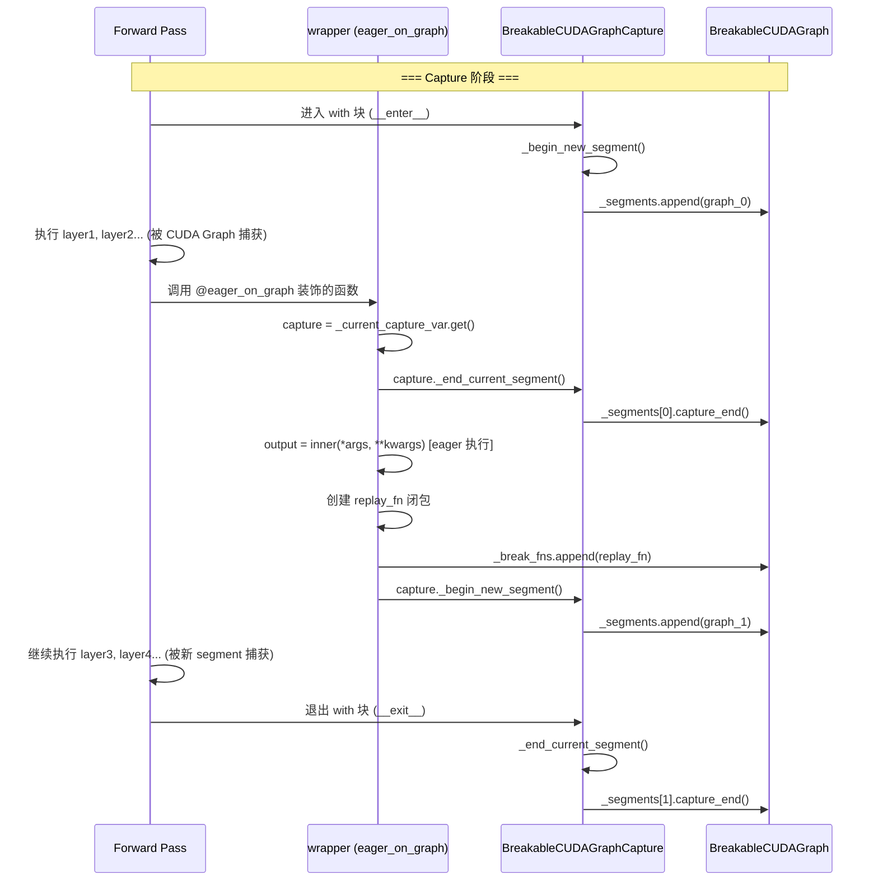
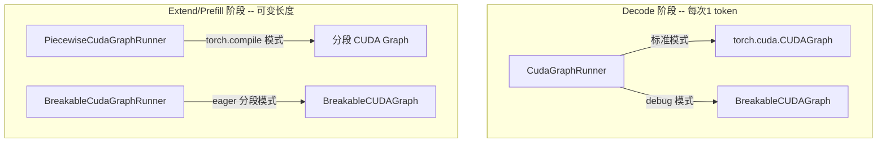
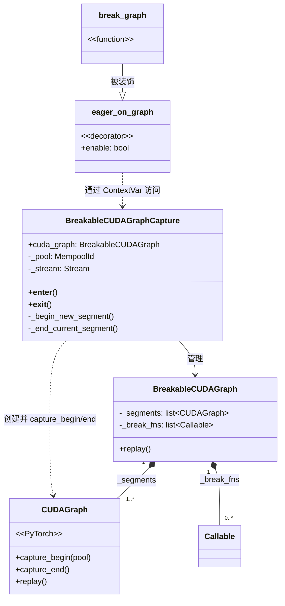
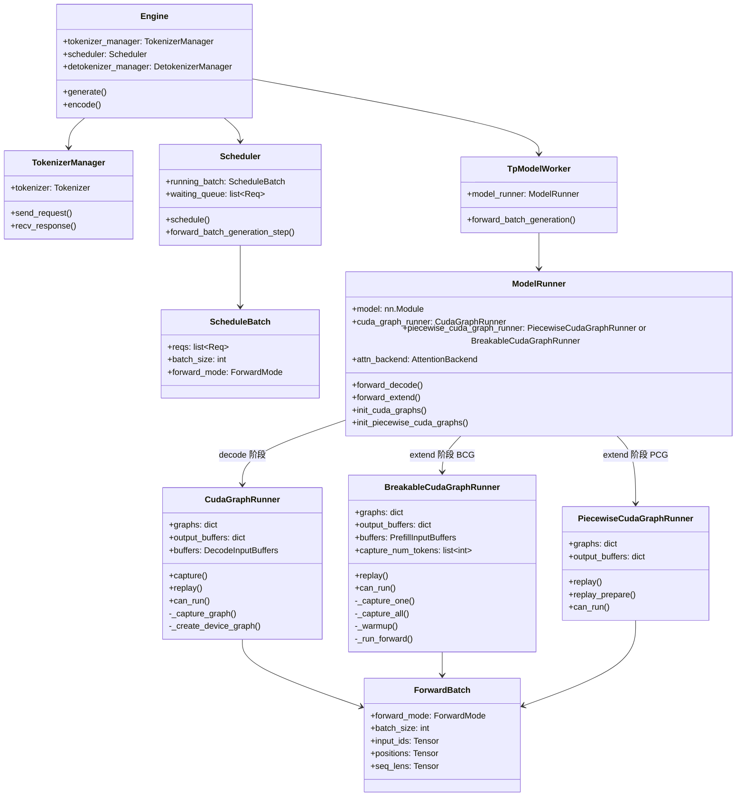
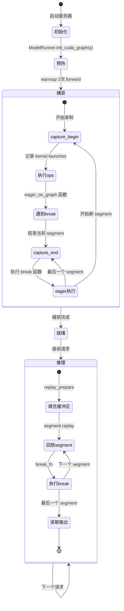
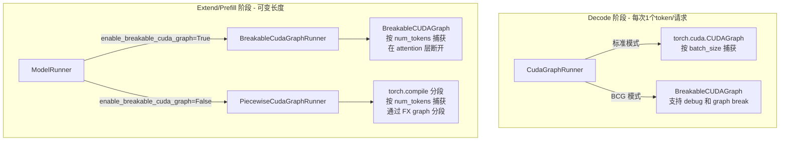
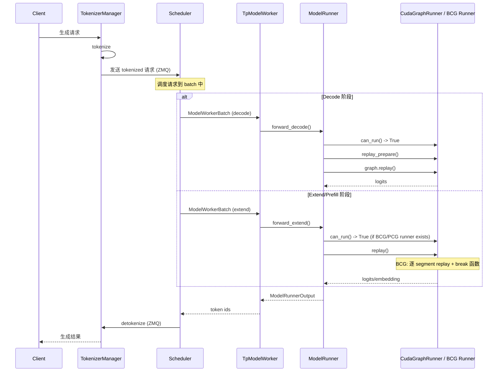
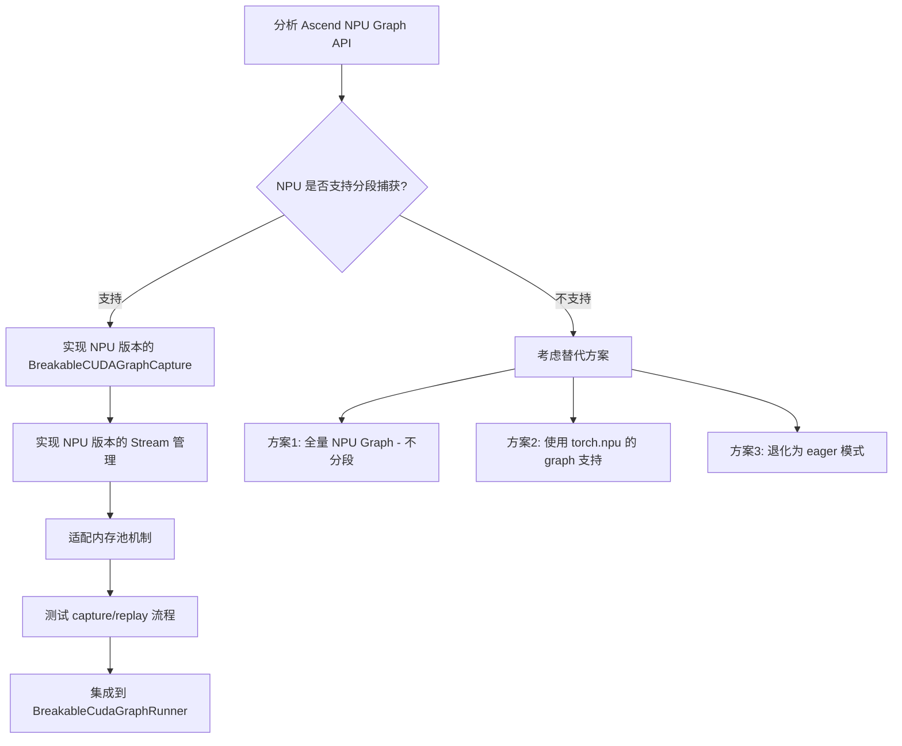

# Breakable CUDA Graph 完全教程

> 本教程面向想要理解 sglang 中 Breakable CUDA Graph (BCG) 实现的开发者。
> 我们会从 Python 语法基础讲起，逐步深入到 CUDA Graph API、BCG 核心代码、以及 sglang 整体架构的类图关系。
> 最终目标是让你具备将 BCG 适配到华为 Ascend NPU A3 的能力。

---

## 目录

1. [Python 语法基础](#1-python-语法基础)
2. [CUDA Graph 基础](#2-cuda-graph-基础)
3. [BCG 核心代码逐行解读](#3-bcg-核心代码逐行解读)
4. [BCG 如何集成到 sglang](#4-bcg-如何集成到-sglang)
5. [类图关系](#5-类图关系)
6. [华为 Ascend NPU 适配思路](#6-华为-ascend-npu-适配思路)

---

## 1. Python 语法基础

在阅读 BCG 代码之前，你需要掌握以下 Python 概念。如果你已经熟悉，可以跳过。

### 1.1 装饰器 (Decorator)

装饰器是 Python 中一种"包装函数"的机制。它的本质是：**接收一个函数，返回一个新函数**。

#### 最简单的装饰器

```python
def my_decorator(func):
    def wrapper(*args, **kwargs):
        print(f"调用 {func.__name__} 之前")
        result = func(*args, **kwargs)
        print(f"调用 {func.__name__} 之后")
        return result
    return wrapper

@my_decorator
def say_hello(name):
    print(f"Hello, {name}!")

say_hello("World")
# 输出:
# 调用 say_hello 之前
# Hello, World!
# 调用 say_hello 之后
```

**发生了什么？** `@my_decorator` 等价于 `say_hello = my_decorator(say_hello)`。
当你调用 `say_hello("World")` 时，实际调用的是 `wrapper("World")`。

#### 带参数的装饰器

BCG 中的 `eager_on_graph(enable=True)` 就是一个**带参数的装饰器**。
它实际上是一个**返回装饰器的函数**：

```python
def eager_on_graph(enable: bool):       # 第1层：接收装饰器参数
    def decorator(inner: Callable):      # 第2层：接收被装饰的函数
        if not enable:
            return inner                 # enable=False 时，不包装，原样返回

        def wrapper(*args, **kwargs):    # 第3层：替换后的函数
            # ... 在这里插入额外逻辑 ...
            return inner(*args, **kwargs)
        return wrapper
    return decorator

# 使用方式
@eager_on_graph(enable=True)
def my_function(x):
    return x * 2

# 等价于:
# my_function = eager_on_graph(enable=True)(my_function)
```

**关键理解**：
- `eager_on_graph(enable=True)` 返回 `decorator`
- `decorator(my_function)` 返回 `wrapper`
- 调用 `my_function(x)` 实际调用的是 `wrapper(x)`

### 1.2 闭包 (Closure)

**闭包 = 函数 + 它引用的外部变量**。

当一个内部函数引用了外部函数的变量，即使外部函数已经执行完毕，那些变量依然"活着"——这就是闭包。

```python
def make_counter():
    count = 0                    # 外部变量

    def counter():
        nonlocal count
        count += 1
        return count             # 引用了外部变量 count

    return counter               # 返回内部函数

c = make_counter()               # make_counter 已经执行完毕
print(c())  # 1                  # 但 count 还"活着"，被 counter 函数"捕获"了
print(c())  # 2                  # count 继续累加
print(c())  # 3
```

**闭包的本质**：内部函数携带了一份对外部变量的**引用**（不是拷贝！），所以外部变量的变化对内部函数可见。

#### BCG 中的 replay 闭包

在 BCG 的 `eager_on_graph` 装饰器中，你可以看到这样的代码：

```python
# breakable_cuda_graph.py 第220-228行
captured_inner = inner                                           # 捕获原始函数
captured_args = tuple(_weak_ref_if_tensor(a) for a in args)      # 捕获参数（弱引用）
captured_kwargs = {k: _weak_ref_if_tensor(v) for k, v in kwargs.items()}
captured_output = _weak_ref_if_tensor(output)                    # 捕获输出（弱引用）

def replay_fn():                                                 # 闭包！
    new_out = captured_inner(*captured_args, **captured_kwargs)  # 引用了 captured_inner, captured_args, captured_kwargs
    return _copy_output(captured_output, new_out)                # 引用了 captured_output

capture.cuda_graph._break_fns.append(replay_fn)                  # 存储闭包，稍后调用
```

**这个 `replay_fn` 就是一个闭包**，它"捕获"了：
- `captured_inner`：原始的被装饰函数
- `captured_args` / `captured_kwargs`：调用时的参数
- `captured_output`：第一次调用产生的输出张量

当 CUDA Graph replay 时，`replay_fn` 被再次调用，它会用**同一个参数引用**重新执行原始函数，并把结果写回到**同一个输出缓冲区**。

### 1.3 上下文管理器 (Context Manager)

上下文管理器是 `with` 语句背后的机制。它保证代码在进入和退出时有确定的行为。

```python
# 用类实现
class MyContext:
    def __enter__(self):
        print("进入 with 块")
        return self

    def __exit__(self, exc_type, exc_val, exc_tb):
        print("退出 with 块")
        return False  # False 表示不吞掉异常

with MyContext() as ctx:
    print("在 with 块内")
# 输出:
# 进入 with 块
# 在 with 块内
# 退出 with 块
```

BCG 中的 `BreakableCUDAGraphCapture` 就是一个上下文管理器：

```python
with BreakableCUDAGraphCapture(cuda_graph=graph, pool=pool, stream=stream):
    output = run_once()  # 这里面的代码会被 CUDA Graph 捕获
# __exit__ 时自动结束最后一个 segment 的捕获
```

### 1.4 ContextVar (上下文变量)

`ContextVar` 是 Python 3.7+ 提供的线程安全的"全局变量"。它可以在不同的调用栈层级中传递状态，而不需要通过函数参数。

```python
from contextvars import ContextVar

# 声明一个上下文变量
current_user: ContextVar[str] = ContextVar("current_user", default="anonymous")

def process_request():
    user = current_user.get()  # 读取当前上下文中的值
    print(f"处理请求的用户: {user}")

# 设置上下文变量
token = current_user.set("Alice")
process_request()   # 输出: 处理请求的用户: Alice
current_user.reset(token)  # 恢复之前的值
process_request()   # 输出: 处理请求的用户: anonymous
```

BCG 中大量使用 `ContextVar` 来在装饰器内部获取当前捕获状态：

```python
_current_capture_var: ContextVar["BreakableCUDAGraphCapture | None"] = ContextVar(
    "current_capture", default=None
)
```

这样，`eager_on_graph` 的 `wrapper` 函数不需要接收 `capture` 参数，就能通过 `_current_capture_var.get()` 知道当前是否处于捕获状态。

---

## 2. CUDA Graph 基础

### 2.1 为什么需要 CUDA Graph？

GPU 执行操作时，每次 kernel launch（内核启动）都有 CPU-to-GPU 的通信开销（约 5-10 微秒）。
对于 decode 阶段（每个 token 只需几十个 kernel），这个开销可能占到总时间的 30-50%。

**CUDA Graph 的解决方案**：一次性"录制"所有 kernel launch，之后只需一次"回放"就能重新执行所有操作。



### 2.2 PyTorch CUDA Graph API

PyTorch 提供了 `torch.cuda.CUDAGraph` 类来操作 CUDA Graph。核心流程分为 **capture（捕获）** 和 **replay（回放）** 两个阶段：

```python
import torch

# 1. 准备静态缓冲区（地址不变的输入/输出）
static_input = torch.randn(10, device='cuda')
static_output = torch.randn(10, device='cuda')

# 2. 预热（让 PyTorch 完成内存分配和 kernel 编译）
for _ in range(2):
    static_output.copy_(static_input * 2)

# 3. 创建 CUDA Graph 对象
graph = torch.cuda.CUDAGraph()

# 4. 捕获：把 forward pass 录制到 graph 中
with torch.cuda.graph(graph):
    static_output.copy_(static_input * 2)  # 这里面的所有 GPU 操作都会被录制

# ===== 至此，graph 已经录制好了 =====

# 5. 在推理时，更新静态缓冲区的值
static_input.copy_(new_data)   # 把新数据拷贝到固定地址

# 6. 回放：重新执行录制的所有操作
graph.replay()

# 7. 读取结果
result = static_output.clone()  # 从固定地址读取结果
```

**关键约束**：
- 捕获期间，所有 GPU 操作必须使用**固定地址**的内存
- 捕获后不能修改 graph 的结构
- 某些操作（动态控制流、CPU-GPU 同步等）**不能**被捕获

### 2.3 CUDA Graph 的底层 API

BCG 使用的 `cuda.bindings` 是 NVIDIA 提供的底层 Python 绑定，对应 C 的 `cudaRuntime.h`：

```python
from cuda.bindings import runtime as rt

# 查询当前 stream 是否处于捕获状态
status, *_ = rt.cudaStreamGetCaptureInfo(stream_ptr)
# status == cudaStreamCaptureStatusActive  表示正在捕获

# 这些是 CUDA Runtime 的 C API 的 Python 封装
# 对应关系:
# cudaStreamGetCaptureInfo  ->  查询 stream 的捕获状态
# cudaStreamCaptureStatusActive  ->  正在捕获中
```

### 2.4 CUDA Graph 内存池

CUDA Graph 使用**共享内存池** (memory pool) 来管理中间张量：

```python
# 获取当前设备的 graph 内存池
pool = torch.cuda.graph_pool_handle()

# 在捕获时指定内存池
graph.capture_begin(pool=pool)
# ... 捕获操作 ...
graph.capture_end()

# 多个 graph 共享同一个 pool，可以复用中间张量的内存
```

**为什么 BCG 需要共享内存池？** 因为 BCG 把一个 forward pass 拆成多个 segment，每个 segment 是一个独立的 `torch.cuda.CUDAGraph`。如果它们共享内存池，那么前一个 segment 的中间张量可以被后一个 segment 复用，节省显存。

---

## 3. BCG 核心代码逐行解读

### 3.1 文件结构

```
python/sglang/srt/model_executor/breakable_cuda_graph/
  __init__.py
  breakable_cuda_graph.py   # 核心实现：装饰器 + 捕获器 + 图容器
  cuda_utils.py             # CUDA Runtime 绑定工具
  context.py                # 运行时状态标志
```

### 3.2 上下文变量（全局状态管理）

文件：`breakable_cuda_graph.py` 第60-68行

```python
# 三个 ContextVar 管理全局捕获状态
_current_capture_var: ContextVar["BreakableCUDAGraphCapture | None"] = ContextVar(
    "current_capture", default=None       # 当前是否在捕获中
)
_current_stream_var: ContextVar[torch.cuda.Stream | None] = ContextVar(
    "current_stream", default=None        # 当前捕获使用的 CUDA stream
)
_forked_streams_var: ContextVar[set[torch.cuda.Stream] | None] = ContextVar(
    "forked_streams", default=None        # 被 fork 出来的辅助 stream
)
```

**为什么用 ContextVar 而不是全局变量？**
- 线程安全：多个线程可以各自有不同的捕获状态
- 调用栈安全：`set()` + `reset(token)` 保证离开 `with` 块后恢复原值

### 3.3 BreakableCUDAGraph -- 图容器

文件：`breakable_cuda_graph.py` 第240-257行

```python
class BreakableCUDAGraph:
    """容器：持有多个 CUDAGraph segment + 每两个 segment 之间的 break 函数。"""

    def __init__(self) -> None:
        self._segments: list[torch.cuda.CUDAGraph] = []  # 图段列表
        self._break_fns: list[Callable[[], Any]] = []     # 断点函数列表

    def replay(self) -> None:
        """回放所有 segment 和 break 函数。"""
        stream = torch.cuda.current_stream()
        token = _current_stream_var.set(stream)
        try:
            for i, seg in enumerate(self._segments):
                seg.replay()                           # 回放第 i 个 segment
                if i < len(self._break_fns):
                    self._break_fns[i]()               # 执行第 i 个 break 函数
        finally:
            _current_stream_var.reset(token)
```

**结构图示**：

```
_segments[0]  ->  _break_fns[0]  ->  _segments[1]  ->  _break_fns[1]  ->  _segments[2]
   CUDA Graph      Python函数        CUDA Graph       Python函数        CUDA Graph
   (捕获的ops)     (eager执行)       (捕获的ops)      (eager执行)       (捕获的ops)
```

### 3.4 BreakableCUDAGraphCapture -- 捕获上下文管理器

文件：`breakable_cuda_graph.py` 第260-333行

```python
class BreakableCUDAGraphCapture:
    """上下文管理器：把 with 块内的代码捕获为多个 CUDA Graph segment。"""

    def __init__(self, cuda_graph, pool=None, stream=None, capture_error_mode="global"):
        self.cuda_graph = cuda_graph    # 外部的 BreakableCUDAGraph 容器
        self._pool = pool               # 共享内存池
        self._stream = stream           # CUDA stream

    def __enter__(self):
        _install_wait_stream_hook()      # 安装 stream fork/join 追踪钩子
        # ... 设置 CUDA stream ...
        self._capture_token = _current_capture_var.set(self)  # 标记"正在捕获"
        self._begin_new_segment()        # 开始第一个 segment
        return self

    def __exit__(self, *args):
        try:
            self._end_current_segment()  # 结束最后一个 segment
        finally:
            # ... 恢复所有 ContextVar ...
            _uninstall_wait_stream_hook()

    def _begin_new_segment(self) -> None:
        graph = torch.cuda.CUDAGraph()
        graph.capture_begin(pool=self._pool, capture_error_mode=self._capture_error_mode)
        self.cuda_graph._segments.append(graph)

    def _end_current_segment(self) -> None:
        # 自动 join 所有被 fork 的辅助 stream
        # ...
        self.cuda_graph._segments[-1].capture_end()
```

**关键理解**：`__enter__` 开始捕获第一个 segment，`__exit__` 结束最后一个 segment。中间的 segment 切换由 `eager_on_graph` 触发。

### 3.5 eager_on_graph -- 核心装饰器

文件：`breakable_cuda_graph.py` 第198-237行

这是 BCG 最关键的代码。让我逐行解释：

```python
def eager_on_graph(enable: bool):           # 装饰器工厂：接收 enable 参数
    def decorator(inner: Callable):          # 接收被装饰的函数
        if not enable:
            return inner                     # enable=False 时什么都不做

        def wrapper(*args, **kwargs):        # 替换后的函数
            capture = _current_capture_var.get()  # 从 ContextVar 获取当前捕获状态
            if capture is None:             # 如果不在捕获中
                return inner(*args, **kwargs)      # 直接执行，不做任何额外操作

            # ===== 以下只在 CUDA Graph 捕获期间执行 =====

            # 第1步：结束当前的 CUDA Graph segment
            capture._end_current_segment()
            # 此时，从 capture 开始到这里为止的所有 GPU 操作
            # 都被录制到了 self.cuda_graph._segments[-1] 中

            # 第2步：正常执行这个函数（eager 模式）
            output = inner(*args, **kwargs)
            # 这个函数的 GPU 操作不会被 CUDA Graph 捕获
            # 因为 segment 已经结束了

            # 第3步：创建 replay 闭包
            captured_inner = inner
            captured_args = tuple(_weak_ref_if_tensor(a) for a in args)
            captured_kwargs = {k: _weak_ref_if_tensor(v) for k, v in kwargs.items()}
            captured_output = _weak_ref_if_tensor(output)

            def replay_fn():                  # <- 这就是闭包！
                new_out = captured_inner(*captured_args, **captured_kwargs)
                return _copy_output(captured_output, new_out)

            # 第4步：把闭包存到 break_fns 列表中
            capture.cuda_graph._break_fns.append(replay_fn)

            # 第5步：开始一个新的 CUDA Graph segment
            capture._begin_new_segment()
            # 后续的 GPU 操作会被录制到新的 segment 中

            return output                     # 返回第一次执行的输出
        return wrapper
    return decorator
```

**执行流程图**：



### 3.6 break_graph -- 手动断点

文件：`breakable_cuda_graph.py` 第336-340行

```python
@eager_on_graph(True)     # 被 eager_on_graph 装饰
def break_graph() -> None:
    """插入一个 graph break。装饰器负责实际的 segment 切分；
    这个函数体什么也不做。"""
    pass
```

**巧妙之处**：`break_graph()` 函数本身什么也不做，但因为它被 `@eager_on_graph(True)` 装饰了，所以调用它时会触发 segment 切分。replay 时，闭包中的 `inner()` 就是 `pass`，所以也不执行任何操作。

### 3.7 weak_ref_if_tensor -- 弱引用张量

```python
def _weak_ref_if_tensor(x):
    """对张量返回弱引用视图，非张量原样返回。"""
    if torch.is_tensor(x):
        from sglang.srt.compilation.weak_ref_tensor import weak_ref_tensors
        return weak_ref_tensors(x)
    return x
```

**为什么要弱引用？**
- 在 capture 阶段，`replay_fn` 闭包捕获了参数和输出张量的引用
- 如果是强引用，这些张量永远不会被释放，导致显存泄漏
- 弱引用：张量可以正常被回收，但只要 CUDA Graph 的内存池还活着，张量的底层存储就还在
- 所以弱引用的 tensor 在 replay 时仍然可以正常使用

### 3.8 _copy_output -- 就地拷贝输出

```python
def _copy_output(dst: Any, src: Any) -> Any:
    """把 src 的输出就地拷贝到 dst，保持地址不变。"""
    if torch.is_tensor(dst) and torch.is_tensor(src):
        dst.copy_(src)              # 张量：就地拷贝数据
        return dst

    if hasattr(dst, "__dict__") and hasattr(src, "__dict__"):
        # 对象：遍历属性，张量属性就地拷贝，非张量属性直接替换
        for key, src_val in src.__dict__.items():
            dst_val = getattr(dst, key, None)
            if torch.is_tensor(dst_val) and torch.is_tensor(src_val):
                dst_val.copy_(src_val)
            else:
                setattr(dst, key, src_val)
        return dst

    if isinstance(dst, dict) and isinstance(src, dict):
        # 字典：类似处理
        for key, src_val in src.items():
            dst_val = dst.get(key)
            if torch.is_tensor(dst_val) and torch.is_tensor(src_val):
                dst_val.copy_(src_val)
            else:
                dst[key] = src_val
        return dst

    return src
```

**为什么需要就地拷贝？**
- CUDA Graph replay 时，后续 segment 引用的输出地址是固定的
- break 函数的输出必须写回**同一块内存地址**
- `dst.copy_(src)` 保证数据写入固定地址，而不是创建新张量

---

## 4. BCG 如何集成到 sglang

### 4.1 两种 CUDA Graph Runner

sglang 中有两种使用 CUDA Graph 的 runner：

| Runner | 文件 | 用途 | 捕获阶段 |
|--------|------|------|----------|
| `CudaGraphRunner` | `cuda_graph_runner.py` | Decode 阶段 | 按 batch size 捕获 |
| `BreakableCudaGraphRunner` | `breakable_cuda_graph_runner.py` | Extend/Prefill 阶段 | 按 num_tokens 捕获 |



### 4.2 CudaGraphRunner 中的 BCG 集成

`CudaGraphRunner` 在 `_create_device_graph` 和 `_capture_graph` 中使用 BCG：

```python
# cuda_graph_runner.py 第943-948行
def _create_device_graph(self):
    if envs.SGLANG_USE_BREAKABLE_CUDA_GRAPH.get():
        return BreakableCUDAGraph()      # BCG 模式
    return torch.cuda.CUDAGraph()        # 标准模式

# cuda_graph_runner.py 第910-941行
def _capture_graph(self, graph, pool, stream, run_once_fn):
    # 选择捕获方式
    if envs.SGLANG_USE_BREAKABLE_CUDA_GRAPH.get():
        graph_ctx = BreakableCUDAGraphCapture    # BCG 捕获器
    else:
        graph_ctx = self.device_module.graph      # 标准 torch.cuda.graph

    # debug 模式：把整个 forward 包一层 eager_on_graph
    if self.model_runner.server_args.debug_cuda_graph:
        captured_fn = eager_on_graph(True)(run_once_fn)
    else:
        captured_fn = run_once_fn

    with graph_ctx(cuda_graph=graph, pool=pool, stream=stream):
        out = captured_fn()
    return out
```

**debug 模式的巧妙设计**：
- `eager_on_graph(True)(run_once_fn)` 把整个 forward 函数包了一层
- 当 BCG capture 开始时，`wrapper` 发现自己在捕获中
- 它立即 `_end_current_segment()`（此时 segment 是空的）
- 然后 eager 执行 forward
- 然后 `_begin_new_segment()`（又一个空 segment）
- 结果就是：所有操作都是 eager 执行的，但走了一遍完整的 capture/replay 流程

### 4.3 BreakableCudaGraphRunner -- 独立的 BCG Runner

`BreakableCudaGraphRunner` 是专门为 extend（prefill）阶段设计的 runner。

```python
# breakable_cuda_graph_runner.py 第71-83行
class BreakableCudaGraphRunner:
    # 复用 PiecewiseCudaGraphRunner 的 replay_prepare 方法
    replay_prepare = PiecewiseCudaGraphRunner.replay_prepare

    def __init__(self, model_runner: ModelRunner):
        # ...
        self._init_buffers(model_runner)    # 初始化静态缓冲区
        self._warmup()                       # 预热
        self._capture_all()                  # 捕获所有 token 大小的 graph

    def _capture_one(self, num_tokens, pool, stream):
        """为特定 token 数量捕获 BCG。"""
        forward_batch = self._build_capture_forward_batch(num_tokens)
        self.model_runner.attn_backend.init_forward_metadata(forward_batch)

        def run_once():
            return self._run_forward(forward_batch, num_tokens)

        # 预热2次
        for _ in range(2):
            self.device_module.synchronize()
            self.model_runner.tp_group.barrier()
            run_once()

        # 捕获
        graph = BreakableCUDAGraph()
        with BreakableCUDAGraphCapture(cuda_graph=graph, pool=pool, stream=stream):
            output = run_once()

        return graph, output
```

**为什么 extend 阶段需要分段？**
- Extend 阶段的 token 数量是动态的（不像 decode 每次只有 1 token）
- 标准的 CUDA Graph 要求固定的输入形状
- BCG 通过在 attention 层处断开，让每个 segment 内的操作形状一致
- 断点处可以动态处理可变长度

### 4.4 ModelRunner 中的选择逻辑

```python
# model_runner.py 第2752-2756行
if self.server_args.enable_breakable_cuda_graph:
    self.piecewise_cuda_graph_runner = BreakableCudaGraphRunner(self)
else:
    self.piecewise_cuda_graph_runner = PiecewiseCudaGraphRunner(self)
```

```python
# model_runner.py 第2863-2872行
def forward_extend(self, forward_batch, ...):
    can_run_graph = (
        self.piecewise_cuda_graph_runner is not None
        and self.piecewise_cuda_graph_runner.can_run(forward_batch)
    )

    if can_run_graph:
        return (
            self.piecewise_cuda_graph_runner.replay(forward_batch, **kwargs),
            can_run_graph,
        )
    # 否则走 eager 路径
```

---

## 5. 类图关系

### 5.1 BCG 核心类图



### 5.2 sglang 整体推理架构类图



### 5.3 CUDA Graph 生命周期



### 5.4 CudaGraphRunner vs BreakableCudaGraphRunner vs PiecewiseCudaGraphRunner



### 5.5 完整的请求处理流程



---

## 6. 华为 Ascend NPU 适配思路

### 6.1 需要替换的关键组件

| CUDA 组件 | Ascend NPU 对应 | 说明 |
|-----------|----------------|------|
| `torch.cuda.CUDAGraph` | `torch.npu.NPUGraph` (或 Ascend 的 graph API) | PyTorch 已经适配了部分 NPU graph 支持 |
| `cuda.bindings.runtime` | `torch_npu` 的 graph 相关 API | 需要 Ascend 的 Python 绑定 |
| `torch.cuda.Stream` | `torch.npu.Stream` | Stream 管理 |
| CUDA 内存池 | NPU 内存池 | 内存管理机制不同 |

### 6.2 BCG 适配的关键挑战

1. **Stream Capture API**：CUDA 的 `cudaStreamBeginCapture` / `cudaStreamEndCapture` 在 Ascend 上是否有对应？
2. **共享内存池**：CUDA Graph 的 `graph_pool_handle()` 在 NPU 上的等价机制？
3. **弱引用张量**：`weak_ref_tensors` 是否兼容 NPU 的内存管理？

### 6.3 适配路径建议



### 6.4 代码改动预估

需要修改/新建的文件：

| 文件 | 改动内容 |
|------|----------|
| `breakable_cuda_graph.py` | 添加 NPU 后端支持（条件分支 `is_npu()`） |
| `cuda_utils.py` | 添加 NPU runtime 绑定（或替换为 torch_npu API） |
| `breakable_cuda_graph_runner.py` | 已经有 `is_npu()` 的部分支持，可能需要扩展 |
| 新建 `npu_utils.py` | NPU 特定的 graph API 封装 |

---

## 附录

### A. 术语表

| 术语 | 含义 |
|------|------|
| **CUDA Graph** | NVIDIA 的操作录制/回放机制，减少 kernel launch 开销 |
| **Breakable CUDA Graph (BCG)** | 可断点的 CUDA Graph，在特定位置分段 |
| **Piecewise CUDA Graph (PCG)** | 基于 torch.compile 的分段 CUDA Graph |
| **Segment** | 一个完整的 `torch.cuda.CUDAGraph`，BCG 中的基本单元 |
| **Graph Break** | 两个 segment 之间的断点，断点处代码 eager 执行 |
| **Closure (闭包)** | 捕获了外部变量的函数，在 BCG 中用于存储 replay 函数 |
| **Decorator (装饰器)** | Python 的函数包装机制，`eager_on_graph` 就是一个 |
| **ContextVar** | Python 的线程安全全局变量，用于传递捕获状态 |
| **Weak Reference** | 不增加引用计数的引用方式，防止内存泄漏 |
| **Eager** | 非 Graph 模式，操作立即执行 |

### B. 关键文件速查

| 文件路径 | 核心内容 |
|----------|----------|
| `python/sglang/srt/model_executor/breakable_cuda_graph/breakable_cuda_graph.py` | BCG 核心：装饰器、捕获器、图容器 |
| `python/sglang/srt/model_executor/breakable_cuda_graph/cuda_utils.py` | CUDA Runtime 绑定 |
| `python/sglang/srt/model_executor/breakable_cuda_graph/context.py` | 运行时状态标志 |
| `python/sglang/srt/model_executor/breakable_cuda_graph_runner.py` | BCG Runner（extend 阶段） |
| `python/sglang/srt/model_executor/cuda_graph_runner.py` | 标准 CUDA Graph Runner（decode 阶段） |
| `python/sglang/srt/model_executor/model_runner.py` | 模型执行器，选择和调度 graph runner |
| `python/sglang/srt/managers/scheduler.py` | 请求调度器 |
