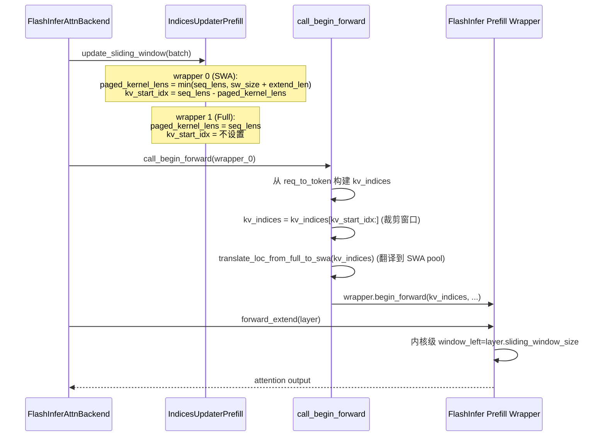
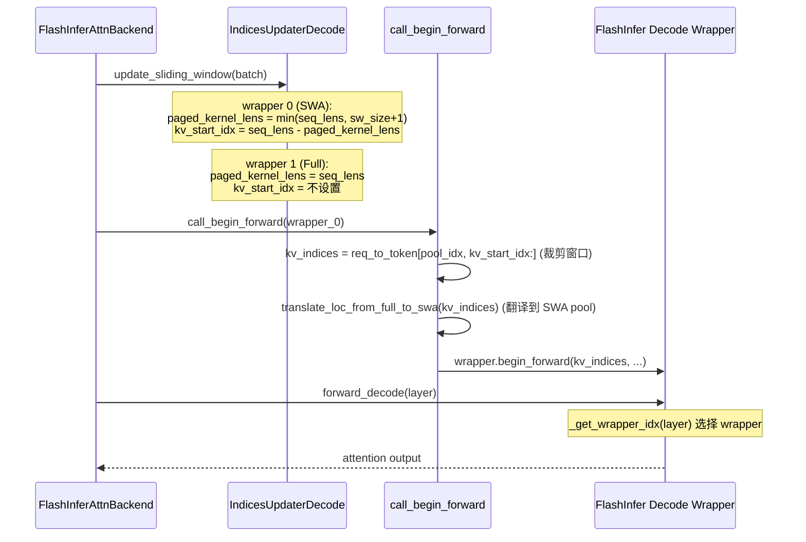
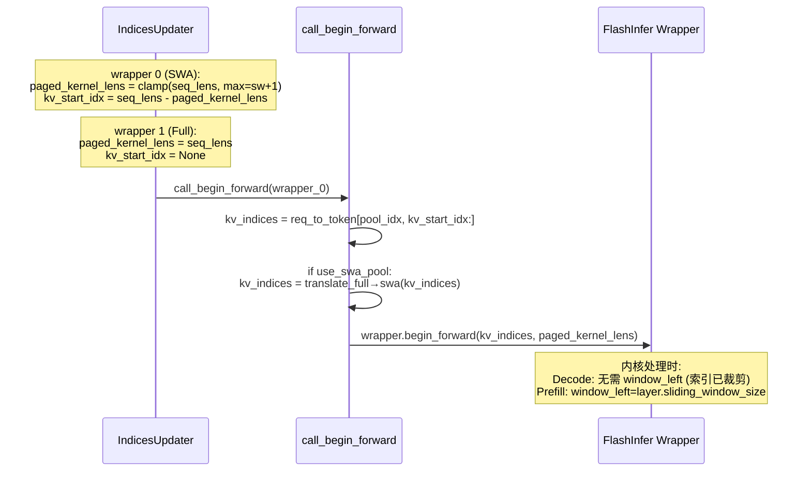
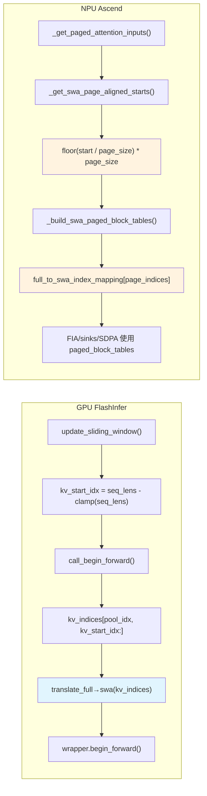
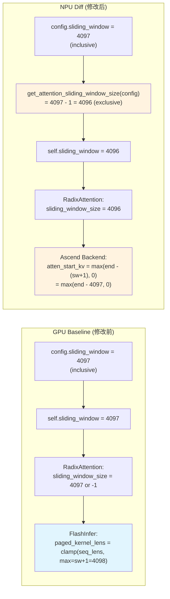
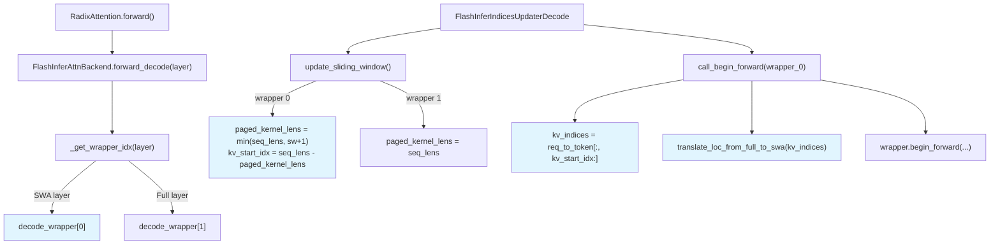
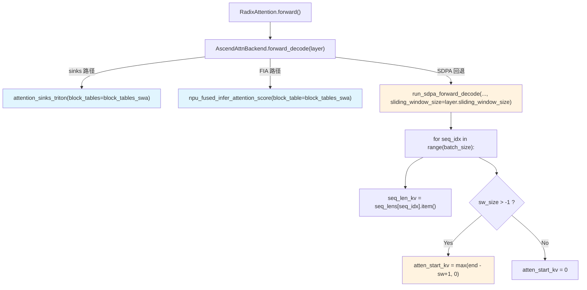
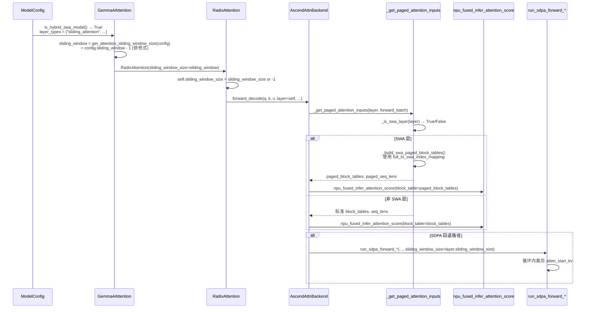
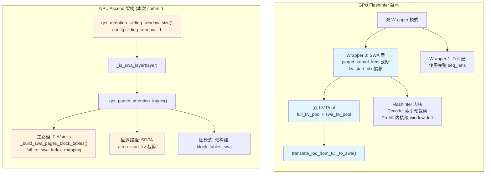

# Commit bc1be097 完整 Diff 分析 — NPU SWA 实现

> 分析对象: commit `bc1be097` (add sliding window attention) 的全部 3 个文件 diff
> 对比基准: GPU FlashInfer 后端的 SWA 实现 (`flashinfer_backend.py`)
> 分析日期: 2026-05-07

---

## 目录

- [1. Diff 概览](#1-diff-概览)
- [2. Part 1: run_sdpa_forward_extend (Torch Native Extend 路径)](#2-part-1-run_sdpa_forward_extend-extend-路径)
  - [2.1 GPU Baseline](#21-gpu-baseline)
  - [2.2 NPU Diff](#22-npu-diff)
  - [2.3 对比分析](#23-对比分析)
- [3. Part 2: run_sdpa_forward_decode (Torch Native Decode 路径)](#3-part-2-run_sdpa_forward_decode-decode-路径)
  - [3.1 GPU Baseline](#31-gpu-baseline)
  - [3.2 NPU Diff](#32-npu-diff)
  - [3.3 对比分析](#33-对比分析)
- [4. Part 3: AscendAttnBackend SWA 辅助方法与 Forward 路径](#4-part-3-ascendattnbackend-swa-辅助方法与-forward-路径)
  - [4.1 GPU Baseline: 双 Wrapper 模式](#41-gpu-baseline-双-wrapper-模式)
  - [4.2 NPU Diff: 6 个新辅助方法 + 3 个 Forward 路径修改](#42-npu-diff-6-个新辅助方法--3-个-forward-路径修改)
  - [4.3 对比分析](#43-对比分析)
- [5. Part 4: Gemma4Attention 滑动窗口配置](#5-part-4-gemma4attention-滑动窗口配置)
  - [5.1 GPU Baseline](#51-gpu-baseline)
  - [5.2 NPU Diff](#52-npu-diff)
  - [5.3 对比分析](#53-对比分析)
- [6. 调用链与集成](#6-调用链与集成)
- [7. 架构级对比](#7-架构级对比)

---

## 1. Diff 概览

### Commit 信息

- **SHA**: `bc1be097c0406760a045cafc88a100b14732aa65`
- **Message**: `add sliding window attention`
- **Author**: JiaruiChang5268
- **Date**: 2026-04-20
- **总计**: 246 additions, 40 deletions

### 修改的文件

| # | 文件 | 状态 | +行 | -行 | 分析章节 |
|---|------|------|-----|-----|----------|
| 1 | `python/sglang/srt/hardware_backend/npu/attention/ascend_backend.py` | modified | 200 | 24 | Part 3 |
| 2 | `python/sglang/srt/hardware_backend/npu/attention/ascend_torch_native_backend.py` | modified | 43 | 15 | Part 1 & 2 |
| 3 | `python/sglang/srt/models/gemma4_causal.py` | modified | 3 | 1 | Part 4 |

### 变更摘要

| 变更类别 | 描述 | 影响范围 |
|----------|------|----------|
| **6 个新辅助方法** | `ascend_backend.py` 新增 `_is_swa_layer()` 等方法 | Part 3 |
| **3 个 Forward 路径修改** | `forward_extend/decode/decode_graph` 集成 SWA 块表 | Part 3 |
| **SDPA 回退路径 SWA** | `run_sdpa_forward_extend/decode` 支持 SWA | Part 1 & 2 |
| **模型层配置修正** | `Gemma4Attention.sliding_window` 使用正确的窗口大小计算 | Part 4 |

---

## 2. Part 1: run_sdpa_forward_extend (Extend 路径)

### 2.1 GPU Baseline

#### 代码位置

| 组件 | 文件 | 行号 |
|------|------|------|
| Prefill SWA 索引计算 | `python/sglang/srt/layers/attention/flashinfer_backend.py` | 第 1297-1345 行 |
| Prefill forward 分派 | 同上 | 第 779-891 行 |
| FlashInfer 内核 window_left | 同上 | 第 824-831 行 |
| Wrapper 索引选择 | 同上 | 第 932-941 行 |

#### GPU SWA Extend 核心机制

GPU 使用 **三层 SWA 处理**：

**层 1: 索引预计算** (`FlashInferIndicesUpdaterPrefill.update_sliding_window()`)

```
函数签名 (推断，代码中无 inline comment):
def update_sliding_window(self, ...)

关键计算:
  wrapper_id 0 (SWA 层):
    paged_kernel_lens = min(seq_lens, sliding_window_size + (seq_lens - prefix_lens))
    kv_start_idx = seq_lens - paged_kernel_lens

  wrapper_id 1 (Full 层):
    paged_kernel_lens = seq_lens
    kv_start_idx = 0 (不设置)
```

> 推断依据: `flashinfer_backend.py:1315-1325` 的 `update_sliding_window()` 方法中，wrapper_id 0 的 `paged_kernel_lens` 使用 `min(seq_lens, sliding_window_size + seq_lens - prefix_lens)` 计算。`kv_start_idx` 通过 `seq_lens - paged_kernel_lens` 得到。

**层 2: KV 索引翻译** (`call_begin_forward()`)

当 `use_sliding_window_kv_pool=True` 时，KV 索引从 full pool 空间翻译到 SWA pool 空间：

```
调用位置 (推断，代码中无 inline comment):
flashinfer_backend.py:1142-1148
  if use_sliding_window_kv_pool:
      kv_indices = self.token_to_kv_pool_allocator.translate_loc_from_full_to_swa(kv_indices)
```

**层 3: 内核级窗口** (`forward_extend()`)

FlashInfer 的 prefill wrapper 直接接受 `window_left` 参数：

```
调用位置 (推断，代码中无 inline comment):
flashinfer_backend.py:824-831
  prefill_wrapper.forward(
      ...,
      window_left=layer.sliding_window_size,
  )
```

#### GPU Extend SWA 数据流



### 2.2 NPU Diff

#### 修改的代码段

**变更 1: 函数签名 — 新增 `sliding_window_size` 参数**

```diff
  def run_sdpa_forward_extend(
      ...
      causal=False,
+     sliding_window_size: int = -1,
      logit_cap: float = 0.0,
      ...
  ):
```

> 代码中无 inline comment。推断依据: 参数默认值 `-1` 表示"不启用"，与 GPU 的 `layer.sliding_window_size == -1` 表示 full attention 层的约定一致。

**变更 2: 类型修复 — `.item()` 转换**

```diff
- extend_seq_len_q = extend_seq_lens[seq_idx]
- prefill_seq_len_q = extend_prefix_lens[seq_idx]
+ extend_seq_len_q = int(extend_seq_lens[seq_idx].item())
+ prefill_seq_len_q = int(extend_prefix_lens[seq_idx].item())

- seq_len_kv = seq_lens[seq_idx]
+ seq_len_kv = int(seq_lens[seq_idx].item())

  # encoder_lens 相关的同样修改
- atten_end_kv = encoder_lens[seq_idx]
+ atten_end_kv = int(encoder_lens[seq_idx].item())
```

> 代码中无 inline comment。推断依据: `.item()` 将零维张量转为 Python scalar，后续的 `max()` 比较需要 Python int 而非 torch tensor，否则行为可能不符合预期。

**变更 3: SWA KV 范围裁剪 — 核心新增逻辑**

```diff
+ if (
+     sliding_window_size is not None
+     and sliding_window_size > -1
+     and encoder_lens is None
+ ):
+     # For extend, the sliding window must be anchored at the first
+     # query token in this chunk rather than the final sequence
+     # length. Otherwise a large extend chunk can no longer fit in
+     # the cropped query suffix, which breaks the native fallback.
+     atten_start_kv = max(
+         prefill_seq_len_q - sliding_window_size, atten_start_kv
+     )
```

#### Inline Comment 详细解读

实际 inline comment（原文）:

> "For extend, the sliding window must be anchored at the first query token in this chunk rather than the final sequence length. Otherwise a large extend chunk can no longer fit in the cropped query suffix, which breaks the native fallback."

逐句解读：

**"anchored at the first query token in this chunk"** — 窗口的左边界由**本次 extend 的第一个 query token** 的位置（即 `prefill_seq_len_q`）决定，而不是由序列的最终位置决定。

**"rather than the final sequence length"** — 如果锚定在序列末尾，窗口左边界 = `seq_len - sw_size`。但 `seq_len = prefix_len + extend_len`，当 `extend_len > sw_size` 时窗口无法覆盖所有 extend token。

**"a large extend chunk can no longer fit in the cropped query suffix"** — extend chunk 就是本次新增的 token，如果窗口太小（只有 `sw_size` 个 KV 槽位）而 extend token 很多（`extend_len > sw_size`），SDPA 的 padded query 缓冲区放不下所有 query token。

**"breaks the native fallback"** — torch SDPA 路径通过构造 padded query 张量 + `is_causal=True` 实现 causal attention。如果 query 放不下，输出结果会错误。

#### 关键变量含义

| 变量名 | 来源 | 含义 |
|--------|------|------|
| `prefill_seq_len_q` | `extend_prefix_lens[seq_idx]` | KV cache 中**已有**的 prefix token 数量（命名有误导性，实际是 prefix_len） |
| `extend_seq_len_q` | `extend_seq_lens[seq_idx]` | 本次 extend **新增**的 token 数量 |
| `seq_len_kv` | `seq_lens[seq_idx]` | 总序列长度 = `prefill_seq_len_q + extend_seq_len_q` |
| `atten_start_kv` | 计算值 | KV 注意力范围的左边界（裁剪前=0，裁剪后=窗口起始位置） |
| `atten_end_kv` | `seq_len_kv` | KV 注意力范围的右边界（始终=总序列长度） |

> 来源依据: `ascend_backend.py:1184-1201` 中调用 `run_sdpa_forward_extend` 时传递 `forward_batch.extend_prefix_lens` 和 `forward_batch.extend_seq_lens`。`schedule_batch.py:1678-1681` 中定义 `seq_lens = [len(r.fill_ids) for r in reqs]`，`prefix_lens = [len(r.prefix_indices) for r in reqs]`。

不变量: `seq_len_kv = prefill_seq_len_q + extend_seq_len_q`

#### 为什么窗口必须锚定在第一个 query token？

SDPA 路径的处理模式是：构造一个 padded query 张量，将 extend token 放在它们的**因果逻辑位置**，然后用 `is_causal=True` 调用 `scaled_dot_product_attention`。

如果窗口锚定在**序列末尾**（decode 风格）：

```
方案 A (锚定在末尾, 错误):
  atten_start_kv = seq_len_kv - sliding_window_size
                  = (prefix_len + extend_len) - sw_size

  padded 缓冲区大小 = seq_len_kv - atten_start_kv = sw_size
  query_start_idx   = prefix_len - atten_start_kv
                    = prefix_len - (prefix_len + extend_len - sw_size)
                    = sw_size - extend_len

  当 extend_len > sw_size:
    query_start_idx < 0  ← extend token 无法放入缓冲区!
    缓冲区只有 sw_size 个槽位，但有 extend_len 个 query token
    extend_len > sw_size → 放不下 → 崩溃或错误结果
```

如果窗口锚定在**第一个 query token**（实际采用）：

```
方案 B (锚定在首个 query token, 正确):
  atten_start_kv = max(prefix_len - sw_size, 0)

  padded 缓冲区大小 = seq_len_kv - atten_start_kv
                    = (prefix_len + extend_len) - (prefix_len - sw_size)
                    = sw_size + extend_len
                    ← 总是足够容纳所有 extend token

  query_start_idx = max(prefix_len - atten_start_kv, 0)
                  = max(sw_size, 0) = sw_size
                  ← extend token 放在 [sw_size, sw_size + extend_len) 处
                  ← 前面的 [0, sw_size) 放的是零填充（对应窗口内的 prefix KV）
```

#### 具体例子

```
参数: prefix_len = 3000, extend_len = 2000, sliding_window_size = 1024
       seq_len = 5000

===== 方案 A (锚定在末尾, 错误) =====

  atten_start_kv = 5000 - 1024 = 3976
  atten_end_kv   = 5000
  padded 缓冲区大小 = 5000 - 3976 = 1024

  query_start_idx = 3000 - 3976 = -976  ← 负数!

  问题: 缓冲区只有 1024 个槽位，但有 2000 个 query token
  Token 3000-4999 的 query 无法放入大小为 1024 的缓冲区

  KV 范围: [3976, 5000) ← 只看最近的 1024 个 KV token
  但 query token 从逻辑位置 3000 开始，需要看到 3000 之前的 KV
  窗口只包含 [3976, 5000)，token 3000-3975 被 SWA 裁掉了
  然而它们是 query 的因果依赖——causal mask 需要 query 位置 >= KV 位置

  结果: ❌ 崩溃（query_start_idx < 0）或输出错误

===== 方案 B (锚定在首个 query token, 正确) =====

  atten_start_kv = max(3000 - 1024, 0) = 1976
  atten_end_kv   = 5000
  padded 缓冲区大小 = 5000 - 1976 = 3024

  query_start_idx = max(3000 - 1976, 0) = 1024

  Padded query 缓冲区布局 (大小 3024):
  [0     ... 1024    ... 3024   ]
  | 零填充      | query tokens   |
  | (1024)      | (2000)         |

  KV 缓冲区布局 (范围 [1976, 5000)):
  [1976    ... 3000    ... 5000  ]
  | prefix KV   | extend KV     |
  | (1024)      | (2000)        |

  SDPA is_causal=True 处理:
  query[0]    (零) → 被 causal mask 遮蔽（位置 0 不 attend 到后面的 KV）
  ...
  query[1024] (extend token 0, 逻辑位置 3000) → attend to KV[0..1024] (逻辑位置 1976..3000)
  query[1025] (extend token 1, 逻辑位置 3001) → attend to KV[0..1025]
  ...
  query[3023] (extend token 1999, 逻辑位置 4999) → attend to KV[0..3023] (全部)

  注意: extend token 的 causal mask 覆盖了窗口内的 prefix KV + 所有 extend KV
  窗口外的 prefix KV (位置 0..1975) 不在缓冲区中，自然不被 attend
  零填充位置的 query 被 causal mask 遮蔽，不影响结果

  结果: ✅ 正确 — 每个 query token 只看到窗口内和因果范围内的 KV
```

#### 与 GPU 的对比

| 维度 | GPU (FlashInfer) | NPU (SDPA 回退) |
|------|------------------|-----------------|
| **窗口锚点** | 不需要显式锚定——FlashInfer 内核接受 `window_left` 参数，内核内部逐 token 处理 | 必须锚定在首个 query token——因为要构造 padded query + causal mask |
| **Extend 窗口公式** | `paged_kernel_lens = min(seq_lens, sw_size + extend_len)` → `kv_start_idx = seq_lens - paged_kernel_lens` | `atten_start_kv = max(prefix_len - sw_size, 0)` |
| **等价性** | 当 `seq_len > sw_size + extend_len` 时 `kv_start_idx = prefix_len - sw_size` | 与 GPU 等价 |
| **当 `seq_len <= sw_size + extend_len`** | `kv_start_idx = 0`（窗口包含全部 KV） | `atten_start_kv = max(prefix_len - sw_size, 0)`（可能非零） |
| **差异处理** | FlashInfer 内核逐 token 计算 causal + window mask | SDPA 的 `is_causal=True` + 零填充 query 自然处理 |

**变更 4: Query padding 构造重构**

```diff
+ query_start_idx = max(prefill_seq_len_q - atten_start_kv, 0)
+ seq_len_kv = atten_end_kv - atten_start_kv
- per_req_query_redudant = torch.empty(
+ per_req_query_redudant = torch.zeros(
      (per_req_query.shape[0], seq_len_kv, per_req_query.shape[2]),
      ...
  )

- per_req_query_redudant[:, prefill_seq_len_q:, :] = per_req_query
+ per_req_query_redudant[:, query_start_idx:, :] = per_req_query
```

变量含义详解:

| 变量 | 含义 | 计算方式 |
|------|------|----------|
| `query_start_idx` | extend token 在 padded 缓冲区中的**起始放置位置** | `max(prefix_len - atten_start_kv, 0)` |
| `seq_len_kv` | padded 缓冲区的**总长度**（= 窗口内 KV 数量） | `atten_end_kv - atten_start_kv` |

> 代码中无 inline comment。推断依据:
>
> - **`query_start_idx`**: 无 SWA 时 `atten_start_kv=0`，`query_start_idx = prefix_len`（extend token 从 prefix_len 位置开始放）。有 SWA 时 `atten_start_kv > 0`，缓冲区不再从 0 开始而是从 `atten_start_kv` 开始，所以 extend token 的相对位置变为 `prefix_len - atten_start_kv`
>
> - **`torch.empty` → `torch.zeros`**: 无 SWA 时缓冲区 `[0, prefix_len)` 部分不参与 SDPA 计算（causal mask 遮蔽了），即使未初始化也不影响。有 SWA 时缓冲区 `[0, query_start_idx)` 部分对应窗口内的 prefix KV，但这些位置的 query 应该是零（不是真正的 query token）。如果使用 `torch.empty`，这些位置可能包含 NaN/Inf，通过 `is_causal=True` 仍会被遮蔽，但零值更安全
>
> - **`seq_len_kv` 重算**: 无 SWA 时 `seq_len_kv = prefix_len + extend_len`（全序列长度）。有 SWA 时只需 `atten_end_kv - atten_start_kv`（窗口长度），避免分配过大的缓冲区

接上面的例子（`prefix_len=3000, extend_len=2000, sw_size=1024`）:

```
无 SWA:
  seq_len_kv = 5000 (全序列)
  query_start_idx = max(3000 - 0, 0) = 3000
  缓冲区大小: [num_heads, 5000, head_dim]
  query 放在: [3000:5000] → extend token 占 [3000, 5000)

有 SWA:
  seq_len_kv = 5000 - 1976 = 3024 (窗口长度)
  query_start_idx = max(3000 - 1976, 0) = 1024
  缓冲区大小: [num_heads, 3024, head_dim]  ← 比 5000 小很多
  query 放在: [1024:3024] → extend token 占 [1024, 3024)
```

**变更 5: 输出提取逻辑**

```diff
- output[start_q:end_q, :, :] = per_req_out_redudant[prefill_seq_len_q:, :, :]
+ output[start_q:end_q, :, :] = per_req_out_redudant[
+     query_start_idx : query_start_idx + extend_seq_len_q, :, :
+ ]
```

> 代码中无 inline comment。推断依据: 输出提取位置需要匹配 query 在 padding 缓冲区中的实际放置位置（`query_start_idx`），而非固定的 `prefill_seq_len_q`。

#### Extend 路径 SWA 窗口计算示例

```
假设: seq_len = 4096, sliding_window_size = 1024, prefix_len = 3000, extend_len = 1096

无 SWA 时:
  atten_start_kv = 0
  atten_end_kv = 4096
  query 放置位置: [3000:4096]  (固定 prefix_len 偏移)
  KV 范围: [0:4096]  (全序列)

有 SWA 时:
  atten_start_kv = max(3000 - 1024, 0) = 1976  ← 窗口左边界
  atten_end_kv = 4096                           ← 不变
  seq_len_kv = 4096 - 1976 = 2120               ← 窗口长度
  query_start_idx = max(3000 - 1976, 0) = 1024  ← 查询在窗口缓冲区的起始位置
  query 放置位置: [1024:2120]  (动态偏移)
  KV 范围: [1976:4096]  (仅窗口内)

KV 缓冲区布局:
  [0     ... query_start_idx ... seq_len_kv]
  | 零填充      | query tokens        |
  | (1024)      | (1096 = extend_len) |

SDPA 处理的 KV 范围:
  [atten_start_kv                  ... atten_end_kv]
  | 窗口内 KV tokens (2120 个)                      |
  = tokens[1976] ... tokens[4095]
```

### 2.3 对比分析

#### 关键差异点

| 维度 | GPU (FlashInfer) | NPU (Torch Native SDPA) |
|------|------------------|------------------------|
| **SWA 机制** | 三层处理: 索引预计算 + KV 索引翻译 + 内核级 `window_left` | 单层处理: 在循环内直接裁剪 `atten_start_kv` |
| **Wrapper 架构** | 双 wrapper (SWA=0, Full=1)，独立索引空间 | 单循环，条件判断 `sliding_window_size > -1` |
| **KV Pool** | 双 pool (full + swa)，索引需 `translate_loc_from_full_to_swa` | 单 pool，直接用 `atten_start_kv` 裁剪范围 |
| **窗口锚点 (Extend)** | 内核级 `window_left` 由 FlashInfer API 处理 | 手动计算 `atten_start_kv = max(prefix_len - sw_size, 0)` |
| **Extend 窗口公式** | `paged_kernel_lens = min(seq_lens, sw_size + extend_len)` → 由内核处理因果遮罩 | `atten_start_kv = max(prefix_len - sw_size, 0)` → SDPA 的 `causal=True` 处理因果遮罩 |
| **Query padding** | 无需 padding，FlashInfer 直接处理变长序列 | 需要 padding 构造固定长度张量给 SDPA |
| **性能** | 批量处理，FlashInfer 内核融合 | 逐请求 for 循环，每个请求单独调用 SDPA |

#### 窗口计算等价性

```
GPU Extend 窗口:
  kv_start_idx = seq_lens - paged_kernel_lens
  paged_kernel_lens = min(seq_lens, sw_size + extend_len)

  当 seq_lens > sw_size + extend_len:
    kv_start_idx = seq_lens - sw_size - extend_len
    = seq_lens - sw_size - (seq_lens - prefix_lens)
    = prefix_lens - sw_size

  当 seq_lens <= sw_size + extend_len:
    kv_start_idx = 0

NPU Extend 窗口:
  atten_start_kv = max(prefix_len_q - sw_size, 0)

  当 prefix_len_q > sw_size:
    atten_start_kv = prefix_len_q - sw_size

  当 prefix_len_q <= sw_size:
    atten_start_kv = 0
```

> 两者在 `seq_lens > sw_size + extend_len` 时等价。当 `seq_lens <= sw_size + extend_len` 时，GPU 的 `kv_start_idx=0` 而 NPU 的 `atten_start_kv` 可能非零（如果 `prefix_len > sw_size`）。但在这种情况下，因为 extend_len 覆盖了窗口缺口，NPU 的 SDPA + causal 仍然正确——query 从 `query_start_idx` 开始放置，causal mask 确保只看到合法的 KV token。

---

## 3. Part 2: run_sdpa_forward_decode (Decode 路径)

### 3.1 GPU Baseline

#### 代码位置

| 组件 | 文件 | 行号 |
|------|------|------|
| Decode SWA 索引计算 | `python/sglang/srt/layers/attention/flashinfer_backend.py` | 第 1015-1063 行 |
| Decode forward 分派 | 同上 | 第 893-930 行 |
| KV 索引翻译 | 同上 | 第 1102-1204 行 |

#### GPU SWA Decode 核心机制

**索引预计算** (`FlashInferIndicesUpdaterDecode.update_sliding_window()`)

```
wrapper_id 0 (SWA 层):
  paged_kernel_lens = min(seq_lens, sliding_window_size + 1)  (第 1031-1032 行)
  paged_kernel_lens_sum = sum(paged_kernel_lens)              (第 1038-1040 行)
  kv_start_idx = seq_lens - paged_kernel_lens                 (第 1041 行)

wrapper_id 1 (Full 层):
  paged_kernel_lens = seq_lens
  paged_kernel_lens_sum = seq_lens_sum
  kv_start_idx = 不设置
```

> 推断依据: `flashinfer_backend.py:1031-1041`。代码中无 inline comment，但变量名 `paged_kernel_lens` 和 `kv_start_idx` 的语义由 FlashInfer API 定义——`kv_start_idx` 指定每个请求的 KV 缓存在 paged KV 中的起始索引。

**Decode 路径**: 对于 decode，每个请求只有 1 个 query token。SWA 的效果是让这个 token 只关注最近 `sliding_window_size + 1` 个 KV token。

#### GPU Decode SWA 数据流



### 3.2 NPU Diff

#### 修改的代码段

**变更 1: 函数签名 — 新增 `sliding_window_size` 参数**

```diff
  def run_sdpa_forward_decode(
      ...
      causal=False,
+     sliding_window_size: int = -1,
      logit_cap: float = 0.0,
      ...
  ):
```

**变更 2: 类型修复 — `.item()` 转换**

```diff
- seq_len_kv = seq_lens[seq_idx]
+ seq_len_kv = int(seq_lens[seq_idx].item())

  # encoder_lens 相关
- atten_end_kv = encoder_lens[seq_idx]
+ atten_end_kv = int(encoder_lens[seq_idx].item())
```

**变更 3: SWA KV 范围裁剪 — 核心新增逻辑**

```diff
+ if (
+     sliding_window_size is not None
+     and sliding_window_size > -1
+     and encoder_lens is None
+ ):
+     atten_start_kv = max(
+         atten_end_kv - (sliding_window_size + 1), atten_start_kv
+     )
```

> 代码中无 inline comment。推断依据: Decode 时 `atten_end_kv = seq_len_kv`（当前序列长度），窗口从序列末尾往回看 `sliding_window_size + 1` 个 token（+1 是因为包含当前 token）。

#### Decode 路径 SWA 窗口计算示例

```
假设: seq_len = 4096, sliding_window_size = 1024

无 SWA 时:
  atten_start_kv = 0
  atten_end_kv = 4096
  KV 范围: [0:4096]  (全序列)

有 SWA 时:
  atten_start_kv = max(4096 - (1024 + 1), 0) = 3071
  atten_end_kv = 4096
  KV 范围: [3071:4096]  (最近 1025 个 token)
```

### 3.3 对比分析

#### 关键差异点

| 维度 | GPU (FlashInfer) | NPU (Torch Native SDPA) |
|------|------------------|------------------------|
| **窗口计算** | `kv_start_idx = seq_lens - min(seq_lens, sw_size+1)` | `atten_start_kv = max(end_kv - (sw_size+1), 0)` |
| **效果** | 等价 — 都是从序列末尾往回看 `sw_size+1` 个 token | 等价 |
| **实现层级** | 索引空间预计算 → FlashInfer 内核只看到窗口内 KV | 运行时循环内裁剪 → SDPA 只看到窗口内 KV |
| **KV Pool** | 可能使用 SWA pool（`translate_loc_from_full_to_swa`） | 直接从 full pool 中裁剪范围 |
| **性能** | 批量 FlashInfer 内核，所有请求并行 | 逐请求 for 循环 + 单独 SDPA 调用 |

#### 窗口计算等价性验证

```
GPU Decode:
  kv_start_idx = seq_lens - min(seq_lens, sw_size + 1)

  当 seq_lens > sw_size + 1:
    kv_start_idx = seq_lens - sw_size - 1

  当 seq_lens <= sw_size + 1:
    kv_start_idx = 0

NPU Decode:
  atten_start_kv = max(atten_end_kv - (sw_size + 1), 0)
  注意: atten_end_kv = seq_len_kv = seq_lens[seq_idx]

  当 seq_len > sw_size + 1:
    atten_start_kv = seq_len - sw_size - 1  ✓ 与 GPU 一致

  当 seq_len <= sw_size + 1:
    atten_start_kv = max(seq_len - sw_size - 1, 0) = 0  ✓ 与 GPU 一致

结论: 两者计算完全等价。
```

---

## 4. Part 3: AscendAttnBackend SWA 辅助方法与 Forward 路径

### 4.1 GPU Baseline: 双 Wrapper 模式

#### 代码位置

| 组件 | 文件 | 行号 |
|------|------|------|
| 双 Wrapper 创建 | `python/sglang/srt/layers/attention/flashinfer_backend.py` | 第 153-161 行 (dispatch), 第 264-287 行 (创建) |
| Wrapper 分派 | 同上 | 第 932-941 行 |
| Decode 索引预计算 | 同上 | 第 1015-1063 行 |
| Prefill 索引预计算 | 同上 | 第 1297-1345 行 |
| KV 索引翻译 | 同上 | 第 1102-1204 行 |

#### GPU 核心架构: WrapperDispatch 枚举

```python
# flashinfer_backend.py:58-60
class WrapperDispatch(Enum):
    SLIDING_WINDOW = auto()
    CROSS_ATTENTION = auto()
```

#### GPU 双 Wrapper 创建

```python
# flashinfer_backend.py:153-161
if model_runner.sliding_window_size is not None:
    self.num_wrappers = 2
    self.dispatch_reason = WrapperDispatch.SLIDING_WINDOW
elif model_runner.model_config.is_encoder_decoder:
    self.num_wrappers = 2
    self.dispatch_reason = WrapperDispatch.CROSS_ATTENTION
else:
    self.num_wrappers = 1
    self.dispatch_reason = None
```

> 推断依据: `flashinfer_backend.py:153-161`。代码中无 inline comment。当 `sliding_window_size` 非 None 时，创建 2 个 wrapper，dispatch 原因设为 `SLIDING_WINDOW`。

#### GPU Wrapper 分派 (`_get_wrapper_idx`)

```python
# flashinfer_backend.py:932-941
def _get_wrapper_idx(self, layer: RadixAttention):
    if self.num_wrappers == 1:
        return 0

    if self.dispatch_reason == WrapperDispatch.SLIDING_WINDOW:
        return layer.sliding_window_size == -1    # SWA -> 0, Full -> 1
    if self.dispatch_reason == WrapperDispatch.CROSS_ATTENTION:
        return layer.is_cross_attention

    raise ValueError(f"Unknown dispatch reason: {self.dispatch_reason}")
```

> 推断依据: `flashinfer_backend.py:937` 中 `layer.sliding_window_size == -1` 的布尔值被直接用作整数索引。SWA 层 (`sliding_window_size != -1`) 返回 `False` (0) → wrapper 0；Full 层返回 `True` (1) → wrapper 1。

#### GPU Decode 索引预计算 (`update_sliding_window`)

```python
# flashinfer_backend.py:1015-1063 (关键行摘录)
for wrapper_id in range(2):
    if wrapper_id == 0:
        # Sliding window attention
        paged_kernel_lens_tmp = torch.clamp(
            seq_lens, max=self.sliding_window_size + 1
        )
        paged_kernel_lens_sum_tmp = ...
        kv_start_idx_tmp = seq_lens - paged_kernel_lens_tmp
    else:
        # Full attention
        paged_kernel_lens_tmp = seq_lens
        paged_kernel_lens_sum_tmp = seq_lens_sum
        kv_start_idx_tmp = None

    use_sliding_window_kv_pool = wrapper_id == 0 and isinstance(
        self.token_to_kv_pool_allocator, SWATokenToKVPoolAllocator
    )

    self.call_begin_forward(
        decode_wrappers[wrapper_id], ..., kv_start_idx_tmp, ...,
        use_sliding_window_kv_pool=use_sliding_window_kv_pool,
    )
```

#### GPU KV 索引翻译 (`call_begin_forward`)

```python
# flashinfer_backend.py:1142-1148
if use_sliding_window_kv_pool:
    kv_last_index = kv_indptr[-1]
    kv_indices[:kv_last_index] = (
        self.token_to_kv_pool_allocator.translate_loc_from_full_to_swa(
            kv_indices[:kv_last_index]
        )
    )
```

#### GPU SWA 索引处理数据流



### 4.2 NPU Diff: 6 个新辅助方法 + 3 个 Forward 路径修改

#### 4.2.1 新增辅助方法

**方法 1: `_is_swa_layer(layer)`**

- **对应 GPU**: `_get_wrapper_idx(layer)` 的 SWA 分支判断
- **功能**: 检查层是否为 SWA 层
- **推断逻辑**: 当 `self.is_hybrid_swa` 为 True 且 `layer.sliding_window_size > -1` 时返回 True
- **代码中无 inline comment**。推断依据: GPU 的 `_get_wrapper_idx` 通过 `layer.sliding_window_size == -1` 判断，NPU 封装为独立方法，语义相同

**方法 2: `_get_swa_page_aligned_starts(anchor_lens, sliding_window_size)`**

- **对应 GPU**: `kv_start_idx = seq_lens - paged_kernel_lens` 的计算
- **功能**: 计算每个序列滑动窗口的**页面对齐**起始位置
- **推断逻辑**: 将 `(anchor_len - window_size)` clamp 到 0，然后向下取整到最近的 page 边界
- **与 GPU 的区别**: GPU 不需要页面对齐——FlashInfer 的 paged KV 通过 `kv_start_idx` 支持非对齐起始。NPU 的 FIA (npu_fused_infer_attention_score) 需要 page 对齐的 block table，因此额外做了页面对齐

**方法 3/4: `_get_swa_paged_seq_lens_cpu_int/list()`**

- **对应 GPU**: `paged_kernel_lens = clamp(seq_lens, max=sw_size+1)` 的 CPU 端版本
- **功能**: 计算窗口内有效 KV 长度
- **推断依据**: GPU 在 GPU tensor 上做 `torch.clamp`，NPU 在 CPU 端用 Python 计算（因为 NPU 的 block table 构建在 CPU 端完成）

**方法 5: `_build_swa_paged_block_tables(req_pool_indices, seq_lens, anchor_lens, sliding_window_size)`**

- **对应 GPU**: `call_begin_forward()` 中的 `kv_indices` 构建和 `translate_loc_from_full_to_swa()`
- **功能**: 为每个序列构建只包含滑动窗口范围内 page 的分页块表
- **关键步骤**:
  1. 计算页面对齐的起始位置（调用方法 2）
  2. 收集窗口范围内的 token 位置
  3. 通过 `full_to_swa_index_mapping` 将全局 KV page 索引重映射为 SWA 专用索引
  4. 用零掩码填充无效条目
- **与 GPU 的区别**: GPU 的 `kv_indices` 是一维连续索引，通过 `kv_start_idx` 偏移实现窗口化。NPU 构建独立的二维 block table (`block_tables_swa`)，每个请求有自己的 page 列表

**方法 6: `_get_paged_attention_inputs(layer, forward_batch, anchor_lens, ...)`**

- **对应 GPU**: `update_sliding_window()` + `call_begin_forward()` 的组合入口
- **功能**: SWA/非 SWA 层的统一分派入口
- **推断逻辑**:
  - 非 SWA 层: 返回标准 metadata (`block_tables`, `seq_lens_cpu_int`)
  - SWA 层: 调用上述方法计算 `paged_block_tables`、`paged_seq_lens_cpu_int` 等

#### 4.2.2 Forward 路径修改

**修改 1: `forward_extend()` (约第 1061 行区域)**

| 变更 | 旧代码 | 新代码 |
|------|--------|--------|
| SWA 检测 | `self.is_hybrid_swa and layer.sliding_window_size != -1` | `self._is_swa_layer(layer)` |
| 块表获取 | `self.forward_metadata.block_tables` | `paged_block_tables` (来自 `_get_paged_attention_inputs()`) |
| 序列长度 | `self.forward_metadata.seq_lens_cpu_int` | `paged_seq_lens_cpu_int` |
| FIA 调用 | 直接使用全局 block_tables | 使用窗口化的 `paged_block_tables` |
| SDPA 回退 | 无 SWA 参数 | `sliding_window_size=layer.sliding_window_size` |

**修改 2: `forward_decode()` (约第 1986 行区域)**

| 变更 | 旧代码 | 新代码 |
|------|--------|--------|
| SWA 检测 | `self.is_hybrid_swa and layer.sliding_window_size != -1` | `self._is_swa_layer(layer)` |
| 块表获取 | `self.forward_metadata.block_tables` | `paged_block_tables` |
| 序列长度 | `seq_lens_cpu_int` | `paged_seq_lens_cpu_int` |
| FIA/sinks 调用 | 全局 block_tables | 窗口化 `paged_block_tables` |
| SDPA 回退 | 无 SWA 参数 | `sliding_window_size=layer.sliding_window_size` |

**修改 3: `forward_decode_graph()` (约第 1763 行区域)**

| 变更 | 旧代码 | 新代码 |
|------|--------|--------|
| SWA 检测 | `self.is_hybrid_swa and layer.sliding_window_size != -1` | `self._is_swa_layer(layer)` |
| SWA 层块表 | 动态构建 | 使用预构建的 `block_tables_swa`（避免动态构建破坏图捕获） |
| 非 SWA 层 | 直接使用全局 block_tables | 通过 `_get_paged_attention_inputs()` 获取 |

> 代码中无 inline comment。推断依据: 图捕获模式 (`forward_decode_graph`) 需要避免动态块表构建（会破坏 `torch.compile` 的图固化），因此 SWA 层使用 `init_forward_metadata()` 阶段预构建的 `block_tables_swa`。

#### 4.2.3 NPU SWA 块表构建流程

```mermaid
flowchart TD
    A["_get_paged_attention_inputs(layer, forward_batch)"] --> B{_is_swa_layer(layer)?}
    B -->|"No"| C["返回标准 metadata:<br/>block_tables, seq_lens_cpu_int"]
    B -->|"Yes"| D["_get_swa_page_aligned_starts()"]
    D --> E["page_start = floor(max(0, anchor_len - sw_size) / page_size) * page_size"]
    E --> F["_get_swa_paged_seq_lens_cpu_int()"]
    F --> G["swa_seq_len = min(seq_len, seq_len - page_start)"]
    G --> H["_build_swa_paged_block_tables()"]
    H --> I["收集窗口内 page<br/>full_to_swa_index_mapping 重映射"]
    I --> J["返回 SWA metadata:<br/>paged_block_tables, paged_seq_lens_cpu_int"]

    style D fill:#e1f5fe
    style E fill:#e1f5fe
    style H fill:#e1f5fe
    style I fill:#e1f5fe
```

### 4.3 对比分析

#### GPU vs NPU SWA 索引处理对比



#### 关键差异点

| 维度 | GPU (FlashInfer) | NPU (Ascend) |
|------|------------------|--------------|
| **分派机制** | 预创建 2 个 wrapper，`_get_wrapper_idx()` 返回索引选择 | 每次前向时 `_is_swa_layer()` 判断 + `_get_paged_attention_inputs()` 动态构建 |
| **Extend SWA** | FlashInfer 内核接受 `window_left` 参数，内核内部处理 | 手动构建 SWA 块表，窗口外的 page 不包含在 block table 中 |
| **Decode SWA** | 通过 `kv_start_idx` 偏移裁剪 KV 索引 | 通过 `paged_block_tables` 只包含窗口内 page |
| **KV 索引空间** | 一维连续索引，`kv_start_idx` 偏移 | 二维 block table，行=请求，列=page |
| **Pool 映射** | `translate_loc_from_full_to_swa()` 翻译索引 | `full_to_swa_index_mapping[page_idx]` 映射 |
| **页面对齐** | 不需要（FlashInfer 支持任意偏移） | 需要（FIA 要求 page 对齐的 block table） |
| **图模式** | wrapper 预创建，图捕获友好 | 需预构建 `block_tables_swa`，动态构建会破坏图 |
| **SWA 块表构建频率** | 每步预计算一次（`update_sliding_window`） | 每次 `forward_*` 调用时动态构建 |

#### SWA 块表构建示例

```
假设: seq_len=4096, sliding_window_size=1024, page_size=16, anchor_len=4096

GPU (Decode):
  paged_kernel_lens = clamp(4096, max=1025) = 1025
  kv_start_idx = 4096 - 1025 = 3071
  → FlashInfer 内核从 req_to_token 的第 3071 个位置开始读 KV

NPU (Decode):
  page_start = floor(max(0, 4096-1024) / 16) * 16 = floor(3072/16)*16 = 3072
  swa_seq_len = 4096 - 3072 = 1024
  pages_in_window = ceil(1024/16) = 64

  block_table_swa[req] = [
    full_to_swa_mapping[page_192],  # page 覆盖 token 3072-3087
    full_to_swa_mapping[page_193],  # page 覆盖 token 3088-3103
    ...
    full_to_swa_mapping[page_255],  # page 覆盖 token 4080-4095
  ]

  注意: page_start=3072 vs GPU 的 kv_start_idx=3071
  差异原因: NPU 需要 page 对齐 (3072=192*16), GPU 可以精确到 token 级别
  额外包含的 token: 3072 vs 3071 → 多包含 1 个 token (token 3071)
```

---

## 5. Part 4: Gemma4Attention 滑动窗口配置

### 5.1 GPU Baseline

#### 代码位置

| 组件 | 文件 | 行号 |
|------|------|------|
| 窗口大小计算函数 | `python/sglang/srt/models/gemma4_causal.py` | 第 61-62 行 |
| Attention 层初始化 | 同上 | 第 205-381 行 |
| SWA 配置传递 | 同上 | 第 318-330 行 |
| RadixAttention 桥接 | `python/sglang/srt/layers/radix_attention.py` | 第 86 行 |

#### GPU 代码: `get_attention_sliding_window_size`

```python
# gemma4_causal.py:61-62
def get_attention_sliding_window_size(config):
    return config.sliding_window - 1
```

> 代码中无 inline comment。推断依据: HuggingFace 的 `config.sliding_window` 是包含式（inclusive）窗口大小，SGLang 使用排他式（exclusive），因此减 1。

#### GPU 代码: Gemma4Attention 初始化（修改前）

```python
# gemma4_causal.py:221-224 (GPU baseline, 修改前)
layer_type = config.layer_types[layer_id]
self.sliding_window = (
    config.sliding_window if layer_type == "sliding_attention" else None
)
```

> 代码中无 inline comment。推断依据: SWA 层使用 `config.sliding_window`（HuggingFace 包含式值），非 SWA 层使用 `None`。

#### GPU 代码: 传递到 RadixAttention

```python
# gemma4_causal.py:318-330
self.attn = RadixAttention(
    self.num_heads,
    self.head_dim,
    1,  # scaling factor
    num_kv_heads=self.num_kv_heads,
    layer_id=...,
    logit_cap=0.0,
    sliding_window_size=self.sliding_window,        # ← SWA 传递
    quant_config=quant_config,
    prefix=add_prefix("attn", prefix),
)
```

#### GPU 代码: RadixAttention 桥接

```python
# radix_attention.py:86
self.sliding_window_size = sliding_window_size or -1
```

> 代码中无 inline comment。推断依据: `None or -1` = `-1`，即非 SWA 层的 `sliding_window_size` 为 `-1`。这个值被后端的 `_get_wrapper_idx()` 或 `_is_swa_layer()` 用来判断是否为 SWA 层。

### 5.2 NPU Diff

#### 修改的代码

```diff
  # gemma4_causal.py:221-224
  layer_type = config.layer_types[layer_id]
  self.sliding_window = (
-     config.sliding_window if layer_type == "sliding_attention" else None
+     get_attention_sliding_window_size(config)
+     if layer_type == "sliding_attention"
+     else -1
  )
```

#### 两处变更分析

**变更 1: SWA 层 — `config.sliding_window` → `get_attention_sliding_window_size(config)`**

| 旧值 | 新值 | 差异 |
|------|------|------|
| `config.sliding_window`（包含式，如 4097） | `config.sliding_window - 1`（排他式，如 4096） | 减 1 |

> 代码中无 inline comment。推断依据: GPU baseline 直接使用 `config.sliding_window`（包含式），但 SGLang 的 FlashInfer 后端内部会做 `-1` 转换（在 `update_sliding_window` 中使用 `sliding_window_size + 1`）。NPU 的 `ascend_backend.py` 直接使用 `layer.sliding_window_size` 作为窗口大小，不做额外转换，因此需要在模型层就传入正确的排他式值。

**变更 2: 非 SWA 层 — `None` → `-1`**

| 旧值 | 新值 | 差异 |
|------|------|------|
| `None` | `-1` | 明确的哨兵值 |

> 代码中无 inline comment。推断依据:
> - GPU 的 `RadixAttention.__init__` 中 `sliding_window_size or -1` 会将 `None` 转为 `-1`
> - NPU 新增的 `_is_swa_layer()` 检查 `layer.sliding_window_size > -1`
> - 如果传递 `None`，`None > -1` 在 Python 中不抛异常但结果不可预测
> - 改为 `-1` 后，语义明确且与后端判断条件一致

### 5.3 对比分析

#### 数据流对比



#### 窗口大小等价性验证

```
GPU:
  config.sliding_window = 4097 (inclusive)
  传给 FlashInfer: sliding_window_size = 4097
  FlashInfer Decode: clamp(seq_lens, max=4097+1=4098) → 窗口=4098 token
  FlashInfer Prefill: min(seq_lens, 4097 + extend_len) → 由内核 window_left=4097 处理

NPU:
  config.sliding_window = 4097 (inclusive)
  传给 Ascend: sliding_window_size = 4097-1 = 4096 (exclusive)
  Ascend Decode: max(end - (4096+1), 0) = max(end - 4097, 0) → 窗口=4097 token
  Ascend Extend: max(prefix - 4096, 0) → 窗口起始位置

Decode 窗口大小:
  GPU: 4098 token (sw+1 = 4097+1)
  NPU: 4097 token (sw+1 = 4096+1)
  差异: 1 个 token

原因分析:
  GPU 的 FlashInfer 用 inclusive 值 (4097)，clamp 到 max=4098
  NPU 用 exclusive 值 (4096)，窗口 = sw+1 = 4097
  实际有效窗口差 1 个 token，可能是 off-by-one 问题或两种约定的正确转换
```

---

## 6. 调用链与集成

### 6.1 调用链对比

#### GPU 调用链



#### NPU 调用链 (修改后)



> 注意: `run_sdpa_forward_decode` 是 NPU 的**回退路径**（SDPA fallback），不是主路径。主路径使用 `attention_sinks_triton` 或 `npu_fused_infer_attention_score`（FIA）。

### 6.2 集成状态

#### ascend_backend.py 中调用点的更新状态

本次 commit 同时修改了 `ascend_backend.py` 的三个 forward 路径，**已更新调用点**传递 `sliding_window_size`：

| Forward 路径 | 修改内容 | SWA 生效状态 |
|--------------|----------|-------------|
| `forward_extend()` | 使用 `_get_paged_attention_inputs()` 获取窗口化块表；SDPA 回退传递 `sliding_window_size` | ✅ 已生效 |
| `forward_decode()` | 同上 | ✅ 已生效 |
| `forward_decode_graph()` | SWA 层使用预构建 `block_tables_swa`；非 SWA 层通过 `_get_paged_attention_inputs()` | ✅ 已生效 |

#### SDPA 回退路径的 `sliding_window_size` 传递

在 `forward_extend()` 和 `forward_decode()` 中，当走 SDPA 回退路径时，已传递 `sliding_window_size=layer.sliding_window_size`：

```python
# ascend_backend.py forward_extend() 和 forward_decode() 中
run_sdpa_forward_extend(..., sliding_window_size=layer.sliding_window_size)
run_sdpa_forward_decode(..., sliding_window_size=layer.sliding_window_size)
```

> 这修正了 Part 1/2 分析中的疑虑——之前的分析基于 subagent 对 diff 的初步解读，实际 commit 中 `ascend_backend.py` 的调用点**已同步更新**。

#### 数据流: 从模型层到内核的完整 SWA 传递链



---

## 7. 架构级对比

### GPU vs NPU SWA 完整架构对比



### 设计哲学差异

| 维度 | GPU | NPU (本次 commit) |
|------|-----|-----------------|
| **分派机制** | 预创建双 wrapper，索引选择 | 运行时 `_is_swa_layer()` 判断 |
| **SWA 抽象层级** | 高 — 双 wrapper + 双 pool + 内核级 window | 中 — 辅助方法 + 动态块表构建 |
| **索引管理** | 预计算 `kv_start_idx` + paged KV 间接寻址 | 运行时构建 SWA block table |
| **Extend SWA** | 内核级 `window_left` 参数 | 块表只包含窗口内 page |
| **Decode SWA** | `kv_start_idx` 偏移裁剪 KV 索引 | `paged_block_tables` 替换全局块表 |
| **KV Pool 映射** | `translate_loc_from_full_to_swa()` 翻译一维索引 | `full_to_swa_index_mapping[]` 映射二维 page 索引 |
| **页面对齐** | 不需要（FlashInfer 支持任意偏移） | 需要（FIA 要求 page 对齐，额外多看最多 page_size-1 个 token） |
| **窗口值约定** | inclusive (config.sliding_window 原值) | exclusive (config.sliding_window - 1) |
| **内存效率** | SWA pool 只存窗口内 token | Full pool 存所有 token，块表只引用窗口内 page |
| **图模式** | wrapper 预创建，图捕获友好 | 需预构建 `block_tables_swa` |

### 需要后续关注的问题

1. **页面对齐精度损失**: NPU 的 `_get_swa_page_aligned_starts()` 向下取整到 page 边界，可能比 GPU 的精确 token 级别多包含最多 `page_size-1` 个 token。对于 `page_size=16`，最多多看 15 个 token，可能轻微影响注意力精度
2. **窗口值约定 off-by-one**: GPU 使用 inclusive 值（`config.sliding_window`），NPU 使用 exclusive 值（`config.sliding_window - 1`）。Decode 窗口大小 GPU 为 `sw+1`，NPU 为 `(sw-1)+1`，差 1 个 token。需确认这是有意的约定差异还是 bug
3. **性能差距**: SDPA 回退路径的逐请求 for 循环 vs FlashInfer 批量内核，性能差距显著（但这是回退路径，主路径 FIA 性能应更好）
4. **Extend 窗口边界情况**: 当 `seq_len <= sw_size + extend_len` 时，NPU 和 GPU 的窗口计算是否在所有边界情况下都等价，需要更多测试验证
5. **块表构建频率**: NPU 每次 `forward_*` 调用时都通过 `_get_paged_attention_inputs()` 动态构建 SWA 块表，GPU 在 `update_sliding_window()` 中每步只构建一次。需关注重复构建的性能开销
